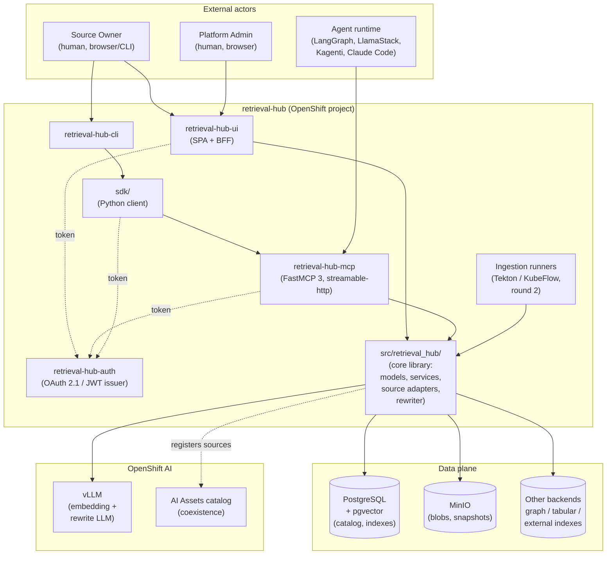
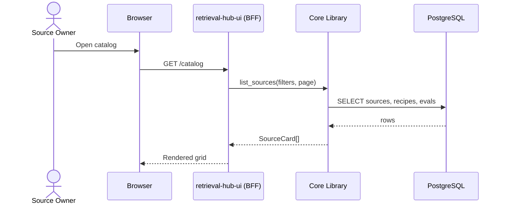
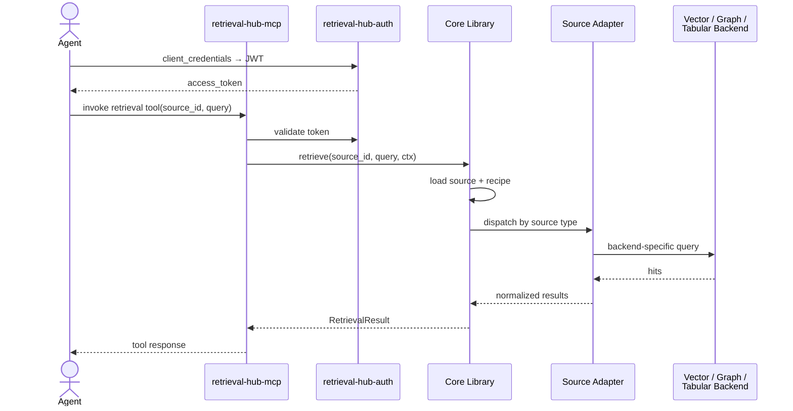
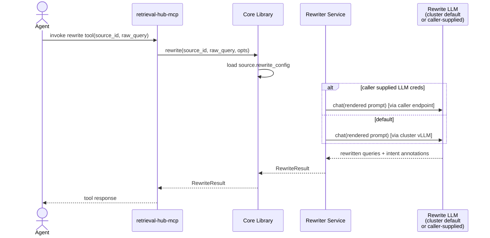
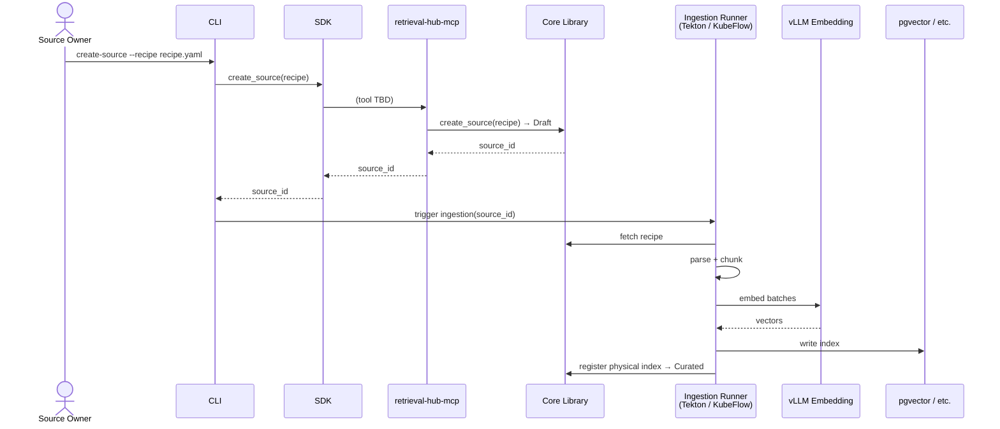
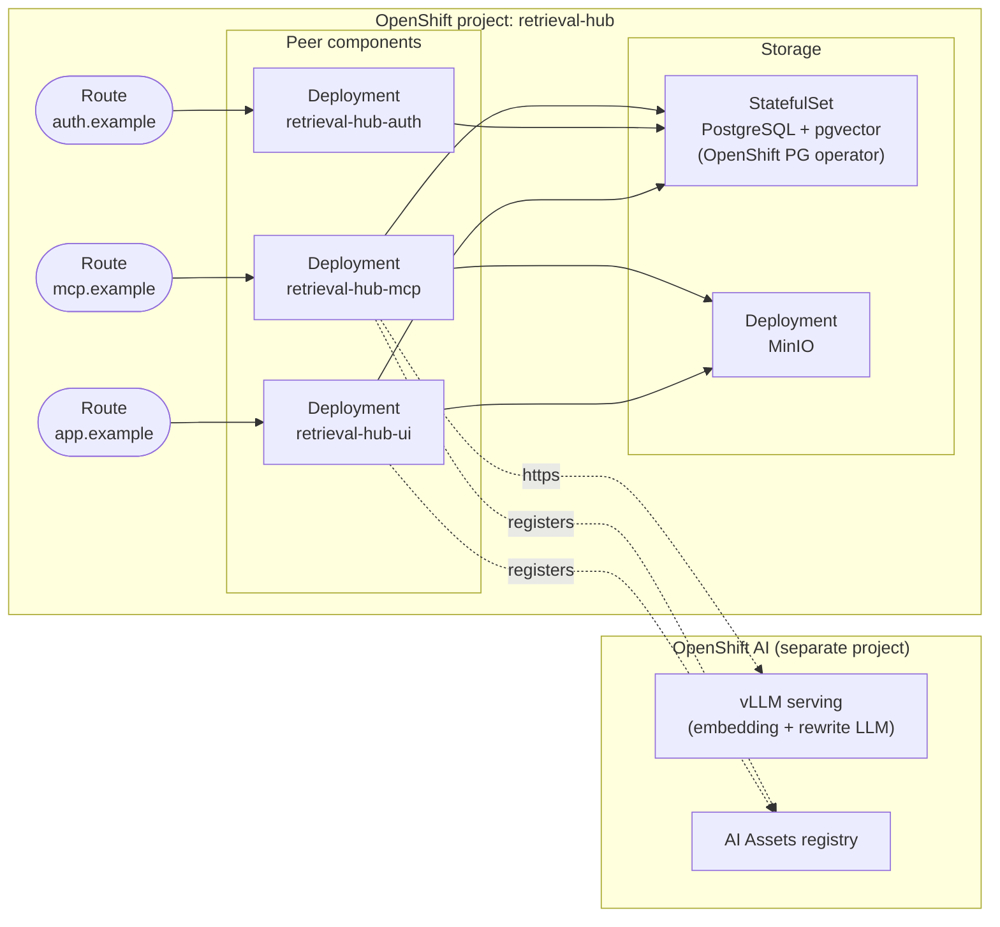

# Architecture

retrieval-hub is a platform component for OpenShift AI that gives agents an easy way to connect to **retrieval sources**: datasets and data connections that have been turned into first-class, reusable RAG surfaces. It is the retrieval analogue of memory-hub, and it follows the same shape (`docs/PLATFORM_COMPONENT_PATTERN.md`): a core library exposed through MCP, packaged as an SDK, driven by a CLI, administered through a small web UI, and (eventually) managed by an Operator.

This document is the big picture. Read it top to bottom. Subsystem details live in their own files in `docs/`; this file links out to them but does not duplicate their contents.

## What problem this solves

Today every team that wants RAG rebuilds the same wheel: pick an embedding model, pick a chunk size, pick a vector store, ingest a corpus, and then watch the agent send the user's raw question — typically the worst possible query — into a vector search. The dataset is treated as a blob with no record of how it was prepared, no per-LLM evaluation, no shared way to consume it. Domain-specific structure (clinical, legal, S1000D, source code) is destroyed by generic ingestion. Tabular data gets shoved through a chunked-document pipeline, badly.

retrieval-hub turns each retrieval surface into a **published, recipe-documented, evaluated artifact** — a *source* — that lives in a catalog, has an owner, exposes itself to agents through MCP, and (where the source owner has invested in it) carries a **per-source query rewriter** so the agent's raw user question gets reshaped into queries this particular knowledge set can actually answer well.

The differentiating bet is that **retrieval expertise should live next to the data**, not inside every agent that tries to use it.

## System overview

The boundaries are deliberate: every external surface (`*-ui`, `*-mcp`, `*-auth`, `*-cli`, `sdk/`) goes through the **core library** and never reaches around it to talk to storage directly. If the UI ends up importing from `retrieval-hub-mcp/`, we've already drifted from the pattern.

External agents only ever touch the **MCP server**. They do not talk to the UI, the auth service directly, or storage. This is what makes retrieval-hub composable with whatever agent runtime someone is using.

## The core domain object: a source

A *source* is a published, recipe-documented retrieval surface backed by one or more physical indexes. Cards in the catalog are the human-readable face of sources. The full data model lives in [`catalog.md`](catalog.md), but the one-paragraph version:

A source has an **owner**, a **status** (`Draft` / `Curated` / `Published` / `Retired`), a **family** that determines which **retrieval patterns** the source supports (vector search, graph traversal, table query, hybrid), a versioned **recipe** describing how it was built, one or more **physical indexes**, zero or more **sample agent prompts**, **evaluation results** keyed by LLM, optional **rewriter metadata** (vocabulary mappings, sample queries, schema hints — see [`query-rewriter.md`](query-rewriter.md)), an **agent-write policy** (whether and how agents may add data), and **lineage**.

The MCP tool layer hides the family-specific complexity behind a consistent surface. A GraphRAG source's retrieval pattern might be "vector-find an entry node, then crawl the graph N levels, then return chunks plus relationships as JSON" — but the agent just asks for *k results for query Q against source S* and the source adapter executes the right pattern. The agent does not need to know whether it is talking to a vector source, a GraphRAG source, or a TableRAG source unless it asks for that detail explicitly.

The four v0 sources we are designing against — Red Hat product docs, VA clinical practice guidelines, Wikipedia content, and code from public repositories — are deliberately heterogeneous. They cover technical documentation, clinical PDFs with specialized vocabulary, broad general knowledge, and source code. If the data model can't cleanly express all four, it's wrong.

## Critical data flows

### Browse the catalog

The simplest flow. A source owner or agent developer opens the admin UI (or hits the AI Assets surface) to discover what sources exist.

The UI's BFF layer exists so the SPA never has to know about the core library's internal types. See [`ui.md`](ui.md).

### Agent issues a retrieval call

The hot path. An agent connects to the MCP server, authenticates, and asks for retrieval against a specific source. The MCP **tool inventory is not specified here** — that is designed through the `/plan-tools → /create-tools → /exercise-tools → /write-system-prompt → /update-docs → /deploy-mcp` workflow described in [`mcp-server.md`](mcp-server.md). What this diagram shows is the *shape* of the call regardless of which tool it ends up being.

Two things to notice. First, the **source adapter** layer is what makes one MCP surface able to serve heterogeneous backends — pgvector for the document corpora, something else for the tabular dataset, possibly a graph store for code. Second, the agent never talks to a backend; the only knowledge an agent needs is *which source it wants*.

### Per-source query rewrite

The differentiator. The agent submits the raw user question, names a source, and gets back N reformulated queries that match how *this particular knowledge set* is written and structured. The rewrite prompt is a curated property of the source — authored by the source owner, versioned with the recipe, tested as part of source publishing.

The canonical motivating example is the VA clinical practice guidelines source: a user asks "what should I do for someone with high blood sugar after a meal" and the rewriter — primed with the source's vocabulary and structure — produces clinical-language reformulations like "VA/DoD clinical practice guideline postprandial hyperglycemia management" that hit the corpus far better than the lay phrasing would.

The full design lives in [`query-rewriter.md`](query-rewriter.md).

### Ingest a new source

The slowest and least-frequent path, but the one that actually creates value. A source owner kicks off an ingestion run, the runners do the heavy work (parse, chunk, embed, store), and the result is registered as a `Curated` card the owner can then evaluate, refine, and publish.

Round 1 of these docs describes the **shape** of ingestion only; the actual orchestration design (Tekton vs. KubeFlow vs. plain Jobs, retry semantics, recipe versioning during long runs) is round 2 and lives in `ingestion.md` when written.

## Deployment topology

retrieval-hub deploys as a single OpenShift project containing the peer components and the data plane. Each peer component is its own Deployment with its own Containerfile, built from its own subdirectory in the repo per the platform pattern.

Notes that matter:

- **PostgreSQL is the OpenShift OOTB operator-managed instance.** That gives us HA, backups, and FIPS via OS-level OpenSSL without writing crypto code. `pgvector` is enabled in the same database — we do not run a separate vector DB until we have proven we need one.
- **MinIO** holds raw documents, snapshots, and any blobs that don't belong in Postgres rows.
- **vLLM lives in the OpenShift AI project**, not in retrieval-hub's project. We consume it as a service. This keeps embedding model lifecycle (new models, version bumps) decoupled from retrieval-hub deploys.
- **Each peer component has its own Route**, which is what lets the MCP server be reached by agents living anywhere on the cluster (or off-cluster, with proper auth).
- **Cluster-scoped resources are minimized.** retrieval-hub does not need to be cluster-admin to function. Source-level access control is enforced inside the auth service, not via Kubernetes RBAC.

The **operator** that manages the lifecycle of all of this is intentionally a future subsystem. Per the platform pattern: start with plain manifests and Kustomize overlays, graduate to an Operator once the configuration surface stabilizes.

## Integration with OpenShift AI surfaces

retrieval-hub is designed to coexist with the platform capabilities the cluster already provides. The integration philosophy is detailed in [`integrations/README.md`](integrations/README.md), but the headline: **consume what's there, fall back gracefully when it's absent, never make any platform integration a hard dependency**. retrieval-hub must run on a cluster with none of these capabilities present, and it must run on a cluster with all of them.

The platform capabilities we integrate with:

- **LlamaStack** ([`integrations/llamastack.md`](integrations/llamastack.md)) — present on the target cluster. retrieval-hub registers as a connector via `/v1/connectors` so LlamaStack-hosted agents can discover and invoke retrieval-hub tools through their normal tool path. Eval **execution** delegates to LlamaStack's `/v1/eval` API with the Ragas provider when present; native eval orchestrator is the fallback. The score-on-the-card stays in retrieval-hub regardless of execution backend. OpenTelemetry trace propagation ties retrieval-hub spans into LlamaStack agent traces.
- **MLflow** ([`integrations/mlflow.md`](integrations/mlflow.md)) — available but installed separately, no SSO assumption. MLflow becomes the **history-of-record** for eval runs (catalog stores headline projections + lineage pointers), the prompt registry for the shared rewriter template, and the dataset versioning store for eval test cases. Service-account auth with the triggering identity recorded as MLflow run tags handles the no-SSO case. Buffer-and-reconcile pattern when MLflow is transiently down. Native Postgres+MinIO is the fallback for clusters without MLflow.
- **Kagenti** ([`integrations/kagenti.md`](integrations/kagenti.md)) — coming to the target cluster, not present yet. retrieval-hub registers as a backend behind the Kagenti MCP Gateway via an `MCPServer` CRD when Kagenti arrives, with audience-scoped token exchange handled by the gateway and `external_jwt_validator` as the auth backend. Namespace-as-tenant. The standalone Route stays available for off-Kagenti consumers in the same deploy.
- **AI Assets** ([`integrations/openshift-ai-assets.md`](integrations/openshift-ai-assets.md)) — coexistence with the RHOAI AI Hub registry. Sources are registered into AI Assets so agent developers find them in the same place they find approved MCP servers and models. Optional, idempotent, no hard dependency.
- **AutoRAG** ([`integrations/autorag.md`](integrations/autorag.md)) — considered, not committed. Optional integration for automated recipe tuning at source creation time and during drift. Subprocess sidecar; no in-process import.

A meaningful fraction of round-1 retrieval-hub design was duplicating things the cluster already provides. The platform-overlap analysis in [`integrations/README.md`](integrations/README.md) is honest about what changed and why. The summary: experiment tracking moves to MLflow, eval execution moves to LlamaStack, agent identity moves to Kagenti+Keycloak in production, MCP edge concerns move to the Kagenti MCP Gateway. **The differentiator — the per-source rewriter metadata model — is intact; none of the platform capabilities has anything in that space.**

The full posture per integration lives in the per-capability docs in [`integrations/`](integrations/). The README explains the integration philosophy and the duplication analysis.

## What's Decided

These are choices we're committed to in round 1. Future docs should treat these as the ground truth.

- **Platform shape**: follows `docs/PLATFORM_COMPONENT_PATTERN.md`. Peer-component layout, core library at `src/retrieval_hub/`, no cross-component imports.
- **Storage default**: PostgreSQL with `pgvector`, managed by the OpenShift PG operator. Add specialized backends (graph store, object store partitions) only when a use case demands them.
- **MCP framework**: FastMCP 3, streamable-http transport, scaffolded from the fips-agents MCP template. SSE is deprecated and not used.
- **MCP supports both reads and data writes for agents.** Agents can query sources *and* add data into existing sources, scoped by source-level policy and auth. **Catalog mutation** (creating sources, editing recipes, publishing, retiring) stays out of MCP — those are human actions, performed through the UI or CLI by an authenticated human identity. The boundary is "data into existing curated sources, yes; changing the curation itself, no." This keeps the memory-hub boundary clean (memory-hub remains per-agent scratch and recall; retrieval-hub remains shared curated knowledge with controlled agent-write surfaces) without artificially blocking the use cases that need agent-writable retrieval.
- **Auth substrate**: OAuth 2.1 `client_credentials` issuing short-lived JWTs as the *baseline*, with the auth service as a separable peer (`retrieval-hub-auth/`). Pluggable IdP behind it. retrieval-hub-auth can also run as a **JWT validator** consuming tokens issued by an external deployment — useful when retrieval-hub is dropped into an environment that already has its own identity story. See [`auth.md`](auth.md).
- **Query rewriter LLM resolution**: cluster-resident LLM is the default; callers can override by passing their own LLM credentials. The cluster default is **`granite-3.3-8b-instruct`**, served by the cluster's vLLM. See [`query-rewriter.md`](query-rewriter.md).
- **AI Assets is coexistence, not coupling.** We register into it where useful and we do not depend on it.
- **Deployable anywhere.** retrieval-hub must run on a cluster with no platform integrations and on a cluster with all of them (LlamaStack + MLflow + Kagenti + AI Assets). Every platform integration is additive: present → enriched, absent → degraded gracefully. No platform integration is a hard dependency.
- **When LlamaStack is present, eval execution delegates to it** (with the Ragas provider) and retrieval-hub keeps the score-on-the-card. Native orchestrator is the standalone fallback.
- **When MLflow is present, it is the history-of-record** for eval runs, the shared rewriter template, and eval test case datasets. The catalog stores headline projections + MLflow lineage pointers. Native Postgres+MinIO is the standalone fallback.
- **When Kagenti is present, retrieval-hub-auth runs in `external_jwt_validator` mode**, the MCP server registers as a backend behind the Kagenti MCP Gateway via `MCPServer` CRD, and namespace = tenant. The standalone Route stays available for off-Kagenti consumers in the same deploy.
- **FIPS posture**: assumed on. UBI9 base images everywhere, OS-level OpenSSL, library choices made accordingly.
- **The four v0 sources are heterogeneous on purpose**: Red Hat product docs, VA clinical practice guidelines, Wikipedia content, code from public repositories. The data model has to handle all four cleanly or it's wrong.

## What's Open

These are the questions round 1 does not answer. They are not blockers, but they are flagged honestly so subsequent rounds know what's still moving.

- **MCP tool inventory.** Deferred to the `/plan-tools → /create-tools → /exercise-tools → /write-system-prompt → /update-docs → /deploy-mcp` workflow. `mcp-server.md` describes the component, the read/write boundary, and the conventions every tool will follow — not the tool inventory itself. Do not pre-specify.
- **Card cardinality.** Is one card always one physical index, or can a logical source have multiple physical indexes behind it (for example, the same corpus embedded with two different models for A/B comparison)? Leaning toward "one logical source, one or more physical indexes," but the data-model implications are real. See [`catalog.md`](catalog.md).
- **Inherited-auth deployment specifics.** retrieval-hub-auth supports running as a JWT validator against an external issuer, but the per-environment specifics (which issuer, which claim mappings, how groups translate, how revocation propagates) are deployment-time questions. See [`auth.md`](auth.md).
- **The tabular retrieval surface.** Vector search over chunked rows is wrong. Real options are text-to-SQL with curated schema descriptions, a typed query DSL exposed as a tool, or a hybrid. We need to design against a real tabular dataset before committing.
- **The code-corpus retrieval surface.** Source code embedding and chunking is its own discipline (AST-aware chunking, code-tuned embeddings like StarCoder embeddings, etc.). Code is one of our v0 sources and it might force a third source-adapter family beyond "document" and "tabular."
- **Ingestion orchestration.** Tekton, KubeFlow, plain Jobs, or a mix. Round 2.
- **Eval execution backend wiring.** LlamaStack's `/v1/eval` with the Ragas provider is the production target when LlamaStack is present; native orchestrator is the standalone fallback. Both are described; neither is wired up against a real corpus yet. See [`evaluation.md`](evaluation.md) and [`integrations/llamastack.md`](integrations/llamastack.md).
- **MLflow concrete configuration.** The integration is designed against MLflow 3.10's GenAI APIs (prompt registry, dataset tracking, RAG evaluation in MLflow runs). The minimum MLflow version we target needs to be pinned at deploy time. See [`integrations/mlflow.md`](integrations/mlflow.md).
- **Kagenti `MCPServer` CRD schema.** The integration is designed against the more recent Kagenti documentation but the precise field names may need to be confirmed against the Kagenti version that lands on the target cluster. See [`integrations/kagenti.md`](integrations/kagenti.md).
- **Synthetic-QA generator choice.** LlamaStack eval / SDG Hub / AutoRAG / hand curation are alternatives, picked based on what lands first against a real corpus. See [`evaluation.md`](evaluation.md).
- **Per-cluster claim mapping in `external_jwt_validator` mode.** Each customer's IdP needs its own deny-allowlist mapping. We should ship Keycloak as the canonical example with a documented role-to-scope mapping before the first Kagenti-fronted deploy. See [`auth.md`](auth.md).
- **Operator timing.** Future subsystem. Not in round 1.
- **Multi-cluster federation.** Out of scope for v1. Single cluster first.

## How to read the rest of these docs

[`SYSTEMS.md`](SYSTEMS.md) is the index — start there if you're trying to find a subsystem. Each subsystem doc is meant to be readable on its own; cross-references are deliberate, not exhaustive. The "Decided vs. Open" sections in the subsystem docs should be consistent with this file — if they drift, this file is the source of truth and the subsystem doc is wrong.
