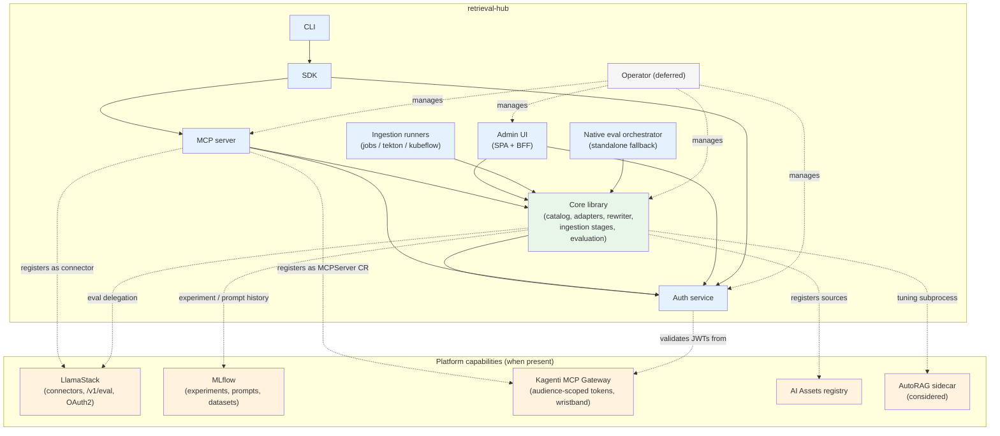

# Systems

This is the map. Every subsystem of retrieval-hub has a one-line description, a status, and a link to its detail doc (if one exists). When you're trying to find something — "where does the query rewriter live, what state is the auth service in, who owns the catalog model" — start here.

[`ARCHITECTURE.md`](ARCHITECTURE.md) is the *narrative* (read top to bottom). This file is the *index* (look up what you need).

## Status definitions

- **`Implemented`** — code exists, tests pass, deployed somewhere we trust. Production-quality.
- **`Skeleton`** — scaffolded from the relevant template (or hand-built scaffold), wires up, has at least one passing test, but the surface area is incomplete. Not production.
- **`Design`** — a design doc exists in `docs/`. No code yet (or only throwaway exploration). Decided enough to start building.
- **`TBD`** — known to be needed, but no design doc and no code. Listed here so it's not forgotten.

A subsystem in `Design` is supposed to be buildable from its doc by someone who has read `ARCHITECTURE.md` and the platform pattern. If a `Design`-status doc isn't enough to start coding from, the doc is the bug, not the code.

## Subsystem inventory

| Subsystem | Status | Description | Detail doc |
|---|---|---|---|
| Core library | Design | Domain models, services, source adapters, the catalog implementation, the rewriter, the ingestion stages. Lives at `src/retrieval_hub/`. The only thing other components import directly. | (covered across [`catalog.md`](catalog.md), [`query-rewriter.md`](query-rewriter.md), [`ingestion.md`](ingestion.md)) |
| Catalog | Design | The source/card data model, lifecycle, recipes vs. physical indexes, retrieval pattern dispatch, rewriter metadata, agent write policy, lineage. The most consequential subsystem of the core library. | [`catalog.md`](catalog.md) |
| Source adapters | Design | Family-specific retrieval and write implementations: `document`, `clinical_document`, `code`, `tabular`, `graph`, `external`. Family is a hard discriminator that determines which retrieval patterns the source supports. | (covered in [`catalog.md`](catalog.md)) |
| Query rewriter | Design | Shared core rewriter parameterized by per-source metadata (vocabulary mappings, sample queries, domain notes), with optional per-source override prompts. The differentiating capability. | [`query-rewriter.md`](query-rewriter.md) |
| MCP server | Design | `retrieval-hub-mcp/` peer component. FastMCP 3, streamable-http, scaffolded from fips-agents template. Reads and data writes both exposed to agents; catalog mutation stays out. Tool inventory deferred to `/plan-tools` workflow. | [`mcp-server.md`](mcp-server.md) |
| Auth service | Design | `retrieval-hub-auth/` peer component. OAuth 2.1 client_credentials, short-lived JWTs, four pluggable IdP backends (`local` / `openshift_oauth` / `oidc_external` / `external_jwt_validator`). The fourth mode lets retrieval-hub inherit auth from another deployment. | [`auth.md`](auth.md) |
| Admin UI | Design (staged) | `retrieval-hub-ui/` peer component with `frontend/` (PatternFly + React SPA) and `backend/` (FastAPI BFF). Deploys as an application in RHOAI. Source-owner workflows, agent-developer browse, platform-admin audit. **Stage 1**: card field listing + data dictionary ([`ui-card-data.md`](ui-card-data.md)). **Stage 2**: visual mockups in PatternFly using Red Hat design tokens ([`ui.md`](ui.md), to be elaborated against `ui-card-data.md`). **Stage 3**: SPA + BFF implementation. | [`ui-card-data.md`](ui-card-data.md), [`ui.md`](ui.md) |
| Ingestion | Design | Seven-stage pipeline (fetch → parse → normalize → chunk → embed → write → register) implemented in the core library, with thin runner wrappers per orchestrator (plain Jobs in v1, Tekton in round 2). Produces `Curated` sources from a recipe and an origin. | [`ingestion.md`](ingestion.md) |
| Evaluation | Design | Eval suites as catalog objects, eval runs against physical indexes, six default metrics including `rewrite_lift`. SDG Hub as working upstream generator. Publishing a source requires an eval run. | [`evaluation.md`](evaluation.md) |
| SDK | Design | `sdk/` published to PyPI as `retrieval-hub`. Typed Python client wrapping the MCP surface, sync + async, transparent token caching, support for both issued and inherited auth modes. | [`sdk.md`](sdk.md) |
| CLI | Design | `retrieval-hub-cli/` peer component built on the SDK. `<noun> <verb>` command surface organized by persona (source owner, agent developer, platform admin). | [`cli.md`](cli.md) |
| MCP tools planning | Design | Notes for the eventual `/plan-tools` workflow. Captures input constraints from the platform integrations (tool-filter wristband consideration, tool prefix conventions, error code reservations) so they're picked up when the workflow runs. | [`mcp-tools-planning.md`](mcp-tools-planning.md) |
| Platform integrations index | Design | Entry point to the integrations directory. Includes the platform-overlap analysis (what round-1 design was duplicating that the cluster already provides) and the integration philosophy. | [`integrations/README.md`](integrations/README.md) |
| LlamaStack integration | Design | Connector registration via `/v1/connectors`, eval execution delegation to LlamaStack `/v1/eval` with the Ragas provider, OAuth2 provider alignment, OpenTelemetry trace propagation. The score-on-the-card stays in retrieval-hub regardless of execution backend. Standalone fallback when LlamaStack is absent. | [`integrations/llamastack.md`](integrations/llamastack.md) |
| MLflow integration | Design | History-of-record for eval runs (catalog stores headline projection + lineage pointers), prompt registry for the shared rewriter template, dataset tracking for eval test cases. Service-account auth with triggering identity in tags handles the no-SSO case. Buffer-and-reconcile pattern when MLflow is transiently down. Native Postgres+MinIO is the standalone fallback. | [`integrations/mlflow.md`](integrations/mlflow.md) |
| Kagenti integration | Design | MCP Gateway registration via `MCPServer` CRD + Gateway API HTTPRoute. RFC 8693 audience-scoped token exchange via Kuadrant AuthPolicy. SPIFFE/SPIRE workload identity. Namespace-as-tenant via `retrieval-hub.redhat.com/tenant-id` annotation. Tool-filter wristband layered with retrieval-hub per-source policy. Standalone Route remains operational for off-Kagenti consumers in the same deploy. Cluster will have Kagenti soon (not yet present). | [`integrations/kagenti.md`](integrations/kagenti.md) |
| Claude Code integration | Design | Per-runtime integration for Claude Code (off-cluster). Standalone Route topology, JWT in env var, sample agent prompts. The simplest per-runtime case; serves as the template for future off-cluster runtimes. | [`integrations/claude-code.md`](integrations/claude-code.md) |
| AI Assets integration | Design | Coexistence integration with the RHOAI AI Hub / AI Assets registry. Optional, idempotent, no hard dependency. | [`integrations/openshift-ai-assets.md`](integrations/openshift-ai-assets.md) |
| Prometheus + Grafana integration | Design | Observability fully delegated to the cluster's Prometheus + Grafana + OpenTelemetry stack. retrieval-hub emits metrics and traces; the admin UI deep-links to Grafana for query volumes, latency distributions, per-identity usage, and anomaly detection. No native query log. | [`integrations/prometheus-grafana.md`](integrations/prometheus-grafana.md) |
| AutoRAG integration | Design (considered) | Optional integration with AutoRAG (Apache 2.0) for automated recipe tuning at source creation time and periodically as sources drift. Document-family sources only. Subprocess sidecar; no in-process import. Not yet committed. | [`integrations/autorag.md`](integrations/autorag.md) |
| Operator | Design (deferred) | Kubernetes Operator owning the lifecycle of retrieval-hub through CRDs (`RetrievalHub`, `Source`, `RewriterPrompt`). Framework: Go with operator-sdk (targeting OLM packaging and OperatorHub). Deliberately deferred until the configuration surface stabilizes. | [`operator.md`](operator.md), [`vision-and-roadmap.md`](vision-and-roadmap.md) |
| Per-runtime integrations | Partial | One per-runtime integration committed: Claude Code (off-cluster, standalone Route). Others (LangGraph, Kagenti-hosted runtimes beyond the generic Kagenti integration, custom Python agents) written as we commit to specific runtimes. | [`integrations/claude-code.md`](integrations/claude-code.md) |

## Dependency graph

Color key: green = the core library, blue = retrieval-hub peer components, gray = deferred future subsystem, orange = platform capabilities consumed when present (each with a documented standalone fallback).

Note that **every dotted edge to a platform capability is optional**: retrieval-hub runs without any of LlamaStack, MLflow, Kagenti, AI Assets, or AutoRAG. The dependency graph above shows what *can* be wired up, not what *must* be present.

## Recommended build order

The order below is the path of least resistance — each step builds on the previous one and produces something demonstrable. Skipping ahead is possible but typically pays for itself in rework.

1. **Core library skeleton + catalog data model + Postgres migrations.** This is the foundation. SQLAlchemy models for source / recipe / physical index / rewrite prompt / eval result, alembic migrations to bring up an empty database. No domain logic yet — just enough to insert and read a `Draft` source.
2. **Auth service skeleton with the `local` IdP backend.** Issues JWTs, exposes JWKS, validates the token shape we said we would issue. `local` backend is enough for development; `openshift_oauth` and `oidc_external` come later. Without auth, you can't write the next step honestly.
3. **MCP server skeleton, scaffolded from the fips-agents template, with no tools yet.** Validates JWTs against the auth service, has the middleware stack from the template, has health endpoints, deploys cleanly. Proves the agent-facing loop works end to end.
4. **First source family adapter: `document`. First real corpus: Red Hat product docs.** Hand-run the ingestion (no pipeline yet — a one-shot script), produce a `Curated` source, write the source-loading and retrieval code paths in the core library. By the end of this step, the core library can answer "retrieve N hits for query Q against source S."
5. **`/plan-tools` → `/create-tools` → `/exercise-tools` against the now-functional core library.** The first round of MCP tools comes from this workflow. By the end of this step, an actual agent (Claude Code or LangGraph) can connect to retrieval-hub and ask the Red Hat docs source a question.
6. **Admin UI stage 1 → stage 2 → stage 3.** Three sub-steps:
   - **6a — Stage 1 (data dictionary, done)**: [`ui-card-data.md`](ui-card-data.md). Field listing for the catalog grid card, the source detail page, and the **minimal round-1 admin dashboard** (cluster health summary, top sources, recent catalog changes, plus deep-link buttons to Grafana/MLflow/Keycloak). Source owners see the admin dashboard filtered to sources they own. Permission flow for restricted sources is round-1-simple: a banner with a pre-populated `mailto:` link. No visual design yet.
   - **6b — Stage 2 (visual mockups)**: PatternFly + React mockups, Red Hat design tokens, RHOAI dashboard integration. Static artifact (Figma, Storybook, or committed mockup images), reviewable before any code is written. Updates [`ui.md`](ui.md) with concrete component mappings to the data dictionary fields. Includes mockups for: catalog grid, source detail with action bar + tabs, access-required banner, admin dashboard.
   - **6c — Stage 3 (SPA + BFF implementation)**: the actual `retrieval-hub-ui/` peer component, browse view + detail view + admin view, read-only first. No source creation in the UI yet. Source owners are still using one-shot scripts. This is enough for agent developers to discover what's there. BFF auth via the cluster's OpenShift OAuth. Observability deep links point at the cluster's Grafana (per [`integrations/prometheus-grafana.md`](integrations/prometheus-grafana.md)).
7. **Second source adapter: `clinical_document`. Second corpus: VA clinical practice guidelines.** Deliberately heterogeneous from `document` (structure-preserving parsing, clinical chunking). This is the corpus the rewriter will be proven against, so getting it ingested cleanly is the prerequisite for step 8.
8. **Query rewriter, end to end.** Rewrite prompt object in the catalog, MCP exposure (whatever tool the `/plan-tools` workflow produced or extended for it), cluster default LLM resolution against the target cluster's vLLM. Run the rewriter against the VA source and **prove the differentiator with a real eval delta** — that's the round-1 success criterion.
9. **Third corpus: Wikipedia (curated subset). Fourth corpus: public code repositories.** These force the data model and adapter layer to handle data velocity (Wikipedia refresh) and a third family (`code`). If `code` is too hard to do well, ship a degraded `code` adapter and improve in v1.x.
10. **SDK + CLI.** Now that the catalog and MCP surface are real, write the SDK (Python typed client, sync + async, transparent token handling) and the thin CLI on top of it. Source owners stop using one-shot scripts and start using the CLI for managing sources.
11. **Admin UI: source creation, recipe configuration, rewrite prompt editor with diff/test, publish/retire.** Now the UI can replace the CLI for the source-owner journey. CLI stays for scripting and ops.
12. **Ingestion runners.** Tekton or KubeFlow pipelines wrapping the previously-hand-run ingestion scripts. Produces `Curated` sources from a recipe + a data origin. This is when ingestion stops being "a script someone runs" and becomes a managed workflow.
13. **Evaluation integration.** SDG Hub (or whatever we settle on) producing eval results that land on cards. Until this step, eval results are produced ad-hoc.
14. **AI Assets registration.** Toggle on the integration and start registering `Published` sources into AI Assets. Test the deep-links both ways with gen AI Studio.
15. **Operator.** Once the configuration surface has stopped moving, write CRDs and an Operator to manage retrieval-hub instances declaratively. Until then, plain manifests + Kustomize overlays are sufficient.

Steps 1–5 are the **vertical slice**. Once they're done, we have the smallest version of retrieval-hub that an external agent can usefully interact with: one source, one MCP server, one auth substrate, no UI yet. Everything else is layering value on top of that slice.

Steps 6–9 are the **round 1 product**. By the end of step 9, retrieval-hub has its differentiating capability proven on a real corpus and is something we could put in front of a customer.

Steps 10–15 are **production hardening and round 2 design work**.

## What this file is not

- It is not a roadmap with dates. The build order is sequencing, not scheduling.
- It is not a single source of truth for what's in any given subsystem. Each subsystem doc is authoritative for its own subsystem; this file is the index.
- It is not a place to write design rationale. Design lives in the subsystem docs and the architecture doc; this file just points at them.

If a subsystem is missing from the table, add it here first, then write its doc, then start coding. If the table and the dependency graph disagree with each other, fix the disagreement before committing — they have to stay in sync or this file stops being useful.
