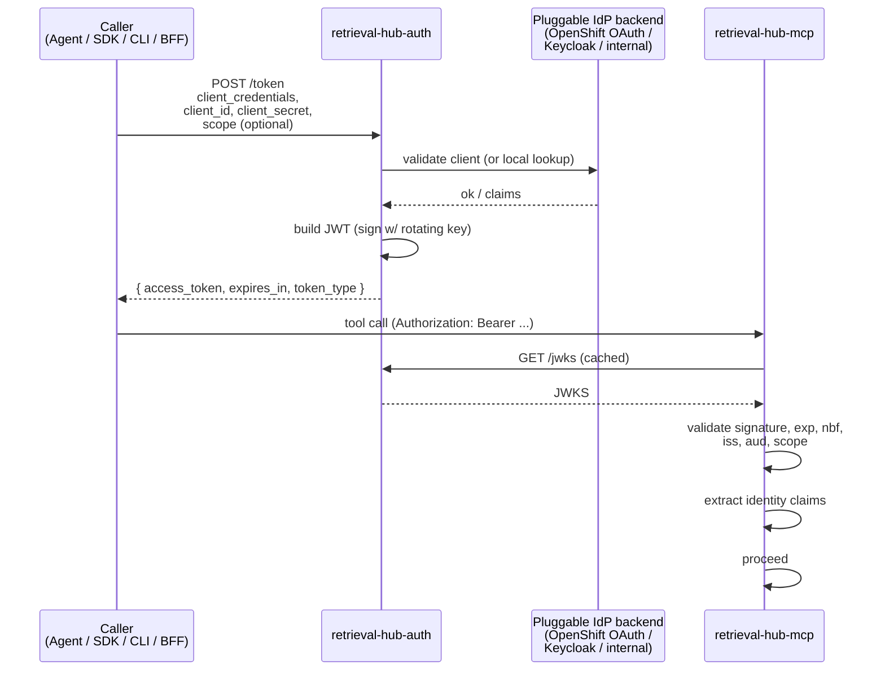
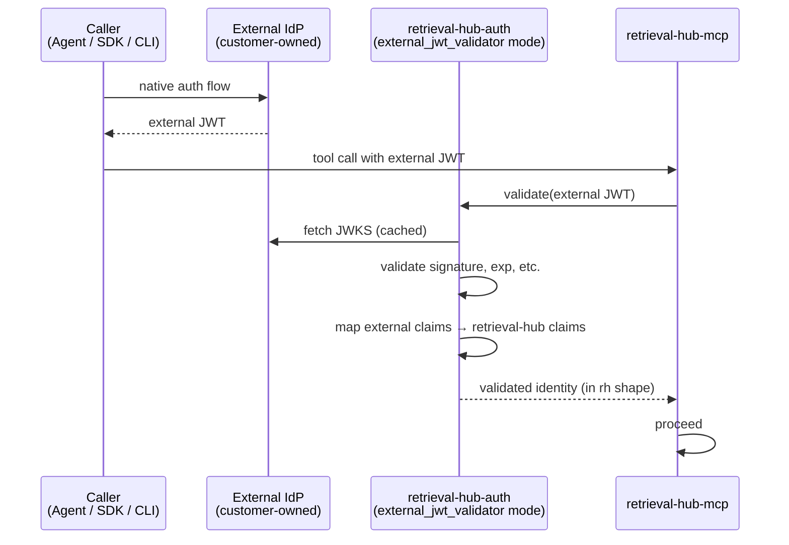

# Auth (`retrieval-hub-auth`)

retrieval-hub has exactly one identity story, and every other component — MCP server, UI BFF, CLI, SDK, ingestion runners — uses it. The baseline story is OAuth 2.1 `client_credentials` issuing short-lived JWTs through a small purpose-built service (`retrieval-hub-auth/`) that fronts a pluggable identity backend. The same service can also run as a **JWT validator** consuming tokens issued by an external deployment — useful when retrieval-hub is dropped into a customer environment that already has its own identity story and the customer does not want a second token issuer in their cluster.

Either way, every consumer of retrieval-hub talks to the same auth service and sees the same JWT shape. The choice between "we issue tokens" and "we validate someone else's tokens" is a deploy-time configuration, not a code change.

This document describes that service: why it exists as a separable peer component, the token shape, the validation contract, the pluggable backend layer (including the inherited-auth mode), source-level access control, and the security posture.

## Why this is its own component

The platform pattern from memory-hub puts auth in its own peer directory (`<project>-auth/`) and we are following that lead, deliberately. The reasoning:

- **The auth substrate is the most likely thing to be replaced.** A given customer environment will want OpenShift OAuth, Keycloak, an internal SAML/OIDC IdP, or some combination. If auth code is scattered across the MCP server, the UI backend, and the CLI, swapping the substrate is a refactor across half the repo. If it's behind one service with one contract, it's swapping one component.
- **Every consumer (MCP, UI, CLI, SDK) needs the same identity story.** Putting it behind a single service is what makes that easy.
- **It needs to be hardened differently from the rest of the system.** Token issuing is the hot security surface. Putting it in its own deployable lets it have its own threat model, its own audit logging posture, its own key handling, and its own deploy cadence.
- **Source-level access policy is enforced inside the core library**, not in the auth service — but the *identity claims* the policy reads come from the JWT the auth service issues. Keeping policy and identity separate is what lets the auth service stay narrow.

The auth service does **not** own the source-access policy. It owns identities, credentials, and tokens. The policy that says "agent X is allowed to query source Y" lives in the catalog, enforced by the core library at retrieval time. See "Source-level access control" below.

## What's in the box

`retrieval-hub-auth/` is a peer top-level component in the repo:

- **Framework**: FastAPI.
- **Base image**: Red Hat UBI9 Python.
- **Crypto**: OS-level OpenSSL via the standard library + `cryptography` package, FIPS-friendly. No bundled crypto, no Python-implemented JWT signing — the `jwt` library we use must support OpenSSL key handles.
- **Storage**: shares the retrieval-hub Postgres database (own schema, own migrations under `alembic/`). Stores client registrations, key material references, audit log of token issuance.
- **Key material**: signing keys live in OpenShift Secrets, mounted into the container at known paths. The auth service does not generate keys; key generation is an operator action (manual in v1, Operator-driven later).
- **Test framework**: pytest, 80% target.

It is built remotely on `ec2-dev-2` like every other peer component, and deployed as its own Deployment + Service + Route in the `retrieval-hub` OpenShift project.

## The grant: OAuth 2.1 `client_credentials`

retrieval-hub serves machines (agents, ingestion runners, the UI BFF, the CLI talking on behalf of a human). Almost every caller is a *workload identity*, not an interactive end-user, so the right grant is `client_credentials`: the caller presents a `client_id` + `client_secret`, the auth service validates them, the auth service issues a short-lived JWT, the caller uses the JWT against the MCP server (or wherever).

We do not use the resource owner password grant (deprecated), and we do not use the implicit grant (deprecated). Authorization Code with PKCE is the right choice for *human* users hitting the UI directly, and the auth service supports it for that path — but the round-1 v1 happy path is `client_credentials` everywhere, with the UI's BFF mediating human auth where the BFF itself is the OAuth client and end users authenticate to the BFF separately.



A few things to notice:

- **The MCP server validates JWTs locally** using the JWKS it fetches from `retrieval-hub-auth`. It does not call the auth service on every request. JWKS is cached with a TTL and a revalidation policy.
- **Tokens are short-lived.** The default `expires_in` is 15 minutes. Long-running agent sessions refresh; they don't sit on a 24-hour token.
- **Scopes are present** (in the `scope` claim) and reserved for cross-cutting capabilities like "can list sources," "can query sources," "can read recipes." Source-level access is *not* a scope — see below — because the set of sources is too dynamic for that to make sense.

## Token shape

A retrieval-hub access token is a signed JWT with the claims below. Claims marked `[std]` are standard OIDC/OAuth; the rest are retrieval-hub additions, prefixed `rh_`.

```json
{
  "iss": "https://auth.retrieval-hub.example/",
  "aud": "retrieval-hub",
  "sub": "client:agent-langgraph-prod-01",
  "iat": 1712500000,
  "nbf": 1712500000,
  "exp": 1712500900,
  "jti": "tok_01HXY...",
  "scope": "sources.list sources.read sources.query rewrite.invoke",
  "rh_identity_kind": "agent",
  "rh_identity_groups": ["langgraph", "platform-agents"],
  "rh_tenant": "default",
  "rh_caller_app": "research-assistant",
  "rh_request_id": "req_01HXY..."
}
```

Notes:

- **`sub` is structured.** Format is `<kind>:<id>`, where `<kind>` is `client` (workload), `user` (interactive human), or `service` (in-cluster trusted workload). Code parses the prefix; never assume the whole `sub` is a user id.
- **`rh_identity_kind`** mirrors the `sub` prefix. It's redundant on purpose so policy code doesn't have to parse strings.
- **`rh_identity_groups`** is the list of group memberships from the IdP. This is what source-level access policy reads (see below). Groups are opaque strings; the auth service does not invent its own groups, it surfaces what the IdP gives it.
- **`rh_tenant`** exists to leave room for multi-tenancy later. v1 is single-tenant; the claim is always `"default"` and the policy layer ignores it. Reserving the claim now means we don't have to break tokens later.
- **`scope`** is a space-separated list of *capabilities*, not a list of resources. "Can this caller list sources at all" is a scope. "Can this caller list source X" is a policy decision made by the core library against `rh_identity_groups`.
- **`jti`** is unique per token and logged. Lets us answer "was this exact token issued by us, and when, and to whom" without trusting the token's other claims.

The `scope` set retrieval-hub recognizes in v1 is small and finite:

| Scope | Meaning |
|---|---|
| `sources.list` | May enumerate sources visible to the caller's identity |
| `sources.read` | May fetch source metadata, recipes, sample prompts, evals |
| `sources.query` | May invoke retrieval against a source |
| `sources.write` | May invoke data writes (`append`, `upsert`, `annotate`) against sources whose `agent_write_policy` allows it |
| `rewrite.invoke` | May invoke the query rewriter |
| `admin.read` | May read admin-only catalog state (drafts, audit) |
| `admin.write` | May mutate **catalog state** (create/edit/publish/retire sources, edit recipes, edit rewriter metadata, edit access policies) |

The distinction between `sources.write` and `admin.write` is the load-bearing part. `sources.write` is the **agent-facing data write** scope: it lets a caller add data into existing curated sources, governed by each source's `agent_write_policy`. `admin.write` is the **human-facing catalog mutation** scope: it lets a caller create new sources, edit recipes, edit rewriter metadata, change access policy, publish, and retire — and it is **never** issued to agent identities by any configured IdP backend. This is the technical mechanism that makes the "data writes yes, catalog mutation no" boundary in [`mcp-server.md`](mcp-server.md) enforceable: an agent cannot, by construction, obtain a token that authorizes catalog mutation.

`sources.write` is issued to agent identities only when an explicit IdP-side rule allows it, and even then it only takes effect for sources whose owners have set `agent_write_policy.allowed = true`. Two gates, both required.

## The pluggable IdP backend

Inside `retrieval-hub-auth/`, the part that says "yes, this caller is authentic, and here are the claims" is a backend trait. v1 ships **four** implementations:

- **`local`** — a small client registration table in retrieval-hub's own Postgres. Useful for development, demos, and air-gapped clusters where there is no enterprise IdP. Never the right choice for production.
- **`openshift_oauth`** — delegates client validation to OpenShift's built-in OAuth server, using ServiceAccount tokens and the OAuth client API. The natural default on RHOAI clusters.
- **`oidc_external`** — talks to a generic OIDC provider (Keycloak, Auth0, an internal IdP). Configured by issuer URL, client id, client secret, JWKS endpoint. retrieval-hub-auth issues retrieval-hub JWTs after validating the upstream provider.
- **`external_jwt_validator`** — retrieval-hub-auth does **not** issue tokens; instead it validates JWTs issued by an external deployment and translates the upstream claims into the retrieval-hub claim shape on the fly. Used when retrieval-hub is dropped into an environment that already has its own identity story and the customer does not want a second token issuer in their cluster. See "Inheriting auth from another deployment" below.

The backend is selected at deploy time via configuration (`RETRIEVAL_HUB_AUTH_BACKEND=openshift_oauth`). Adding a new backend means writing a new implementation of the trait — no other component has to change, because the JWT shape consumers see stays the same regardless of backend.

The auth service is the only component that knows the backend exists. The MCP server, the core library, the UI BFF, the CLI, and the SDK all only see "a JWT validator at `RETRIEVAL_HUB_AUTH_URL`" — and they don't care whether the JWTs they're validating were issued here or somewhere upstream.

## Inheriting auth from another deployment

A common deployment pattern, especially inside a customer environment, is that **identity already exists**. The customer has Keycloak, or OpenShift OAuth, or an internal SSO, and they don't want a second token issuer in their cluster. They want retrieval-hub to *trust* the tokens their existing system already issues.

The `external_jwt_validator` IdP backend is for that case. When configured:

- retrieval-hub-auth runs as a **token validator and claim translator**, not an issuer. It does not have signing keys of its own. It does not own the `/token` endpoint.
- Callers obtain JWTs from the **external issuer** directly, using whatever flow the external IdP supports. They send the external JWT in the `Authorization` header to retrieval-hub MCP / UI / CLI, exactly as if it were a retrieval-hub-issued token.
- retrieval-hub-auth, on every JWT validation request from a consumer, validates the external JWT against the external issuer's JWKS and **translates** the claims into the retrieval-hub claim shape: maps `sub` to a structured identity, projects external groups into `rh_identity_groups`, projects external roles or scopes into the retrieval-hub `scope` set.
- The translation is configured at deploy time as a **claim mapping** policy — declarative, version-controlled, audited.

Schematically:



What this gives the customer:

- **One identity story for the cluster.** Their existing IdP is the source of truth.
- **No new credentials to manage.** No retrieval-hub `client_id`/`client_secret` rotation.
- **No new keys to rotate.** retrieval-hub-auth has no signing keys in this mode.
- **The same source-level policy enforcement** — the core library still reads `rh_identity_groups` from the validated token, so all the catalog-side policy code is unchanged.

What it costs:

- **The customer's IdP becomes part of retrieval-hub's trust boundary.** If the upstream issuer is compromised, retrieval-hub is compromised. This is the same trade-off any "trust an upstream IdP" integration makes; the mitigation is: pick the customer's IdP carefully, document the trust boundary, audit the claim mapping configuration like a security artifact.
- **Claim mapping is a real piece of configuration that someone has to maintain.** A bad mapping that, say, projects "everyone" into `admin.write` is catastrophic. The mapping is part of the deploy artifacts, version-controlled, change-reviewed, and audited at startup.
- **We give up some control over scope issuance.** In particular, the "agents never get `admin.write`" guarantee is now a *property of the claim mapping*, not a property of an IdP backend that retrieval-hub controls. This is enforced by a hard rule in the claim mapping evaluator: **no claim mapping rule may emit `admin.write` for an identity whose `rh_identity_kind` is `client` or `service`**. This rule is enforced in code, not in configuration, so a bad mapping cannot disable it.

The `external_jwt_validator` mode is the **production default in Kagenti deploys** — see [`integrations/kagenti.md`](integrations/kagenti.md) for the full integration shape. The other three backends (`local`, `openshift_oauth`, `oidc_external`) remain available and are the right choice when retrieval-hub *is* the identity authority for its slice of the cluster, or when running on a non-Kagenti cluster.

### Canonical reference case: Kagenti + Keycloak

When retrieval-hub runs behind the Kagenti MCP Gateway, the `external_jwt_validator` configuration takes a specific shape that's worth documenting as the reference case. The full flow is in [`integrations/kagenti.md`](integrations/kagenti.md); the auth-service-specific parts:

- **Upstream issuer**: Keycloak (the cluster's Keycloak that Kagenti uses for OAuth2). retrieval-hub-auth fetches the JWKS from Keycloak's standard endpoint and caches it.
- **Audience claim we expect**: the audience the Kagenti MCP Gateway sets when minting downstream tokens for retrieval-hub. This is the gateway-configured target hostname for our service, typically something like `retrieval-hub.retrieval-hub.svc.cluster.local`. Configured at deploy time as `RETRIEVAL_HUB_EXPECTED_AUDIENCE`.
- **`sub` translation**: Kagenti agents have SPIFFE identities (`spiffe://cluster.local/ns/clinical-agents/sa/research-bot`). The claim mapping projects these into structured retrieval-hub identities like `agent:spiffe:spiffe://cluster.local/ns/clinical-agents/sa/research-bot`.
- **`rh_tenant` source**: read from a namespace annotation on the agent's namespace — `retrieval-hub.redhat.com/tenant-id`. Falls back to the namespace name if the annotation is absent. Cross-tenant access is unsupported.
- **`rh_identity_groups` projection**: a **deny-allowlist**. The cluster's Keycloak roles often include platform-level roles that are meaningless to retrieval-hub. The mapping configuration explicitly lists which Keycloak roles get projected; everything else is dropped. This prevents a future Kagenti or Keycloak role addition from silently granting access to retrieval-hub sources.

A canonical Keycloak-role-to-`rh_identity_groups` allowlist for a Kagenti deploy might look like:

```yaml
claim_mapping:
  upstream: keycloak
  jwks_uri: https://keycloak.example.com/realms/cluster/protocol/openid-connect/certs
  expected_audience: retrieval-hub.retrieval-hub.svc.cluster.local

  group_allowlist:
    # Kagenti-issued roles that should map into retrieval-hub groups
    - kagenti-agent-base       # → "agents"
    - kagenti-agent-writer     # → "agent-writers"
    - clinical-agents          # → "clinical-agents" (a tenant-specific group)
    - retrieval-hub-admin      # → "admins" (humans only)

  group_translations:
    kagenti-agent-base: agents
    kagenti-agent-writer: agent-writers
    clinical-agents: clinical-agents
    retrieval-hub-admin: admins

  scope_translations:
    agents: [sources.list, sources.read, sources.query, rewrite.invoke]
    agent-writers: [sources.list, sources.read, sources.query, sources.write, rewrite.invoke]
    admins: [sources.list, sources.read, sources.query, sources.write, rewrite.invoke, admin.read, admin.write]

  # Hard rule, enforced in code regardless of the configuration above:
  # admin.write may not be projected for any identity whose rh_identity_kind
  # is "agent" or "service". Even if the configuration above appears to
  # allow it, the code path rejects it.
```

The hard rule about `admin.write` is critical: it is the technical mechanism behind "MCP is not a catalog mutation surface for agents." It is enforced by the claim mapping evaluator in code, not by configuration, so a bad mapping cannot bypass it. The same protection holds for `external_jwt_validator` mode against any upstream IdP — not just Kagenti — because the code-level rule applies regardless of where the token came from.

When `oauth2_token` is also being validated by LlamaStack on the same cluster (per [`integrations/llamastack.md`](integrations/llamastack.md)), both retrieval-hub-auth and LlamaStack point at the same Keycloak JWKS. Tokens validated for one service are also valid for the other if their audience claim covers it. The Kagenti MCP Gateway handles the audience scoping for downstream services automatically.

### Concrete Keycloak realm sketch

A realistic starting configuration for a cluster that runs retrieval-hub behind the Kagenti MCP Gateway, with LlamaStack also consuming tokens from the same Keycloak. This is **not** a copy-paste-ready manifest — it's a worked example for a deploy engineer to adapt. The aim is to make every abstract decision above concrete in one place.

**Realm**: `rhoai-platform` (or whatever the cluster's existing realm is named; retrieval-hub doesn't require a dedicated realm).

**Realm roles** (these get projected into claims):

```
kagenti-agent-base       # every Kagenti-managed agent gets this
kagenti-agent-writer     # agents authorized to write to opt-in retrieval-hub sources
clinical-agents          # tenant-specific group for clinical-domain agents
platform-agents          # tenant-specific group for platform-maintenance agents
retrieval-hub-admin      # humans who administer the retrieval-hub catalog (never assigned to workload identities)
retrieval-hub-reader     # humans who can browse and audit but not mutate
```

**Clients**:

- **`retrieval-hub-mcp`** — audience claim target for retrieval-hub MCP tool calls. The Kagenti MCP Gateway uses RFC 8693 token exchange to mint downstream tokens with this audience.
- **`llamastack`** — the existing LlamaStack client, with its own `llamastack_roles` protocol mapper (per RHOAI 3.0 "Working with Llama Stack" Chapter 5). Reuses the same realm roles.
- **`retrieval-hub-ui`** — the human-facing BFF client, uses Authorization Code flow with PKCE for interactive user login.

**Protocol mappers on the `retrieval-hub-mcp` client**:

| Mapper name | Maps to claim | Contents |
|---|---|---|
| `realm roles → rh_identity_groups` | `rh_identity_groups` | All realm roles the user/agent has (space-separated or array; retrieval-hub's claim mapping applies the deny-allowlist after) |
| `SPIFFE id → sub` | `sub` | For workload identities, the SPIFFE ID string |
| `namespace → rh_tenant` | `rh_tenant` | From the workload's Kubernetes namespace annotation (populated by Kagenti) |

**Protocol mappers on the `llamastack` client** (for reference, not retrieval-hub's concern):

| Mapper name | Maps to claim | Contents |
|---|---|---|
| `realm roles → llamastack_roles` | `llamastack_roles` | Same realm roles, but under the claim name LlamaStack's `oauth2_token` provider expects |

**Claim mapping configuration in retrieval-hub-auth** (applied *after* Keycloak has issued the token; this is what retrieval-hub-auth's `external_jwt_validator` backend does):

```yaml
claim_mapping:
  upstream: keycloak
  jwks_uri: https://keycloak.rhoai-platform.svc.cluster.local:8443/realms/rhoai-platform/protocol/openid-connect/certs
  issuer: https://keycloak.rhoai-platform.svc.cluster.local:8443/realms/rhoai-platform
  expected_audience: retrieval-hub.retrieval-hub.svc.cluster.local

  # Deny-allowlist: only these realm roles are projected into rh_identity_groups.
  # Any Keycloak role not in this list is dropped silently.
  group_allowlist:
    - kagenti-agent-base
    - kagenti-agent-writer
    - clinical-agents
    - platform-agents
    - retrieval-hub-admin
    - retrieval-hub-reader

  # Role-to-group translation (optional renaming layer)
  group_translations:
    kagenti-agent-base: agents
    kagenti-agent-writer: agent-writers
    clinical-agents: clinical-agents
    platform-agents: platform-agents
    retrieval-hub-admin: admins
    retrieval-hub-reader: readers

  # Role-to-scope translation
  scope_translations:
    agents:         [sources.list, sources.read, sources.query, rewrite.invoke]
    agent-writers:  [sources.list, sources.read, sources.query, sources.write, rewrite.invoke]
    clinical-agents: [sources.list, sources.read, sources.query, rewrite.invoke]
    platform-agents: [sources.list, sources.read, sources.query, rewrite.invoke]
    readers:        [sources.list, sources.read, admin.read]
    admins:         [sources.list, sources.read, sources.query, sources.write, rewrite.invoke, admin.read, admin.write]

  # Identity-kind derivation rules
  identity_kind:
    - if: sub_starts_with "spiffe://"
      kind: agent
    - if: sub_starts_with "service:"
      kind: service
    - default: user

  # Hard rule (enforced in code, not configuration — listed here for visibility):
  # admin.write is never projected for an identity whose resolved kind is
  # "agent" or "service", regardless of what group_allowlist or scope_translations
  # say. The claim mapping evaluator rejects the projection and logs a warning.
```

**What this worked example gives you**:

- A Kagenti-deployed agent with only `kagenti-agent-base` lands in retrieval-hub with `rh_identity_groups: [agents]`, scopes `sources.list sources.read sources.query rewrite.invoke`, identity kind `agent`. It can browse and query sources but cannot write to any source (no `sources.write`) and cannot mutate the catalog (no `admin.write`).
- An agent with `kagenti-agent-writer` additionally gets `sources.write`, so it can write to sources whose `agent_write_policy.allowed = true`. It still cannot mutate the catalog.
- A clinical-domain agent with `kagenti-agent-base` + `clinical-agents` can query sources whose `access.allowed_groups` intersects `[clinical-agents]`, in addition to public sources.
- A human administrator signed into the retrieval-hub-ui with the `retrieval-hub-admin` role gets all agent scopes plus `admin.read` and `admin.write`, so they can mutate the catalog. The code-level rule does not block them because their resolved identity kind is `user`.
- An adversarial actor with the `retrieval-hub-admin` role *attached to a SPIFFE workload identity* (e.g., a misconfiguration, or a stolen token) is **still denied `admin.write`** because the code-level rule rejects the projection once it sees `rh_identity_kind: agent`.

**How to get there in an actual Keycloak**:

1. Create the realm (or use an existing one).
2. Create the realm roles above.
3. Create the three clients with appropriate grant types (`client_credentials` for `retrieval-hub-mcp` and `llamastack`, `authorization_code` for `retrieval-hub-ui`).
4. Add the protocol mappers to each client.
5. Assign realm roles to users (humans) and to service accounts (workloads, via Kagenti's SPIFFE → Keycloak workload identity flow).
6. Configure retrieval-hub-auth with the `claim_mapping` block above, deployed as a ConfigMap (or Secret, if the deploy engineer wants the configuration to be treated as sensitive).

**What to avoid**:

- Do not assign `retrieval-hub-admin` to any service account or workload identity. This is enforced in code, but operational hygiene matters: the role should be a human-only role by convention as well as by mechanism.
- Do not use Keycloak client roles (as opposed to realm roles). LlamaStack's `llamastack_roles` mapper specifically requires realm roles, and keeping both mappers pointed at realm roles is simpler.
- Do not reuse the same client for both retrieval-hub-mcp and LlamaStack. They have different audience claims and different role-mapping requirements.

This is the canonical reference case. Other customer environments will look different (different Keycloak realm, different role naming, different scope assignments), but the **shape** of the mapping — deny-allowlist, typed scope translation, code-level `admin.write` guard — should stay the same. If a future integration doc adds a second supported IdP (an internal SSO, Okta, etc.), it should produce an equivalent worked example for its own environment.

## Source-level access control

Whether a given identity is allowed to see or query a given source is **catalog policy**, not auth policy, and it lives inside the core library at the point where source records are loaded. The auth service does not know about sources at all.

The policy lookup, in pseudocode:

```
def can_access(identity: Identity, source: Source, action: Action) -> bool:
    if source.access.visibility == "public":
        return action in {"list", "read", "query", "rewrite"}

    if source.access.visibility == "restricted":
        if identity.kind == "user" and "admin" in identity.groups:
            return True
        return any(g in source.access.allowed_groups for g in identity.groups)

    return False
```

In words: a `public` source is visible to anyone authenticated; a `restricted` source is visible only to identities whose group memberships intersect the source's `allowed_groups`. The same check runs whether the caller arrived via MCP, the UI, or the CLI — because all three call into the core library, and the core library is the only place the check is implemented.

This means:

- **Adding a new source-level permission rule does not change the auth service.** It changes the core library's policy module and the source record's `access` field.
- **Identity groups are the only thing that crosses the auth/catalog boundary.** Everything else stays on its own side.
- **Audit is unified.** The core library logs `(identity, source, action, allowed)` for every access decision, on every code path, with a request id that traces back to the JWT's `jti`.

The `access.visibility` enum is `public | restricted` in v1. A `private` (only-the-owner) variant is plausible and probably the right default for `Draft` sources, but it isn't required for round 1 because draft sources aren't agent-visible at all by lifecycle rules.

## Security posture

The auth service has its own threat model and the round-1 commitments it operates under are:

- **FIPS-clean.** OS OpenSSL only, UBI9 base image, no Python-implemented crypto, JWT library configured to use OpenSSL key handles.
- **Signing keys never leave the container.** Keys are mounted from OpenShift Secrets at known paths. The auth service reads them at startup and holds OpenSSL handles, not raw key material in Python objects.
- **Key rotation is supported, manual in v1.** The auth service can serve a JWKS with multiple active keys (one signing, others still validating during a rotation window). Rotation procedure is a runbook in `docs/operations/` (round 2). Operator-driven rotation is later.
- **Client secrets are stored hashed.** Argon2id, never plain.
- **No secrets in logs, ever.** The structured logger has a redaction filter applied at the source level, not as a cleanup pass.
- **Audit log of every token issuance**, separate from the application log, includes `jti`, `sub`, `client_id`, `iat`, `exp`, `scope`, IP, user agent, IdP backend used, and the issuance result. Lives in its own Postgres table with append-only enforcement at the application level.
- **Token validation logs failures**, not successes, by default. Successes are noisy and not interesting; failures are signal.
- **Rate limiting on `/token`**, mandatory before public-facing deploy. Per-`client_id` and per-IP. Round 1 default values are TBD; pick concrete numbers when we deploy.
- **No PII in JWTs.** `sub` is an opaque structured id; user emails and names are not in the token. The UI fetches display names from the IdP separately, by id.

## SDK / CLI / agent integration

The Python SDK (`sdk/`) handles tokens transparently for callers. Default behavior:

- Reads `RETRIEVAL_HUB_URL`, `RETRIEVAL_HUB_CLIENT_ID`, `RETRIEVAL_HUB_CLIENT_SECRET` from env vars.
- On first use, hits the auth service's `/token` endpoint and caches the JWT in memory with its `expires_in`.
- On any call where the cached token is within 60 seconds of expiry, refreshes proactively in the background.
- On a 401 from the MCP server (race condition: token expired between local check and server check), refreshes once and retries; second 401 is propagated as an error.
- Never logs the token.

The CLI uses the SDK and inherits this behavior. Agents using one of the supported runtimes (LangGraph, LlamaStack, Kagenti, Claude Code) configure the auth service URL and credentials through whatever mechanism that runtime uses for MCP server credentials; the SDK is the reference implementation but the only contract that matters is "send a valid Bearer token."

## What's Decided

- **OAuth 2.1 `client_credentials` is the v1 grant** for everything except interactive UI users (who go through the BFF).
- **Short-lived JWTs**, default 15-minute expiry, JWKS-based local validation in every consumer.
- **Pluggable IdP backend** with three v1 implementations: `local`, `openshift_oauth`, `oidc_external`.
- **The auth service owns identities and credentials. The catalog (core library) owns source-level policy.** The bridge is the `rh_identity_groups` claim.
- **A small finite scope set** (`sources.list`, `sources.read`, `sources.query`, `sources.write`, `rewrite.invoke`, `admin.read`, `admin.write`). The `sources.write` / `admin.write` distinction is load-bearing: `sources.write` is agent-facing data writes; `admin.write` is human-facing catalog mutation.
- **`admin.write` is never issued to agent identities** under any IdP backend, including `external_jwt_validator` where the rule is enforced by the claim mapping evaluator in code, not configuration.
- **`sources.write` is two-gated**: caller must hold the scope, AND the source must have `agent_write_policy.allowed = true`.
- **Four IdP backends**: `local`, `openshift_oauth`, `oidc_external`, `external_jwt_validator`. The fourth is the likely production mode in customer environments where identity is already solved.
- **FIPS-clean from day one**, OS OpenSSL only.
- **Audit log of token issuance is separate from application log**, append-only at the app layer.
- **The SDK handles token caching and refresh transparently** when retrieval-hub-auth issues tokens. In `external_jwt_validator` mode the caller brings their own token from the upstream IdP and the SDK passes it through.

## What's Open

- **The exact rate-limit numbers on `/token`.** TBD at deploy time. Need real concrete defaults. Not applicable in `external_jwt_validator` mode (no `/token` endpoint).
- **Whether `private` (owner-only) source visibility is a v1 enum value** or whether `Draft` lifecycle is sufficient. Leaning sufficient.
- **Multi-tenancy.** The `rh_tenant` claim is reserved but the v1 policy layer ignores it. When we need real tenancy, it's a focused change to the policy module and the SDK config.
- **Operator-driven key rotation.** Round 2.
- **Whether ServiceAccount tokens from in-cluster workloads can short-circuit `client_credentials`** in `local` / `openshift_oauth` modes (i.e. trust the ServiceAccount JWT directly, without a retrieval-hub-issued JWT on top). Probably yes for performance, but it's a real security decision — it makes the cluster's RBAC part of our trust boundary. Round 2. Not relevant in `external_jwt_validator` mode where this is essentially the default.
- **Per-environment claim mapping configuration in `external_jwt_validator` mode.** Each customer's external IdP will need its own mapping; we should ship a documented format and a few canonical examples (Keycloak → retrieval-hub, OpenShift OAuth → retrieval-hub) before the first customer deploy.
- **End-user (interactive human) auth flow specifics for the UI.** The BFF mediates it and the round-1 default is the cluster's OpenShift OAuth, but there are edge cases (off-cluster admin, separable enterprise IdP for human users) that the UI doc will detail.
