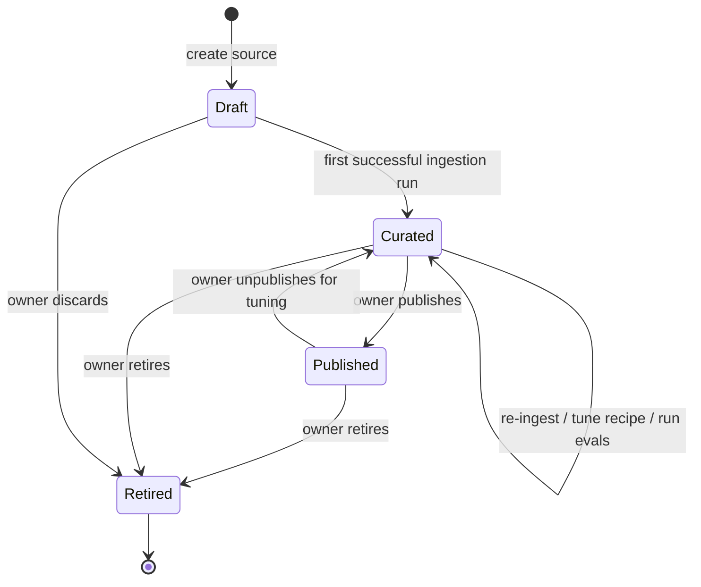

# Catalog

The catalog is the heart of retrieval-hub. Every other subsystem — MCP server, UI, query rewriter, ingestion, AI Assets integration — exists to put things into the catalog or get things out of it. If the catalog data model is wrong, everything else is wrong.

This document defines what a *source* is, what lives on a *card*, how sources are versioned, how they move through their lifecycle, and how the four heterogeneous v0 sources (Red Hat product docs, VA clinical practice guidelines, Wikipedia content, public code repos) all fit one model.

It does not describe SQL DDL. Schema-level details belong in `alembic/` migrations once we start writing code. What this document describes is the *shape* of the model — concrete enough to discuss, deliberately abstract enough to leave the storage implementation open.

## What a source is

A **source** is a published, recipe-documented retrieval surface backed by one or more physical indexes. It is the thing an agent asks questions of. It is the thing a source owner publishes. It is the thing a card represents.

A source is **not** a raw dataset. The dataset is the *origin*; the source is what you get after running the recipe over the dataset. You can have the same dataset behind multiple sources (e.g. one source built with a small embedding model for cheap recall, another built with a larger one for higher precision), and you can have one source whose underlying dataset gets refreshed nightly.

The single most important property is that a source carries **everything an agent or an agent developer needs to use it well**: the recipe, the eval scores, the sample prompts, and (where the owner has invested) the rewrite prompt. None of that is allowed to be tribal knowledge. If it's not on the card, it doesn't exist.

## Source families and retrieval patterns

retrieval-hub does not pretend that "RAG" means "vector search over chunked PDFs." A source is one of several *families*, and the family is a hard discriminator that drives which adapter handles retrieval, which **retrieval patterns** the source supports, and which fields are meaningful in the recipe.

The point of having a family is twofold. First, it lets the catalog represent heterogeneous data shapes — a tabular dataset with a SQL retrieval surface and a chunked-PDF corpus with a vector retrieval surface should both be first-class. Second, and more importantly, **it lets the MCP tool layer hide the heterogeneity behind consistent tools**. An agent asks for `k results for query Q against source S`, and the source's adapter — selected by family — knows whether to do a vector ANN search, a graph traversal, a SQL aggregation, or some hybrid. The agent does not have to know.

The families we are designing for in round 1 are:

- **`document`** — text or text-extracted-from-binary documents, chunked and embedded. Default retrieval pattern is vector ANN search over chunks. The Red Hat product docs and Wikipedia v0 sources are both in this family. Probably the largest single family in practice.
- **`clinical_document`** — a specialization of `document` for clinical / medical / regulated content. Same retrieval pattern, but ingestion uses domain-aware parsing (preserve section structure, recognize ICD codes, etc.) and the rewriter metadata is almost always populated heavily. The VA clinical practice guidelines source is here. Whether this is a true subtype or just `document` with a `domain` flag is one of the open questions.
- **`code`** — source code corpora. AST-aware chunking, code-tuned embeddings, file/symbol/repo-aware retrieval. Retrieval patterns include "find symbol by name," "find symbol by semantic description," and "find related symbols by call graph." The public-repos v0 source is here. This family likely forces its own adapter and may force its own embedding model serving.
- **`tabular`** — structured data with a retrieval surface that supports filter / aggregate / reason-over rather than pure semantic search. Retrieval patterns include constrained text-to-SQL, typed query DSL, and "describe-then-fetch" (LLM names columns + filters, adapter executes). No v0 source yet committed; one is needed before we lock the design (see Open Questions).
- **`graph`** — explicit graph stores or graph-shaped data (entity/relationship). Retrieval patterns are typically *hybrid*: vector search to find entry nodes, then graph traversal N levels deep, then return chunks plus relationships as a structured JSON payload. This is the canonical illustration of "the tool hides the complexity": the agent asks for `k things` and the adapter does the find-then-crawl behind the scenes. See "Retrieval patterns" below.
- **`external`** — a connection to a retrieval system that retrieval-hub does not own (someone else's Elasticsearch, a hosted vector DB, a corporate search API). Retrieval patterns are whatever the external system supports, projected through the adapter into our normalized result shape. The card describes the external system, the recipe is mostly metadata, and the adapter is a thin client.

The family is fixed at source creation time. You don't migrate a source from `document` to `code`; you create a new source.

## Retrieval patterns

A *retrieval pattern* is a named, parameterized way the adapter can answer the question "give me the most relevant N results for this query against this source." A family declares which patterns it supports and which is the default. The recipe pins the parameters.

The point of naming patterns explicitly — rather than hiding them inside the adapter as private implementation — is that **the catalog needs to advertise what each source can actually do**, so the MCP tool layer can dispatch correctly and so an agent (or an agent developer) can ask "does this source support graph traversal?" without reading the adapter source code.

The round-1 named patterns:

- **`vector_ann`** — pure approximate nearest-neighbor over an embedding index. Parameters: `top_k`, `score_threshold`. Default for `document` and `clinical_document`.
- **`vector_with_filters`** — ANN with structured filters applied (date range, source URL prefix, document type, etc.). Parameters: `top_k`, plus a typed filter object. Available on any family whose backend supports it.
- **`graph_traverse_from_seed`** — vector ANN finds N entry nodes, then graph traversal walks K levels deep collecting related nodes and edges. Returns chunks **and** relationships in one normalized response. Parameters: `seed_top_k`, `traversal_depth`, `max_total_nodes`, optional `relationship_types_filter`. Default for `graph`.
- **`structured_query`** — adapter accepts a typed query (for `tabular`, this might be a constrained text-to-SQL or a typed filter+aggregate object) and returns rows projected as RetrievalResult items. Parameters: family-specific.
- **`hybrid`** — explicit composition: run two or more patterns and merge/dedupe/rerank. The recipe declares which patterns and the merge policy.
- **`passthrough_external`** — adapter forwards the query to an external retrieval system using its native API and projects the response. Used by `external` family.

The key invariant is that **every pattern returns a normalized `RetrievalResult` shape** to the MCP layer: a list of items, each with a `text` (or `text_with_structure` for graph results), a `score`, a `source_uri`, structured `metadata`, and the lineage handle (`physical_index_id`, `recipe_version`). Graph results additionally carry a `relationships` field — an array of `(from, to, relationship_type, weight)` tuples — which agents can ignore if they only want the chunk text. This is what lets the tool layer be consistent across families.

A source's recipe declares:

```yaml
retrieval:
  default_pattern: vector_ann
  supported_patterns:
    - vector_ann
    - vector_with_filters
  parameters:
    vector_ann:
      top_k_default: 10
      top_k_max: 50
    vector_with_filters:
      top_k_default: 10
      top_k_max: 50
      filter_schema_id: doc_filter_v1
```

For a graph source it might look like:

```yaml
retrieval:
  default_pattern: graph_traverse_from_seed
  supported_patterns:
    - graph_traverse_from_seed
    - vector_ann
  parameters:
    graph_traverse_from_seed:
      seed_top_k_default: 5
      seed_top_k_max: 20
      traversal_depth_default: 2
      traversal_depth_max: 4
      max_total_nodes_default: 50
      max_total_nodes_max: 200
      relationship_types_default: []   # all types
```

The MCP tool layer reads these declarations to know what patterns are available and what parameters they accept. When the agent calls a retrieval tool against a graph source with `k=20`, the tool looks at `default_pattern: graph_traverse_from_seed`, validates `k` against `seed_top_k_max`, and dispatches to the adapter — which does the find-then-crawl and returns the structured result. The agent never had to know the source was graph-shaped unless it asked.

## A source, sketched

Conceptually, a source looks like this. The shape is YAML-ish to make it readable; the actual storage is relational (Postgres) with the typed fields normalized and the recipe stored as a versioned JSON blob.

```yaml
id: src_01HXY...                       # opaque id, generated
slug: rh-product-docs                   # url-safe, owner-chosen, unique
name: "Red Hat Product Documentation"
family: document
status: published                       # draft | curated | published | retired
visibility: public                      # public | restricted

owner:
  team: platform-docs
  contacts: ["alice@example.com"]
maintainers: ["bob@example.com"]

description_short: |
  Public Red Hat product documentation, chunked and embedded for
  semantic retrieval. Covers OpenShift, RHEL, Ansible, and OpenShift AI.
description_long: |
  (markdown — full description, intended audience, gotchas, etc.)

known_limitations: |
  Corpus freeze date is December 2024. Pediatric sections are
  incomplete for most conditions.

recipe:
  version: 3                            # bumped on any field change
  parser:
    kind: docling
    options: { ... }
  chunker:
    kind: semantic
    chunk_size_tokens: 512
    overlap_tokens: 64
  embedding:
    model: nomic-embed-text-v1.5
    dimension: 768
    served_by: vllm                      # logical handle to the vLLM endpoint
  backend:
    kind: pgvector
    table: idx_rh_product_docs_v3

retrieval:
  default_pattern: vector_ann
  supported_patterns: [vector_ann, vector_with_filters]
  parameters:
    vector_ann:
      top_k_default: 10
      top_k_max: 50
    vector_with_filters:
      top_k_default: 10
      top_k_max: 50
      filter_schema_id: doc_filter_v1

physical_indexes:
  - id: pidx_01HXZ...
    recipe_version: 3
    backend_kind: pgvector
    location: idx_rh_product_docs_v3
    built_at: 2026-04-01T12:00:00Z
    document_count: 184302
    health: ok

sample_prompts:
  - applies_to: granite-3-*
    role: system
    text: |
      You are answering questions about Red Hat products using
      retrieved documentation. Cite the doc title and section.
  - applies_to: llama-3.3-*
    role: system
    text: |
      ...

evals:
  # Retrieval-only runs (one per evaluated LLM)
  - llm: granite-3.3-8b-instruct
    suite: rh-docs-eval-v2
    suite_version: 2
    suite_type: retrieval
    scores: { recall_at_5: 0.81, mrr: 0.74 }
    run_at: 2026-04-02T03:14:00Z
  - llm: gpt-4o
    suite: rh-docs-eval-v2
    suite_version: 2
    suite_type: retrieval
    scores: { recall_at_5: 0.86, mrr: 0.79 }
    run_at: 2026-04-02T03:18:00Z

  # End-to-end run (pinned LLM, carries both retrieval and RAGAS metrics)
  - llm: granite-3.3-8b-instruct
    suite: rh-docs-e2e-eval
    suite_version: 1
    suite_type: end_to_end
    scores:
      recall_at_5: 0.81
      mrr: 0.74
      faithfulness: 0.88
      answer_relevancy: 0.83
      answer_correctness: 0.79
      context_precision: 0.72
      context_recall: 0.81
      e2e_pinned_llm: granite-3.3-8b-instruct
      e2e_pinned_llm_version: v2026.04
    run_at: 2026-04-15T03:14:00Z

rewriter_metadata:
  enabled: true
  vocabulary_mappings: []                 # heavier on clinical_document sources
  domain_notes: |
    Red Hat product documentation. Prefer official product names
    (Red Hat Enterprise Linux, not "RHEL") in reformulated queries.
  sample_queries:
    - raw: "how do I set up a build pipeline"
      good_rewrites:
        - "OpenShift Pipelines Tekton PipelineRun configuration"
  schema_hints: null                       # not applicable for document family
  prompt_override_id: null                 # uses the shared core rewriter
  llm_resolution: default                  # default | caller_required | caller_optional
  default_llm: granite-3.3-8b-instruct
  max_rewrites: 5

agent_write_policy:
  allowed: false                           # default for curated public sources
  scope_required: sources.write
  allowed_groups: []
  write_modes: []                          # append | upsert | annotate
  write_validation: null                   # optional schema or content checks

lineage:
  origin:
    kind: web_crawl
    config: { roots: ["https://docs.redhat.com/..."], ... }
  refresh:
    cadence: weekly
    last_refresh_at: 2026-04-01T11:30:00Z
    last_refresh_run_id: run_01HXY...
  ingestion_runs: [ ... ]                # bounded history; full history in audit log

responsible_use:
  intended_use:
    primary_use: "RAG context for agents answering clinical guideline questions from VA/DoD healthcare providers"
    secondary_uses:
      - "Clinical decision support reference for formulary questions"
      - "Training data curation for clinical NLP models"
    out_of_scope_uses:
      - "Direct patient-facing medical advice without clinician review"
      - "Pediatric treatment planning"
      - "Non-US clinical practice guidance"

  measurement_technique: |
    Expert committee consensus guidelines developed by VA/DoD Evidence-Based
    Practice Work Groups. Each guideline undergoes systematic literature review,
    evidence grading (GRADE methodology), committee deliberation, and external
    peer review. Guidelines are updated on a 3-5 year cycle.

  interpretation_guardrails:
    - guardrail: "This source does not contain post-2024 clinical guidelines"
      severity: error
      explanation: "The corpus freeze date is December 2024. Queries about guidelines updated after that date will return stale or missing results."
    - guardrail: "Pediatric dosing information is incomplete"
      severity: warning
      explanation: "The VA guidelines primarily cover adult populations. Pediatric dosing sections exist for some conditions but are not comprehensive."
    - guardrail: "Drug interaction data should be cross-referenced"
      severity: info
      explanation: "Interaction tables are present but sourced from 2022 reference data. Cross-reference with a current drug interaction database for clinical decisions."

  supported_conclusions:
    - conclusion: "Treatment recommendations for adult hypertension management"
      basis: "Comprehensive VA/DoD CPG with evidence grading, updated 2023"
    - conclusion: "First-line medication classes for type 2 diabetes"
      basis: "Full pharmacotherapy chapter with RCT citations"

  unsupported_conclusions:
    - conclusion: "Pediatric treatment protocols"
      category: scope
      reason: "Guidelines are adult-focused; pediatric sections are incomplete"
    - conclusion: "Cost-effectiveness comparisons between treatment options"
      category: methodological
      reason: "Guidelines assess clinical efficacy, not economic outcomes"
    - conclusion: "Applicability to non-US healthcare systems"
      category: scope
      reason: "Guidelines reflect VA/DoD formulary and US clinical practice norms"

  population_coverage:
    target_population: "US military veterans and active-duty service members"
    sampling_frame: "VA/DoD clinical practice guideline development committees"
    estimated_coverage: "Adult populations served by VA and DoD healthcare systems"

  excluded_populations:
    - "Pediatric patients (< 18 years) except where explicitly noted"
    - "Non-US patient populations"
    - "Patients with rare conditions not covered by existing CPGs"

  data_suppression_rules:
    - rule: "Patient identifiers removed from all case examples"
      method: "De-identification per HIPAA Safe Harbor"

access:
  visibility: public
  allowed_identities: []                  # empty = anyone authenticated
```

The card the UI shows is a projection of this record. Not everything on the source is on the card surface — `physical_indexes` and `lineage.ingestion_runs` are owner-facing detail, not browse-time data.

The `suite_type` field on each eval entry lets the card projection distinguish retrieval-only runs from end-to-end runs. When end-to-end runs are available, the card shows the most recent end-to-end run's `answer_correctness` and `faithfulness` as headline scores. Sources without end-to-end evals continue to show retrieval-only scores.

End-to-end eval suites carry an `e2e_config` block that controls the generation step:

```yaml
e2e_config:
  use_pinned_llm: true
  generation_prompt_source: source_sample_prompts
  max_answer_tokens: 512
  temperature: 0.0
```

`e2e_config` is present only on end-to-end eval suites. `use_pinned_llm: true` signals the eval orchestrator to use the cluster-level pinned model for the generation step, rather than a per-suite or per-run model. `generation_prompt_source: source_sample_prompts` tells the orchestrator to use the source's own sample prompts as the system prompt, making the eval realistic. `max_answer_tokens` and `temperature` control generation parameters for reproducibility.

## Responsible use metadata

The `responsible_use` block on the source record groups fields that help consumers assess fitness-for-use *before* querying a source. These fields complement the eval scores (which measure pipeline performance) with source-level documentation of what the data can and cannot support. All fields in this block are optional but recommended, especially for sources in regulated domains.

**`interpretation_guardrails`** are the most novel field. Each guardrail carries a severity level that signals how dangerous it is to ignore:

- `error` means ignoring this constraint will produce invalid results. The MCP layer could surface error-level guardrails in retrieval responses, and agents could check them before relying on results.
- `warning` means results may be unreliable in the described area.
- `info` is supplementary caution: worth knowing, unlikely to invalidate results.

**`supported_conclusions`** and **`unsupported_conclusions`** with category tagging (`scope`, `temporal`, `methodological`, `interpretive`) enable programmatic filtering. An agent or tool can check whether a proposed query falls within the source's supported scope before issuing a retrieval call. The categories let tooling distinguish "this source doesn't cover that topic" (scope) from "this source covers the topic but the data is too old" (temporal) or "the methodology doesn't support that kind of inference" (methodological).

**`population_coverage`** and **`excluded_populations`** are critical for regulated domains. The data card framework literature notes that exclusions are often more important than inclusions for analytical validity. A source that covers "US military veterans" says something useful; a source that explicitly excludes "pediatric patients" and "non-US populations" says something essential.

**`measurement_technique`** describes how the upstream data was created. This is distinct from `lineage.origin`, which describes how retrieval-hub fetched it. `lineage.origin` might say "web crawl from healthquality.va.gov"; `measurement_technique` says "expert committee consensus using GRADE methodology." The data card framework literature calls this the "epistemological foundation" of the dataset.

**`data_suppression_rules`** document any redaction or anonymization applied to the source content. For clinical sources this typically means HIPAA-compliant de-identification; for other domains it might mean PII scrubbing or confidential-business-information redaction.

**`intended_use`** is a structured object replacing any free-text intended-use field. It separates primary use, secondary uses, and out-of-scope uses into distinct fields so that tooling can check programmatically whether a proposed application falls within the source owner's intended scope.

**`card_completeness`** is a computed field (not owner-written) that tracks how completely the card is filled in. It carries four subfields: `overall` (fraction of all recommended fields populated), `mechanical` (completion rate for name, slug, family, recipe, lineage fields), `judgment` (completion rate for guardrails, intended use, limitations, population coverage, conclusions), and `missing_fields` (a list of field names not yet populated, visible to owners). The mechanical/judgment split matters because mechanical fields can be auto-populated or validated by linters, while judgment-intensive fields require domain expertise and are the ones most likely to be left blank.

## Recipes are versioned, physical indexes are realizations

A **recipe** is the parameterization of how the source is built: parser, chunker, embedding model, backend choice, and any source-family-specific knobs. The recipe lives on the source as a versioned object — every meaningful change bumps the version.

A **physical index** is a built realization of one recipe version against one snapshot of the underlying data. Physical indexes carry their own ids, their own backend locations, their own build timestamps, and a pointer to the exact recipe version they were built from.

This separation matters because:

- **Refreshing the data does not change the recipe.** A weekly Wikipedia refresh produces a new physical index (or replaces the existing one in place, depending on backend) without bumping the recipe version. The card surface stays stable.
- **Tuning the recipe does not silently overwrite production.** Bumping `chunk_size_tokens` from 512 to 384 creates recipe v4. The owner can build a v4 physical index in parallel with the v3 production index, run evals, A/B them, and only flip over when v4 wins.
- **Lineage is always answerable.** Given a retrieval result, we can name the physical index it came from, the recipe version that built it, and the data snapshot it covers. No silent drift.

The data model is therefore: one logical source → one or more recipe versions → one or more physical indexes per recipe version. The card and the agent talk about the *logical source*. The adapter layer is what knows how to pick the right physical index at retrieval time.

That picking policy needs to be explicit. Round 1 default: **the logical source has a single `active_index` pointer**, set by the owner. Multi-index A/B and traffic splitting are real features but they're round 2.

### Automated recipe tuning (considered)

Picking good recipe parameters by hand is the highest-friction step in source creation. A source owner has to choose a chunker, chunk size, overlap, embedding model, top-k, and (sometimes) a reranker, mostly by guessing at what will work for their corpus. Same problem comes back periodically as the corpus drifts, the embedding model gets superseded, or a better recipe becomes available.

We are considering — *not yet committing to* — an integration with [AutoRAG](https://github.com/Marker-Inc-Korea/AutoRAG), an open-source AutoML-style optimizer for RAG pipelines, as the engine behind an optional **recipe tuning** capability. The two moments we'd use it are at source creation time (find a good initial recipe) and periodically as the source drifts (re-tune against the new state of the world). Both use the same machinery: declare a search space, run AutoRAG against the corpus, get back a recommended recipe and a scoreboard, present it to the source owner as a diff against their current recipe, let them decide.

The integration is scoped to `document` and `clinical_document` family sources (AutoRAG's modules are document-focused). It runs as a subprocess sidecar container, never as an in-process import — keeping retrieval-hub's dependency surface and FIPS posture clean. Promotion of a recommended recipe is always a human action; AutoRAG suggests, the source owner decides, the catalog produces a new recipe version.

The full design lives in [`integrations/autorag.md`](integrations/autorag.md). Until we wire it up, this section is an option, not a feature.

## Rewriter metadata

The query rewriter is the differentiator (see [`query-rewriter.md`](query-rewriter.md)). The way it works is **not** "every source author writes a custom rewrite prompt from scratch" — that bar is too high and most sources would never get one. Instead, retrieval-hub ships a **shared core rewriter** (one carefully-engineered prompt template), and each source contributes **metadata** that gets injected into the shared template at call time.

The metadata a source declares for the rewriter is a first-class field on the source record:

- **`vocabulary_mappings`** — pairs of `(lay_term, canonical_term)` that the rewriter uses to translate user phrasing into corpus phrasing. For VA clinical guidelines, this is where the heavy lifting happens: `"high blood sugar" → "hyperglycemia"`, `"blood pressure" → "hypertension"`, expansion of acronyms, recognition of common patient phrasings. For Red Hat docs, it's lighter: `"RHEL" → "Red Hat Enterprise Linux"` and a few product-name canonicalizations.
- **`domain_notes`** — a short markdown blob describing what kind of content this source holds and how queries against it should be phrased. Think "the README for a query author." This is what gives the shared rewriter the situational awareness to know whether it's reformulating clinical questions or technical documentation queries.
- **`sample_queries`** — a small set of `(raw_query, good_rewrites)` examples drawn from real or synthetic user questions. The rewriter uses these as few-shot examples in the shared template. This is the lowest-effort way for a source owner to *shape* the rewriter's behavior without writing a prompt — they just curate good examples.
- **`schema_hints`** — for `tabular` family sources, a structured description of the schema and which columns are query-relevant. For other families, null.
- **`prompt_override_id`** — optional reference to a per-source override prompt object for the unusual case where the shared core rewriter is genuinely insufficient. This is the **exception**, not the default. A source owner should reach for `vocabulary_mappings` and `sample_queries` first.
- **`llm_resolution`**, **`default_llm`**, **`max_rewrites`** — runtime parameters described in [`query-rewriter.md`](query-rewriter.md).

The point of this design: enabling rewriting on a source should be a **declarative** action. The owner declares what their corpus looks like; the shared rewriter handles the prompt-engineering plumbing. When the shared rewriter is good enough — and for most sources it should be — owners get the differentiator for free. When it isn't, the override path exists but is not the happy path.

## Agent writes

retrieval-hub allows agents to write data into existing sources via MCP, scoped by source-level policy and auth. This is **data writes**, not catalog mutation: an agent can add a document, append a row, annotate an existing chunk — but an agent cannot create a new source, edit a recipe, change retrieval parameters, publish, or retire. Those are human actions, performed through the UI or CLI by an authenticated human identity.

The boundary is "data into existing curated sources, yes; changing the curation itself, no." This is what makes the agent-write surface safe to expose: the trust gates of the catalog (who owns this source, what's its eval score, who's allowed to query it) are still set by humans, and agents operate within those gates.

The write policy is a property of the source:

```yaml
agent_write_policy:
  allowed: true                       # default false on most curated sources
  scope_required: sources.write       # auth scope the caller must hold
  allowed_groups: ["clinical-agents"] # caller's identity_groups must intersect (empty = anyone with the scope)
  write_modes: [append, annotate]     # subset of: append | upsert | annotate
  write_validation:                   # optional schema or content checks
    schema_id: clinical_note_v1
    require_provenance: true
```

The three write modes are deliberately different operations with different semantics:

- **`append`** — add a new document / chunk / row / node to the source. The simplest case. The new item gets ingested through the same recipe the source was built with, embedded with the same embedding model, and stored alongside everything else. For graph sources, append can also create new edges.
- **`upsert`** — write a document/row identified by an external `key` field; if a document with that key already exists, replace it (and re-embed). Used by sources that mirror external systems where the external system is the source of truth and retrieval-hub is a queryable projection.
- **`annotate`** — attach structured metadata or a free-form note to an existing chunk/row/node *without* changing the underlying content. Useful for human-in-the-loop and agent-feedback workflows: an agent flags a chunk as "verified relevant" or "stale" and the annotation rides with the chunk on future retrievals.

Writes go through the same source adapter the read path uses, so the adapter is what enforces validation, schema checks, and embedding consistency. They are **not** an end-run around the recipe — an `append` to a `vector_ann` source still gets parsed by the recipe's parser, chunked by the recipe's chunker, and embedded by the recipe's embedding model. This is what keeps the source coherent.

Every agent write produces an **audit record** carrying the caller identity, the source id, the write mode, the new item id(s), the recipe version that processed it, and a request id. The audit record is queryable and shows up in the source detail view's lineage tab. Source owners can see exactly who has written what to their source.

By default, `agent_write_policy.allowed` is **false**. A source owner has to explicitly opt a source into agent-writability. The default is read-only, but read-only is no longer the only option — the absolute restriction from the round 1 draft of this doc was wrong.

## Source lifecycle

Sources move through four states. The transitions are deliberate; nothing happens automatically except by an explicit action from an owner or an ingestion run.



- **`Draft`** — the source exists in the catalog but has no physical index yet. Recipe is being authored. Not visible to agents. Visible in the UI only to the owner and maintainers.
- **`Curated`** — at least one physical index exists. The owner is iterating: re-ingesting, tuning the recipe, running evals, drafting the rewrite prompt. Not visible to agents. Visible in the UI to the owner, maintainers, and platform admins.
- **`Published`** — the source is visible to agents through MCP, listed in the catalog, and registered with AI Assets if integration is enabled. Publishing requires (a) at least one healthy physical index, (b) at least one eval run with results recorded, and (c) at least one sample prompt. Those minimums are enforced by the publish action, not by hope. End-to-end eval runs are not required for the publish gate; at least one retrieval-only eval run remains the requirement. When end-to-end runs exist, their scores appear on the card alongside retrieval scores, giving consumers a fuller picture.
- **`Retired`** — no longer maintained. Hidden from default catalog views and from the agent-facing list. Existing retrieval calls against a retired source return a structured "retired" error so agents can handle it gracefully. The data and history are preserved for lineage and audit.

Publishing is intentionally a heavyweight action. The whole point of the catalog is that *published* means "you can trust this," which only works if publish has teeth.

## How the four v0 sources fit

The data model is the right shape if it expresses all four v0 sources without contortion. Here's how each one lands.

**Red Hat product docs** — `family: document`, default retrieval pattern `vector_ann`. Docling-parsed, semantically chunked at ~512 tokens with ~64 overlap, embedded with a general-purpose text embedding model, stored in pgvector. Sample prompts per LLM family. Eval suite based on synthetic Q&A generated from the docs themselves. Rewriter enabled with light metadata: a few product-name canonicalizations (`"RHEL" → "Red Hat Enterprise Linux"`, etc.) and a small set of sample queries. Red Hat docs are written in fairly literal language, so the rewriter's win is smaller than for clinical content.

**VA clinical practice guidelines** — `family: clinical_document`, default retrieval pattern `vector_ann`. Same general shape as `document` but with a structure-preserving parser that keeps section hierarchy intact and a chunker that respects clinical section boundaries. The rewriter metadata is heavy: extensive `vocabulary_mappings` (lay → clinical terminology), expansion of common acronyms, recognition of patient phrasings of clinical conditions, and curated `sample_queries` for the most common question types. The shared rewriter, fed this metadata, should produce clinical-vocabulary reformulations of lay-language questions. This is the source where the rewriter most clearly justifies its existence, and we should treat it as the proving ground for the differentiator.

**Wikipedia content** — `family: document`. Specifically a curated subset, not "all of Wikipedia" — we pick a real, useful slice (e.g. articles in a particular topic area) so the eval and the use case stay concrete. The interesting design pressure here is *refresh*: Wikipedia changes constantly, so this source exercises the lineage / refresh cadence machinery harder than the Red Hat docs source does.

**Public code repos** — `family: code`. This is the source that pushes the data model the hardest. AST-aware chunking (chunk by function / class, not by token), a code-tuned embedding model (possibly different from the text one), and retrieval results that include file path, symbol name, and surrounding context, not just a chunk of text. The recipe shape under `family: code` will look noticeably different from `family: document`, which is fine — that's what families are for. We need to be honest about whether we ship the code adapter in v1 or defer it.

If any of these four can't be expressed cleanly, the model is wrong and we re-cut it.

## What's on a card vs. what's in the source

The card is the *browse-time* surface. The full source record is the *owner-time and detail-time* surface. Mixing the two is the most common mistake in catalog UIs.

**On the card (browse view):**
- Name, slug, family, status
- Short description
- Owner team
- Embedding model name, chunk size, backend kind (the headline recipe facts)
- Top-line eval scores (one row per LLM evaluated)
- "Rewrite available" badge
- Last refresh timestamp
- Visibility / access summary

**On the detail page (one click in):**
- Long description (markdown)
- Full recipe, with version history
- Full retrieval pattern declaration (supported patterns, parameters, defaults)
- All physical indexes, their build times, their health
- All sample prompts, per LLM family
- Full eval results, all suites, all runs
- Rewriter metadata (vocabulary mappings, sample queries, domain notes), and a "test" affordance
- Agent write policy (allowed modes, allowed groups, validation, recent write activity)
- Lineage: origin, refresh cadence, refresh history
- Access policy
- Audit trail of state transitions and agent writes

The MCP `get_source` shape (whatever the tool ends up being called — see [`mcp-server.md`](mcp-server.md)) returns the *card* projection by default, with an optional flag to fetch the full record. Agents almost never need the full record; agent developers writing system prompts do.

## Ownership boundary with platform capabilities

When retrieval-hub runs on a cluster that has LlamaStack, MLflow, and (eventually) Kagenti, several catalog fields become **projections of state held authoritatively in those platform systems**, while other fields stay authoritative on the retrieval-hub side. The split is consistent: runtime / hot-path / security state stays in the catalog (Postgres); experiment-history / comparison / prompt-evolution state lives in the platform systems with cached projections in the catalog for fast display.

The full per-field tables live in the integration docs ([`integrations/mlflow.md`](integrations/mlflow.md), [`integrations/llamastack.md`](integrations/llamastack.md), [`integrations/kagenti.md`](integrations/kagenti.md)). The catalog-side summary:

| Catalog field | Source of truth | Notes |
|---|---|---|
| Source identity (id, slug, family, status) | retrieval-hub Postgres | Hot path; security boundary |
| Recipe (parser, chunker, embedding, backend, retrieval patterns) | retrieval-hub Postgres | Hot path; ingestion reads it |
| Active physical index pointer | retrieval-hub Postgres | Hot path; retrieval reads it |
| Owner, maintainers, access policy, agent_write_policy | retrieval-hub Postgres | Security boundary |
| Per-source `rewriter_metadata` (vocabulary, samples, domain notes, schema) | retrieval-hub Postgres | Strongly typed; hot path; typed UI editor |
| Lineage of state transitions and agent writes | retrieval-hub Postgres | Audit |
| Eval suite definition (the catalog object) | retrieval-hub Postgres | The "what to evaluate" |
| Eval test cases (the actual cases) | **MLflow dataset** when present, MinIO Parquet when absent | Versioned in MLflow when available |
| Eval run history (full per-run metrics, parameters) | **MLflow run** when present, retrieval-hub Postgres when absent | Catalog stores headline projection + lineage pointer |
| **Headline eval scores on the card** | **retrieval-hub Postgres** | Always — projection from whichever execution backend ran the eval. Core to the value proposition. |
| Eval execution (the actual metric computation) | **LlamaStack `/v1/eval` (Ragas)** when present, retrieval-hub native orchestrator when absent | The catalog never holds metric-computation logic; it holds the result |
| End-to-end eval headline scores (answer_correctness, faithfulness) | **retrieval-hub Postgres** (projected from EvalRun, same as retrieval scores) | Same projection pattern as retrieval headline scores |
| End-to-end eval execution | **LlamaStack `/v1/eval` (Ragas)** when present, retrieval-hub native with bundled Ragas when absent | Uses cluster-pinned model for generation step |
| Pinned model configuration | **retrieval-hub admin config** | Cluster-level setting consumed by end-to-end eval orchestrator |
| `rewrite_lift` metric | **retrieval-hub** (computed in our code from two-run delta) | Always |
| Shared rewriter template (text + version history) | **MLflow prompt registry** when present, core library file when absent | Catalog caches active version pointer |
| Per-source override prompts (rare) | **MLflow prompt registry** when present, retrieval-hub Postgres when absent | Same pattern as shared template |
| Sample prompts per LLM family | retrieval-hub Postgres | Strongly tied to source identity |
| Recipe tuning run history (when AutoRAG is wired) | **MLflow run** when present, retrieval-hub MinIO when absent | See [`integrations/autorag.md`](integrations/autorag.md) |
| Workload identity for in-cluster agents | **SPIFFE/SPIRE via Kagenti** when present, OAuth client_credentials when absent | We consume; we never issue in Kagenti mode |
| Tenant boundary | **Kubernetes namespace via Kagenti** when present, `"default"` when absent | Namespace-as-tenant per [`integrations/kagenti.md`](integrations/kagenti.md) |

The pattern is consistent across the table: **the catalog is authoritative for what users see and what the runtime checks; the platform systems are authoritative for history, comparison, identity issuance, and infrastructural concerns**. Every field that delegates to a platform system has a documented standalone fallback so retrieval-hub remains runnable on clusters without that system.

### Tenant id source under Kagenti

When running under Kagenti, the `rh_tenant` claim — which has been reserved as `"default"` since round 1 — is populated from a namespace annotation:

```yaml
apiVersion: v1
kind: Namespace
metadata:
  name: clinical-agents
  annotations:
    retrieval-hub.redhat.com/tenant-id: "clinical-team-prod"
```

If the annotation is absent, the namespace name itself is used as the tenant id. Cross-tenant access is **not supported** under Kagenti, mirroring Kagenti's own posture. Source-level access policy can use `rh_tenant` as one of the inputs alongside `rh_identity_groups` for sources that should be tenant-scoped.

In non-Kagenti deploys, `rh_tenant` stays at `"default"` and policy ignores it. The same source records and access checks work in both modes.

## Structured card export (JSON-LD)

Every source in the catalog can be exported as a self-describing JSON-LD document that maps retrieval-hub fields to standard vocabularies. This format is designed for machine consumption: an AI agent that needs to understand a source's full metadata, limitations, and quality scores can read the JSON-LD export rather than parsing the UI. Audit tooling can ingest the export to check compliance posture across all sources in the catalog.

The export is available via `GET /sources/<slug>/card.jsonld` and as a "Download Card" action on the detail page.

Three vocabulary layers provide the mapping:

- **Schema.org** for base metadata (name, description, creator, dates, measurement technique).
- **PROV-O** for provenance (where the data came from).
- **A custom `rh:` namespace** (`https://retrieval-hub.example.org/vocab/v1/`) for retrieval-hub-specific fields that have no standard equivalent (guardrails, eval scores, retrieval patterns).

### Vocabulary mapping

| retrieval-hub field | JSON-LD mapping |
|---|---|
| `name` | `schema:name` |
| `description_short` | `schema:description` |
| `owner_team` / `owner_contacts` | `schema:creator` |
| `created_at` | `schema:datePublished` |
| `updated_at` | `dct:modified` |
| `recipe.version` | `schema:version` |
| `measurement_technique` | `schema:measurementTechnique` |
| `known_limitations` | `rh:knownLimitations` |
| `intended_use` | `rh:intendedUse` |
| `interpretation_guardrails` | `rh:interpretationGuardrails` |
| `supported_conclusions` | `rh:supportedConclusions` |
| `unsupported_conclusions` | `rh:unsupportedConclusions` |
| `population_coverage` | `rh:populationCoverage` |
| `excluded_populations` | `rh:excludedPopulations` |
| `data_suppression_rules` | `rh:dataSuppressionRules` |
| `lineage.origin` | `prov:wasDerivedFrom` |
| `refresh_cadence` | `rh:updateCadence` |
| `card_best_score` | `rh:retrievalQuality` |
| `card_answer_quality` | `rh:answerQuality` |
| `family` | `rh:sourceFamily` |
| `retrieval.supported_patterns` | `rh:retrievalPatterns` |
| `card_completeness` | `rh:cardCompleteness` |

### Example export

A complete JSON-LD export for the VA clinical guidelines source:

```json
{
  "@context": {
    "schema": "https://schema.org/",
    "dct": "http://purl.org/dc/terms/",
    "prov": "http://www.w3.org/ns/prov#",
    "rh": "https://retrieval-hub.example.org/vocab/v1/"
  },
  "@type": "schema:Dataset",
  "schema:name": "VA Clinical Practice Guidelines",
  "schema:description": "VA/DoD clinical practice guidelines covering hypertension, diabetes, PTSD, and 12 other conditions.",
  "schema:creator": {
    "@type": "schema:Organization",
    "schema:name": "clinical-informatics",
    "schema:email": "alice@example.com"
  },
  "schema:datePublished": "2026-01-15",
  "dct:modified": "2026-04-08",
  "schema:version": "3",
  "schema:measurementTechnique": "Expert committee consensus guidelines developed by VA/DoD Evidence-Based Practice Work Groups using GRADE methodology with systematic literature review and external peer review.",
  "rh:sourceFamily": "clinical_document",
  "rh:intendedUse": {
    "rh:primaryUse": "RAG context for agents answering clinical guideline questions from VA/DoD healthcare providers",
    "rh:secondaryUses": [
      "Clinical decision support reference for formulary questions",
      "Training data curation for clinical NLP models"
    ],
    "rh:outOfScopeUses": [
      "Direct patient-facing medical advice without clinician review",
      "Pediatric treatment planning",
      "Non-US clinical practice guidance"
    ]
  },
  "rh:knownLimitations": [
    "Corpus freeze date is December 2024",
    "Pediatric sections are incomplete for most conditions"
  ],
  "rh:interpretationGuardrails": [
    {
      "rh:guardrail": "This source does not contain post-2024 clinical guidelines",
      "rh:severity": "error",
      "rh:explanation": "The corpus freeze date is December 2024. Queries about guidelines updated after that date will return stale or missing results."
    },
    {
      "rh:guardrail": "Pediatric dosing information is incomplete",
      "rh:severity": "warning",
      "rh:explanation": "The VA guidelines primarily cover adult populations."
    }
  ],
  "rh:supportedConclusions": [
    {
      "rh:conclusion": "Treatment recommendations for adult hypertension management",
      "rh:basis": "Comprehensive VA/DoD CPG with evidence grading, updated 2023"
    }
  ],
  "rh:unsupportedConclusions": [
    {
      "rh:conclusion": "Pediatric treatment protocols",
      "rh:category": "scope",
      "rh:reason": "Guidelines are adult-focused; pediatric sections are incomplete"
    }
  ],
  "rh:populationCoverage": {
    "rh:targetPopulation": "US military veterans and active-duty service members",
    "rh:samplingFrame": "VA/DoD clinical practice guideline development committees",
    "rh:estimatedCoverage": "Adult populations served by VA and DoD healthcare systems"
  },
  "rh:excludedPopulations": [
    "Pediatric patients (< 18 years) except where explicitly noted",
    "Non-US patient populations"
  ],
  "rh:dataSuppressionRules": [
    {
      "rh:rule": "Patient identifiers removed from all case examples",
      "rh:method": "De-identification per HIPAA Safe Harbor"
    }
  ],
  "prov:wasDerivedFrom": {
    "@type": "prov:Entity",
    "schema:name": "VA/DoD Clinical Practice Guideline Repository",
    "schema:url": "https://www.healthquality.va.gov/"
  },
  "rh:updateCadence": "weekly",
  "rh:retrievalQuality": {
    "rh:bestRecallAt5": 0.74,
    "rh:bestLlm": "granite-3.3-8b-instruct",
    "rh:rewriteLift": 0.27
  },
  "rh:answerQuality": {
    "rh:answerCorrectness": 0.79,
    "rh:faithfulness": 0.88,
    "rh:pinnedLlm": "granite-3.3-8b-instruct"
  },
  "rh:retrievalPatterns": ["vector_ann", "vector_with_filters"],
  "rh:cardCompleteness": {
    "rh:overall": 0.92,
    "rh:mechanical": 1.0,
    "rh:judgment": 0.85
  }
}
```

### Regulatory compliance mapping

The table below maps regulatory requirements to the retrieval-hub fields that provide the documentation substrate each requirement calls for. This mapping is a reference for enterprise customers assessing compliance posture. retrieval-hub does not certify regulatory compliance, but the card fields provide the documentation that compliance requires. The JSON-LD export makes this documentation machine-readable for audit tooling.

| Regulation | Requirement | retrieval-hub field(s) |
|---|---|---|
| EU AI Act Article 10(2)(b) | Statistical properties of training data | `card_best_score`, `card_answer_quality`, eval metrics |
| EU AI Act Article 10(2)(f) | Bias examination procedures and outcomes | `population_coverage`, `excluded_populations`, `known_limitations` |
| EU AI Act Article 10(2)(a) | Data governance and management practices | `measurement_technique`, `lineage`, `recipe` |
| NIST AI RMF GOVERN 1.5 | Ongoing monitoring of AI data | `refresh_cadence`, eval re-run triggers, `card_answer_quality` |
| NIST AI RMF MAP 2.3 | Scientific integrity of data | `measurement_technique`, `supported_conclusions`, eval metrics |
| NIST AI RMF MEASURE 2.6 | Bias assessment | `population_coverage`, `excluded_populations`, `known_limitations` |
| NIST AI RMF MEASURE 2.7 | AI accuracy under deployment conditions | `supported_conclusions`, `interpretation_guardrails`, eval metrics |
| ISO/IEC 42001 Annex A.7 | Data for AI systems | All 12+ card fields, eval metrics |
| ISO/IEC 42001 Annex B.4 | Data provenance and lineage | `lineage`, `measurement_technique`, `prov:wasDerivedFrom` |
| ISO/IEC 5259-2 | Data quality dimensions | `card_best_score`, `card_answer_quality`, `card_completeness` |
| California AB 2013 | 12-category training data summary | Minimum card fields (name, description, creator, etc.) |
| Colorado SB 24-205 | Documented bias testing | `population_coverage`, `excluded_populations`, `interpretation_guardrails` |

## What's Decided

- **A source has a hard `family` discriminator** that selects the source adapter at retrieval time. The four families targeted in round 1 are `document`, `clinical_document`, `code`, and `tabular`, with `graph` and `external` as named slots that may or may not ship in v1. The family determines which **retrieval patterns** the source supports.
- **Retrieval patterns are named, declared on the source, and dispatched by the adapter.** The MCP tool layer uses the declaration to know what's available and what parameters apply. Patterns include `vector_ann`, `vector_with_filters`, `graph_traverse_from_seed`, `structured_query`, `hybrid`, `passthrough_external`. All patterns return a normalized `RetrievalResult` shape so the tool surface stays consistent across families.
- **Recipe is versioned, physical index is a realization.** Refreshing data does not bump the recipe version; tuning the recipe does.
- **One logical source → one active physical index, in v1.** Multi-index A/B and traffic splitting are round 2.
- **Lifecycle is `Draft → Curated → Published → Retired`** with explicit owner actions for each transition. Publishing requires a healthy physical index, at least one eval run, and at least one sample prompt — enforced, not asked.
- **Card is a projection of the source, not a separate object.** No drift between card and source possible.
- **The rewriter is shared core + source metadata.** Each source declares `rewriter_metadata` (vocabulary mappings, sample queries, domain notes, schema hints) that gets injected into a shared rewriter prompt template. Per-source override prompts exist as the exception, not the default.
- **Agents may write data into existing sources via MCP**, scoped by `agent_write_policy` on the source plus auth scope on the caller. Three write modes: `append`, `upsert`, `annotate`. **Catalog mutation** (create/edit/publish/retire) is not exposed to agents and remains a human action through the UI or CLI.
- **`agent_write_policy.allowed` defaults to `false`.** Agent-writability is opt-in per source.
- **The four v0 sources stay heterogeneous on purpose.** They are the data model's regression test.
- **Responsible use metadata is a structured, optional section on the source record.** Fields include `interpretation_guardrails` (with severity levels), `supported_conclusions` / `unsupported_conclusions` (with category tagging), `population_coverage`, `excluded_populations`, `measurement_technique`, `data_suppression_rules`, and a restructured `intended_use` object.
- **Every source has a JSON-LD structured export** (`GET /sources/<slug>/card.jsonld`) that maps card fields to Schema.org, PROV-O, and a custom `rh:` namespace. The export is designed for machine consumption by AI agents and audit tooling.
- **Card completeness is a computed field** tracking how completely the card is filled in, split into mechanical vs. judgment-intensive field completion rates.

## What's Open

- **`clinical_document` as a real family vs. a `domain` flag on `document`.** Round 1 leans toward "real family" because the parser, chunker, and rewriter-metadata weight are different enough to deserve their own adapter. Could collapse it later if reality disagrees.
- **Whether `code` ships in v1.** It's the hardest family to do well, and shipping it badly is worse than not shipping it. Possible compromise: ship a degraded `code` adapter in v1 (file-level chunking, generic text embeddings) and improve in v1.x.
- **The tabular retrieval surface.** No v0 tabular source committed yet. Until we pick one, the `tabular` family in this doc is a placeholder. Whatever we pick will likely force changes to `structured_query`.
- **Card cardinality of physical indexes.** "One active index per source" is the round-1 default but real A/B testing wants more, and it's likely to come up early.
- **Whether the shared rewriter prompt is one template or one-per-family.** Round 1 leans toward "one template that branches on family inside the prompt," but a small set of family-specific templates might end up cleaner once we test across the v0 sources.
- **`upsert` write mode semantics for graph sources.** Append-as-edge is clean; upserting nodes with stable external keys is clean; updating an edge in place is messier. Likely needs a real use case to design against.
- **Whether and when to wire up the AutoRAG-driven recipe tuning capability** described in "Automated recipe tuning (considered)" above. The design exists in [`integrations/autorag.md`](integrations/autorag.md); the decision to ship it is open. Most likely path: ship the v0 vertical slice without it, then add it as a v0.5 capability against the Red Hat docs source.
- **Storage shape of eval results.** Per-(LLM, suite, run) row is the obvious model, but we may need a richer eval object once we get into reranker scores, latency-by-LLM, cost-per-query estimates, etc. Round 2.
- **Audit trail location.** Inline on the source record or in a separate audit table. Probably separate, but not committed.
- **Whether `error`-severity interpretation guardrails should be surfaced in MCP retrieval responses automatically**, or whether agents should query guardrails separately before relying on results. Automatic surfacing is simpler for agent developers; separate querying keeps the retrieval response lean.
- **How to enforce or incentivize completion of judgment-intensive card fields** (guardrails, intended use, population coverage). Possible approaches: require them for the `Published` state, show card completeness on the admin dashboard, or rely on visibility and healthy pressure.
- **The `rh:` namespace URL** (`https://retrieval-hub.example.org/vocab/v1/`) is a placeholder. The production namespace needs a stable, resolvable URL.
