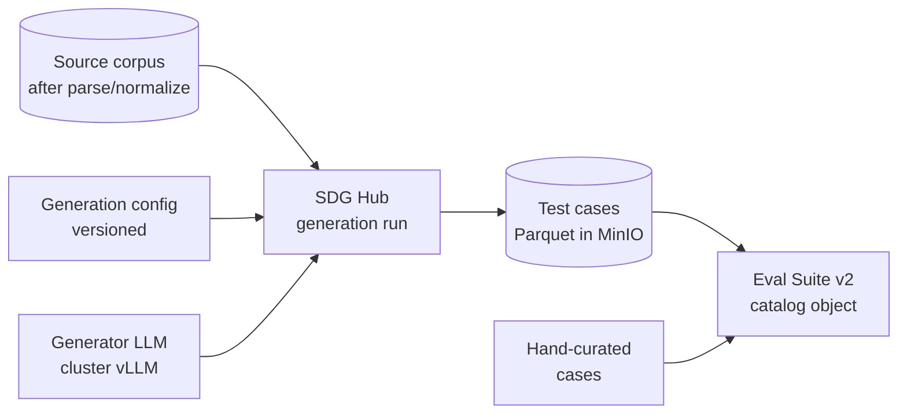
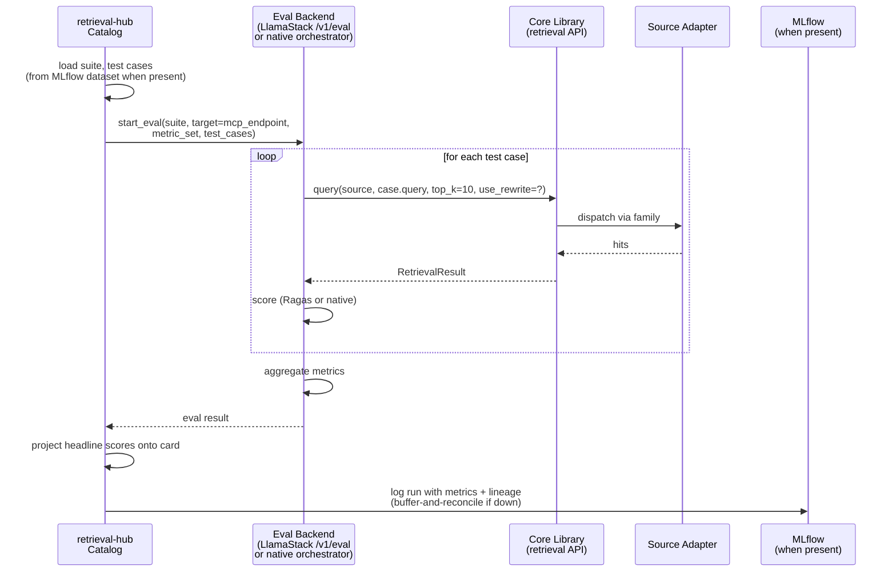

# Evaluation

A retrieval source is only as trustworthy as the evidence behind it. The catalog's headline promise — "every card carries eval scores so picking a source is a data-driven decision" — only works if those scores are produced systematically, with reproducible methodology, against multiple LLMs, and visibly attached to the source.

This document describes how that happens: what an *eval suite* is, how *eval runs* work, what metrics we report, where the rewrite-vs-no-rewrite delta comes from, and how evaluation gates the publish lifecycle. It also describes the boundary between retrieval-hub and any upstream eval framework (SDG Hub is the working assumption) so we are clear about what we own and what we consume.

## Why this matters

Most RAG implementations ship without real evals. The team picks parameters that "feel right," runs a handful of demo queries, and calls it good. When the agent fails on real questions later, nobody can answer "is this the embedding model, the chunker, the corpus, the LLM, or the rewriter?" because there's no baseline.

retrieval-hub's bet is the opposite: **publishing a source requires an eval run, and the results are visible on every card**. Comparing two sources is comparing eval scores. Comparing two recipes is comparing eval scores at different recipe versions. Proving the rewriter is earning its keep is comparing eval scores with rewrite enabled vs. disabled. The only way this works is if the eval system is real, repeatable, and tightly integrated with the lifecycle.

## What an eval suite is

An **eval suite** is a versioned, named, reusable collection of test cases against a particular *kind* of source. It is its own catalog object — created, owned, versioned, and audited like a source or a rewriter prompt. Multiple sources can share an eval suite (all `clinical_document` sources can be evaluated by `clinical-doc-eval-v2`); a source declares which suite it uses on its recipe.

Conceptually:

```yaml
id: eval_01HYZ...
slug: rh-docs-eval
name: "Red Hat Product Documentation Eval Suite"
version: 2
owner: platform-docs
description: |
  Synthetic Q&A pairs generated from Red Hat product docs, plus
  curated hand-written test cases. Covers OpenShift, RHEL, Ansible.

applies_to:
  family: document
  domain_hint: redhat-products

generation:
  source: synthetic
  generator: sdg-hub                       # or "manual" or "mixed"
  generated_at: 2026-03-15T00:00:00Z
  config_id: sdg_config_01HXX...           # frozen reference to the SDG config used

test_cases:
  count: 412
  storage_uri: minio://retrieval-hub-evals/rh-docs-eval-v2/cases.parquet
  schema: case_schema_v1

metrics:
  - recall_at_k: { ks: [1, 3, 5, 10] }
  - mrr: {}
  - ndcg_at_k: { ks: [5, 10] }
  - latency: { percentiles: [50, 95, 99] }
  - cost_estimate: { unit: tokens }
  - rewrite_lift: { compared_metric: recall_at_5 }

last_modified: 2026-03-15T12:00:00Z
```

The test cases themselves live in object storage as Parquet (or JSON for small suites), schema-validated by the suite's `schema` field. They are **not** stored inline in the catalog database, both because they can be large and because they're versioned independently from the suite metadata.

A test case shape (the `case_schema_v1`):

```yaml
id: case_01...
query: "how do I configure a Tekton pipeline to deploy to OpenShift"
intent: "how_to"                            # optional, for per-intent breakdowns
expected_documents:                         # ground truth — at least one of these should be retrieved
  - id: doc_id_or_uri
    relevance: 1.0
expected_passages:                          # finer-grained ground truth
  - document_id: ...
    section: "Triggering Pipelines"
    snippet: "..."
metadata:
  difficulty: medium
  source_of_case: synthetic                 # synthetic | curated | user_query_log
```

The shape is family-aware. A `code` family eval suite has test cases with `expected_symbols` instead of `expected_documents`; a `tabular` family has `expected_rows`. Each family has its own case schema, but the metric machinery (Recall@k, MRR, NDCG) operates on the same underlying "did we retrieve the expected items" abstraction.

## How an eval is generated

Most sources will not have hand-curated eval test cases. Hand-curating Q&A pairs against a corpus is real work and most owners won't do it. The path retrieval-hub designs around is **synthetic generation**, with hand-curation as an augmentation rather than a replacement.

The working assumption is **SDG Hub** ("Synthetic Data Generation Hub" — the Red Hat synthetic data tooling) as the upstream generator. SDG Hub takes a corpus, an LLM, and a generation config, and produces structured Q&A pairs with ground-truth pointers back into the corpus. Those pairs become the test cases for the eval suite.

The flow:



retrieval-hub does not implement synthetic generation itself. It calls SDG Hub (or whatever generator is configured) and stores the results. This keeps the responsibility boundary clean: the generator owns "make good test cases from a corpus," retrieval-hub owns "use the cases to evaluate sources and put scores on cards."

The generator interface is **pluggable**. Round 1 names two concrete candidates:

1. **SDG Hub** — the Red Hat synthetic data tooling. The natural fit for the RHOAI ecosystem; not yet wired up against a real corpus from retrieval-hub.
2. **AutoRAG's data creation pipeline** — the synthetic Q&A generator from the [AutoRAG project](https://github.com/Marker-Inc-Korea/AutoRAG), Apache 2.0, immediately runnable. Same role as SDG Hub from retrieval-hub's perspective: feed it a corpus, get back QA pairs in a known format. AutoRAG also offers a recipe optimization capability that we'd use independently — see [`integrations/autorag.md`](integrations/autorag.md). For the eval generation use case, we'd consume only the data-creation half.

The two are alternatives, not stacked. Either could be wired up; either could be the eventual default. The right choice for v0 is "whichever produces a usable QA dataset against the Red Hat docs source first." We're agnostic at the design level.

If neither is available, the working fallbacks are:

- **Hand-curated only** — small suites authored by the source owner, no synthetic generation. Fine for early development; doesn't scale.
- **Mining real query logs** — for sources that have been live for a while, the highest-value test cases are the ones real agents actually ask. Round 2 path; mentioned here so we don't paint ourselves into a corner.

## How an eval run works

An **eval run** is the execution of an eval suite against a specific physical index of a specific source, with a specific LLM, with the rewriter either enabled or disabled. The result is a row in the source's `evals` field carrying the metric scores.

Each run is identified by `(source_id, physical_index_id, eval_suite_id, eval_suite_version, llm, rewrite_enabled, run_at)`. That tuple is what makes results comparable: the same source, same index, same suite, same LLM with rewrite on vs. off is what produces the rewrite delta. Bumping any field produces a new comparable axis.

There are **three paths** for an eval run to land on a source card. The first two trigger execution; the third imports results that were computed elsewhere.

- **Delegated execution (production happy path when LlamaStack is present)** — retrieval-hub triggers eval execution in LlamaStack's `/v1alpha/eval` API with the **Ragas provider**, using the flow described in [`integrations/llamastack.md`](integrations/llamastack.md). retrieval-hub runs the retrieval itself, pre-populates `retrieved_contexts` in the dataset rows, and asks Ragas to score. This is the production happy path.
- **Native execution (standalone fallback)** — eval execution runs in retrieval-hub's own orchestrator inside the core library at `src/retrieval_hub/evaluation/`. Same metric set, computed in our code, against the same production retrieval path. Used on clusters where LlamaStack is not present.
- **Import (bring-your-own-eval)** — an eval run that happened **outside retrieval-hub's workflow** is imported into the catalog with lineage preserved. Examples: a LlamaStack eval triggered directly via the LlamaStack UI by a clinician reviewing a VA guideline corpus; a Ragas evaluation run from a researcher's notebook; a custom eval suite scored outside the cluster and submitted to retrieval-hub as a JSON payload. These are valid and useful — they should land on the card the same as any other eval result, tagged with their source so admins can see where the numbers came from.

All three paths produce the same `EvalResult` object in the catalog with the same field set; they differ only in the `execution_backend` field (`llamastack` / `native` / `imported`) and in how the run lineage is populated.

When **MLflow is present**, all three paths also log the run to MLflow (see [`integrations/mlflow.md`](integrations/mlflow.md)) so the full history-of-record is unified regardless of where execution happened.

### Eval result imports

The import path is what lets retrieval-hub **consume eval work done outside its own workflow**. This is important for three reasons:

1. **LlamaStack evals may happen independently.** An agent-runtime engineer may run LlamaStack evals against retrieval-hub sources as part of their agent development cycle, without triggering those runs through retrieval-hub's UI. We want those results on the source card anyway, so the developer who decides whether to use a source sees the full picture.
2. **External Ragas runs from notebooks.** Researchers commonly run Ragas evaluations in Jupyter notebooks, record the results as JSON/parquet, and want to publish them. A simple import endpoint (or CLI command) accepts their result and attaches it to the source.
3. **Air-gapped environments.** In clusters where LlamaStack can't reach retrieval-hub-mcp directly, an operator may run the eval on a jump host, export the result, and import it into retrieval-hub manually. The import path makes this possible without custom plumbing.

The import shape is a simple JSON payload:

```yaml
source_slug: va-clinical-guidelines
physical_index_id: pidx_01HXZ...          # optional; defaults to active
eval_suite_slug: va-cpg-eval
eval_suite_version: 2
llm: granite-3.3-8b-instruct
rewrite_enabled: true
run_at: 2026-04-08T03:14:00Z
execution_backend: imported
source_system: llamastack                  # where it was actually run
source_system_run_id: ls_run_01HXY...     # for provenance
scores:
  recall_at_5: 0.74
  mrr: 0.68
  faithfulness: 0.88
  answer_relevancy: 0.83
triggered_by: user:alice@example.com
import_notes: "Run by clinical-informatics team as part of Q2 review"
```

Import is a catalog mutation that requires `admin.read` + source ownership, or `admin.write`. Imports are audited the same as any other catalog change. Imported results are clearly marked on the card (`source_system: llamastack` shows as a small badge) so consumers know whether the number came from an automated retrieval-hub-triggered run or a manual import — and can weigh them accordingly.

The CLI will expose `retrieval-hub eval import <file>` and the UI will eventually have an "Import eval result" action on the Evaluations tab (round 2, not round 1).

### The shared code path across all three backends

In all three cases — delegated, native, or imported — the retrieval step that produced the `retrieved_contexts` went through retrieval-hub's production retrieval path (or was triggered against retrieval-hub-mcp directly, which is the same thing). There is no "eval mode" that bypasses anything. This is what makes eval scores predictive of real-world performance regardless of how the eval was run.



Three properties hold across both backends:

1. **Eval runs use the production retrieval path.** Same core library API, same adapter, same physical index. Same code path as production agent calls.
2. **The score on the card stays in retrieval-hub.** Regardless of which backend computed it, the headline values rendered on the source card are projected from the result and stored in the catalog. This is core to the value proposition (see [`integrations/README.md`](integrations/README.md)) — the catalog is authoritative for the user-facing score even when execution is delegated.
3. **`rewrite_lift` is computed by retrieval-hub from the two-run delta.** The eval backend runs each test case twice (once with rewrite, once without); retrieval-hub computes the lift from the resulting metric pair. This is true in both backends and is not delegated to Ragas.

When **MLflow is present** (see [`integrations/mlflow.md`](integrations/mlflow.md)), the **history of record** for an eval run lives in MLflow as an MLflow run with parameters, metrics, and lineage tags. The catalog stores the headline scores (for the card) plus a lineage pointer `{experiment_id, run_id, dataset_id}` into MLflow. The full historical UI — run comparison, metric plots, dataset versioning — is delegated to MLflow. When MLflow is absent, eval runs are stored as rows in retrieval-hub Postgres with full per-run parameters and metrics; the comparison ergonomics are degraded but the data is intact.

### What "delegate to LlamaStack" actually means

When the LlamaStack backend is in use, retrieval-hub's role is:

1. **Define the eval suite** as a catalog object. The suite knows its source family, its metric set, its test case version, and how to call into LlamaStack's eval API.
2. **Generate or fetch test cases** (from MLflow dataset, or from the round-1 native storage in MinIO Parquet as fallback).
3. **Configure the LlamaStack eval invocation**: pass the test cases, the retrieval target (retrieval-hub-mcp endpoint), the metric set name (e.g., `ragas_default`), and the LLM under evaluation.
4. **Wait for completion** (LlamaStack eval runs are async benchmark executions; retrieval-hub polls or subscribes for results).
5. **Project the result** onto the source card: pick the headline metrics, compute `rewrite_lift` from the two-run delta if applicable, and write the catalog row.
6. **Log the run to MLflow** (when present) using the buffer-and-reconcile pattern.

The LlamaStack-side work is: receive the test cases and target, invoke retrieval through the MCP target for each case, compute Ragas metrics, return the aggregate. retrieval-hub does not know how Ragas computes metrics; LlamaStack does not know what a "source card" is.

This boundary is what makes the integration **clean** and **survivable**. If LlamaStack's eval API changes shape, the contract is in one wrapper module. If we ever decide to drop the LlamaStack backend, we fall back to native and the cards still display the same fields.

### Eval orchestration vs. ingestion orchestration

Eval orchestration is separate from ingestion orchestration, even though they're structurally similar. An ingestion run produces a physical index; an eval run reads from a physical index and produces a score. They share runner infrastructure (plain Jobs in v1, Tekton in round 2) but they are different kinds of runs with different semantics. In the LlamaStack-backend mode, retrieval-hub does not own eval orchestration at all — LlamaStack's eval API does. In native mode, the eval orchestrator lives at `src/retrieval_hub/evaluation/` alongside the ingestion stages.

## Metrics

A v1 eval run reports these metrics. They are the union of "what every retrieval evaluation reports" and "what's specifically interesting for retrieval-hub."

| Metric | What it measures | Why it's on the card |
|---|---|---|
| `recall_at_k` for k ∈ {1, 3, 5, 10} | Fraction of test cases where at least one ground-truth item appears in the top-k retrieved | The headline number for "does the source actually find the right stuff" |
| `mrr` | Mean reciprocal rank of the first ground-truth item in the result list | Captures ranking quality (a hit at position 1 is much better than at position 10) |
| `ndcg_at_k` for k ∈ {5, 10} | Normalized DCG, the standard graded-relevance metric | The "ranking quality with graded relevance" headline; less interpretable than recall but more sensitive to subtle ordering changes |
| `latency` p50/p95/p99 | End-to-end retrieval latency from the eval orchestrator's perspective | Without latency, "high recall" is meaningless — a 30-second retrieval is useless |
| `cost_estimate` (in tokens or $) | Cost per retrieval call, factoring in embedding cost, LLM cost (if rewrite enabled), and any judge LLM cost | Real production decisions are made on cost-per-query, not just quality |
| `rewrite_lift` | Delta in `recall_at_5` (or configurable) between rewrite-enabled and rewrite-disabled runs | The differentiator metric. This is the number that proves the rewriter is earning its keep on this source. |

Two metrics are **only present when the eval run is configured with an LLM judge**:

- `llm_judge_relevance` — average judgment score across cases, where a judge LLM rates each retrieved item against the query on a 0-1 scale
- `llm_judge_groundedness` — for sources where ground truth is sparse, the judge model assesses whether the retrieved passages actually contain answer material

LLM-in-loop metrics are slower and more expensive, so they're opt-in per eval suite. The default is "no judge, just structural metrics."

## Rewrite-vs-no-rewrite as a first-class output

The rewriter is the differentiator. Proving it works requires running every eval **twice** — once with `use_rewrite=False` and once with `use_rewrite=True` — and reporting both results plus the delta on the card.

The recipe for an eval suite that targets a rewrite-enabled source declares:

```yaml
metrics:
  - recall_at_k: { ks: [1, 3, 5, 10] }
  - mrr: {}
  - rewrite_lift:
      compared_metric: recall_at_5
      report_per_intent: true                # break down lift by query intent
```

When the eval orchestrator runs the suite, it executes each test case twice and computes the lift. The result row carries both score sets and the lift:

```yaml
- llm: granite-3.3-8b-instruct
  suite: va-cpg-eval
  suite_version: 3
  physical_index: pidx_01HXZ...
  rewrite_enabled: true
  run_at: 2026-04-06T03:14:00Z
  scores:
    recall_at_5: 0.74
    recall_at_5_no_rewrite: 0.47
    rewrite_lift_at_5: 0.27
    mrr: 0.68
    mrr_no_rewrite: 0.41
    latency_p95_ms: 1840
    cost_estimate_tokens_per_query: 1240
```

The `rewrite_lift_at_5: 0.27` value is what shows up on the card as `(rewrite +0.27 R@5)` next to the score for that LLM. If the lift is small or negative on a particular source, the card shows that just as honestly. The rewriter is not allowed to be a marketing claim; it's a measurement.

The v0 success criterion for the rewriter, restated from [`query-rewriter.md`](query-rewriter.md), is: *on the VA source, `rewrite_lift_at_5` is large enough that nobody who uses the source would turn it off*. We will believe it when we see it.

## How eval relates to the publish gate

Per [`catalog.md`](catalog.md), publishing a source requires "at least one eval run with results recorded." This is the gate that makes the catalog trustworthy. Specifically:

- A source cannot transition `Curated → Published` without at least one eval run row in `evals`.
- That eval run must have completed against the source's currently active physical index.
- The eval run does **not** have to meet a particular score threshold — that's a judgment call for the source owner. But it must exist, so the score is on the card and the consumer can decide for themselves.

The publish action checks the eval gate the same way it checks the other gates (healthy index, sample prompts). If the gate fails, the action returns a structured error pointing at exactly what's missing — and in the eval case, suggesting which suite would apply (based on family) and offering a CLI/UI command to start a baseline eval run.

## Re-running evals after changes

Eval results can drift. The triggers for an automatic re-eval are:

- **A new physical index is registered.** Refreshing the data may change retrieval quality even with the same recipe; the catalog kicks off a re-eval against the new active index.
- **A recipe change creates a new physical index.** Same logic — the new index gets evaluated, and the comparison between recipe versions becomes a real artifact.
- **A new eval suite version is published.** Sources that use the suite get re-evaluated against the new cases.
- **A new LLM is added to the cluster's "headline LLMs" list.** Sources are re-evaluated with the new LLM so their cards have the new column.
- **A source owner triggers a manual re-eval** from the UI or CLI.

Automatic re-evals are queued behind a configurable concurrency cap (default 2 concurrent eval runs cluster-wide) so a recipe edit doesn't cause an eval storm.

## Ownership and audit

Eval suites are owned. Eval runs are audited. Specifically:

- An eval suite has an `owner` and `maintainers`, just like a source. Suite edits flow through the same review process as source edits.
- Every eval run is logged with `who_triggered` (a human identity for manual runs, the system for automatic ones), `run_id`, `started_at`, `completed_at`, success/failure status, and a pointer to the result row(s) it produced.
- The audit log is queryable by source (`retrieval-hub audit eval-runs --source ...`) and by suite. This is what lets a platform admin answer "when was this score generated and by what process" for any number on any card.

## What's Decided

- **Eval suites are first-class catalog objects**, versioned, owned, reusable across sources of the same family. Test cases live as MLflow datasets when MLflow is present; in MinIO Parquet otherwise. Metadata lives in the catalog database.
- **Eval results can arrive via three paths**: delegated execution (LlamaStack `/v1alpha/eval` with Ragas — production happy path), native execution (retrieval-hub's own orchestrator — standalone fallback), or **import** (results computed elsewhere are ingested into the catalog with provenance preserved). All three produce the same `EvalResult` shape; they differ only in the `execution_backend` / `source_system` fields. See [`integrations/llamastack.md`](integrations/llamastack.md).
- **Imported eval runs are a first-class path**, not an edge case. LlamaStack evals triggered independently of retrieval-hub, Ragas runs from researchers' notebooks, and air-gapped evaluations all land on the card via the same import contract. They are clearly labeled on the card so consumers can tell where the number came from.
- **The score on the card is always retrieval-hub's**, projected from whichever backend computed it. Core to the value proposition.
- **`rewrite_lift` is computed by retrieval-hub** from the two-run delta in either backend.
- **MLflow is the experiment / history-of-record** when present, with native Postgres+MinIO as the fallback. The catalog stores headline projections plus MLflow lineage pointers. See [`integrations/mlflow.md`](integrations/mlflow.md).
- **The synthetic-QA generator is pluggable**, with three named candidates: LlamaStack's eval API (which can produce Ragas-style test sets when running in the LlamaStack backend), SDG Hub (the Red Hat tooling), and AutoRAG's data creation pipeline. They are alternatives, not stacked; pick whichever lands first against a real corpus.
- **Eval runs use the production retrieval path** — same core library API, same adapter, same physical index, no special "eval mode."
- **Eval orchestration is separate from ingestion orchestration**, but shares runner infrastructure (plain Jobs in v1, Tekton in round 2).
- **Six metrics by default**: `recall_at_k`, `mrr`, `ndcg_at_k`, `latency`, `cost_estimate`, `rewrite_lift`. LLM-in-loop metrics (`llm_judge_relevance`, `llm_judge_groundedness`) are opt-in per suite.
- **Every eval run on a rewrite-enabled source runs twice** (with and without rewrite) and reports the lift as a first-class metric on the card.
- **Publishing a source requires at least one eval run.** No score threshold is enforced — the score is shown honestly and the consumer decides.
- **Re-evals trigger automatically** on new physical index, new recipe, new suite version, new headline LLM, queued behind a concurrency cap.
- **Eval suites and runs are owned and audited** the same way sources are.

## What's Open

- **Which generator gets wired up first** (LlamaStack eval, SDG Hub, or AutoRAG). They're alternatives. LlamaStack eval is the natural choice if we're already using LlamaStack as the eval execution backend. AutoRAG is more immediately runnable in isolation. SDG Hub is the Red Hat thing. Decision lands when we have a real corpus to test against — almost certainly the Red Hat docs source.
- **Concrete integration shape against the chosen generator.** Until we wire one up against a real corpus, the integration is described but not exercised.
- **The exact metric set parity** between Ragas (LlamaStack backend) and our native backend. Ragas covers the structural metrics plus LLM-judge metrics; native covers structural only by default. We need to make sure the score-on-the-card is consistent across backends (a card built against the LlamaStack backend should not display fields a native-backend card cannot).
- **Buffer-and-reconcile policy** for MLflow logging when MLflow is transiently down. Covered in [`integrations/mlflow.md`](integrations/mlflow.md) at design level; needs operational tuning.
- **The case schema for `code` family.** `expected_symbols` is the right idea but the exact structure (file path? repo? function signature? AST node id?) needs to be designed against a real code source.
- **The case schema for `tabular`.** `expected_rows` is similarly under-specified. Depends on what the tabular retrieval surface looks like.
- **Per-intent breakdowns.** `report_per_intent: true` is the right idea but the intent vocabulary will differ across sources. We need a small, shared intent vocabulary or a per-suite one.
- **Whether `cost_estimate` reports tokens, dollars, or both.** Tokens are exact; dollars require a per-model price table. Probably both, with dollars marked as estimates.
- **Eval result retention.** How many historical eval runs do we keep? Probably "all of them" until storage becomes a problem, then aggregate older runs.
- **The exact concurrency cap on automatic re-evals.** Two is a guess. Tune it once we have a real cluster.
- **LLM judge model selection.** When LLM-in-loop metrics are on, which judge model? Probably a reasoning-tuned model, possibly different from the headline LLMs. Round 2.
- **How retrieval-hub interacts with external eval frameworks** beyond synthetic-QA generation. The generator interface is pluggable for QA creation; full pipeline-evaluation frameworks (AutoRAG's optimization stage, for instance) are a separate integration concern handled in [`integrations/autorag.md`](integrations/autorag.md).
