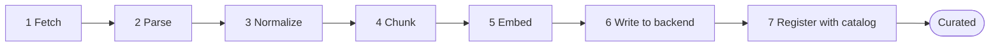

# Ingestion

Ingestion is what turns a raw dataset into a `Curated` source with a physical index — the precondition for everything else retrieval-hub does. Until ingestion runs successfully, a source is just a `Draft` record in the catalog with a recipe and no data behind it.

This document describes the ingestion architecture: the staged pipeline, the runner choices, per-family pipelines, refresh semantics, error handling, the boundary between ingestion and the catalog, and how recipe versioning interacts with long-running runs.

It does **not** specify a single orchestration framework. The ingestion *logic* lives in the core library and is runner-agnostic; thin wrappers adapt it to whichever orchestrator the cluster has. v1 ships with at least the plain-Job wrapper and plans for Tekton.

## Where it sits

Unlike the other peer components, ingestion is a mix of two things:

- **Ingestion logic** lives in the core library at `src/retrieval_hub/ingestion/`. Stages, parsers, chunkers, embedding clients, backend writers, the registration handshake with the catalog. This is plain Python that can be invoked in-process from anywhere — a unit test, a CLI command, a batch job, a Tekton task, a notebook for ad-hoc work.
- **Ingestion runners** are thin orchestration wrappers that take an ingestion job specification and execute the stages of the core library against it. The runners live under their own subdirectory per orchestrator: `runners/jobs/` for plain Kubernetes Jobs, `runners/tekton/` for Tekton tasks, `runners/kubeflow/` for KubeFlow pipelines. None of them contain domain logic; they are glue.

This split is deliberate. It means:

- The same ingestion code is exercised by unit tests, by ad-hoc CLI runs, and by production batch jobs.
- Adding a new orchestrator means writing a new thin wrapper, not rebuilding the pipeline.
- A customer who runs Tekton can use the Tekton wrapper. A customer who doesn't can use plain Jobs. A customer who has KubeFlow already can use KubeFlow. Same logic underneath.
- Debugging an ingestion failure does not require running an entire orchestrator — you can replay any stage in a Python REPL with the same inputs.

## Stages

Every ingestion run is a sequence of stages. The stages are the same for every source family; what differs is *which implementation* of each stage runs (a `code` source uses an AST chunker, a `document` source uses a semantic chunker, etc.). Each stage is a checkpoint: if a later stage fails, the run can resume from the failed stage without redoing the earlier ones.

### 1. Fetch

Pull raw bytes from the data origin into the ingestion runner's working storage. Origin types are pluggable:

- `web_crawl` — crawl a website starting from declared roots, respecting robots.txt and a depth/page-count budget
- `s3` / `minio` — download an object prefix
- `file_upload` — bytes already uploaded to MinIO via the UI/CLI
- `git_clone` — clone a repository at a specific ref (the v0 path for the public-code-repos source)
- `database_query` — run a query against an external database, materialize the result set
- `external_index` — for `external` family sources, no fetch is needed; the recipe registers a connection

Fetch produces a manifest of "what came in" — file list, byte counts, content hashes. The manifest is checkpointed before stage 2 starts.

### 2. Parse

Turn raw bytes into a normalized intermediate representation. Parser implementations are family-aware but configured by recipe:

- **Document family** — Docling for PDFs, HTML, DOCX, etc. Produces structured Markdown with section hierarchy and provenance metadata (source URL, page number, section heading).
- **Clinical document family** — Docling with a clinical post-processor: preserves section hierarchy more aggressively, recognizes ICD/CPT/LOINC codes inline, marks structured fields like dosages and lab values.
- **Code family** — language-specific AST parsers (tree-sitter for the polyglot case). Produces a normalized AST plus a symbol table mapping (file, symbol, kind, range).
- **Tabular family** — schema introspection. Produces a typed schema description plus a stream of rows.
- **Graph family** — graph-shape parser configured per source (RDF/Turtle, Cypher dump, JSON node-edge format). Produces a stream of nodes and edges with their typed properties.
- **External family** — no parsing; the adapter wraps the external system's native query API.

Parser output goes to a checkpoint store before stage 3.

### 3. Normalize

Apply family-specific normalization that doesn't belong in either parsing (too specialized) or chunking (too early). Examples:

- Strip boilerplate from web pages (nav, footer, cookie banners) that the parser couldn't detect structurally.
- Resolve cross-references in clinical documents (a section that says "see Section 4.2" gets the actual content of 4.2 inlined as context).
- Deduplicate near-duplicate documents.
- For code: resolve `import` statements to the file paths they point at within the corpus.
- For tabular: apply column-level transforms declared in the recipe (e.g. parse a free-text date column into a normalized timestamp).

Normalization is the most likely place for source-specific logic to live, and the recipe declares which normalization steps to run. v1 ships a small set of named normalizers; sources opt in.

### 4. Chunk

Split the normalized representation into retrievable units. The unit is family-dependent:

- **Document / clinical_document** — semantic chunks with token budgets and overlap, respecting section boundaries.
- **Code** — symbol-level chunks (function, class, method) with surrounding context (imports, sibling symbols).
- **Tabular** — usually 1 row = 1 chunk, but the recipe can declare row-grouping or column-projection strategies for retrieval.
- **Graph** — node-with-neighborhood chunks: a node plus its 1-hop neighbors, materialized as a structured chunk.

The recipe pins all the chunker parameters (`chunk_size_tokens`, `overlap_tokens`, etc.), so chunking is deterministic given the same input and the same recipe version.

### 5. Embed

Call the embedding model declared in the recipe. The embedding service is vLLM-served (in the OpenShift AI project), accessed via HTTP. Implementation details:

- **Batching** — the runner batches embedding requests up to the model's max batch size and the embedding endpoint's max payload size, whichever is smaller. Batch size is configurable per recipe.
- **Concurrency** — the runner makes N concurrent batched requests, where N is recipe-configurable and defaults to 4. This is what makes large corpora feasible without saturating the embedding endpoint.
- **Idempotency** — every chunk has a deterministic content hash; if the same chunk has already been embedded in this run (e.g. on resume), the runner skips it.
- **Backoff** — embedding failures retry with exponential backoff. Repeated failures fail the stage with a structured error pointing at the chunk(s) that couldn't be embedded.
- **Token accounting** — the runner tracks total tokens embedded per run, for cost reporting and for the resource budget enforcement described below.

For sources that don't use embeddings (`tabular` with text-to-SQL retrieval, `graph` with structural-only patterns), this stage is a no-op.

### 6. Write to backend

Write the embedded chunks (or the structured rows / nodes / edges) into the source's backend. Backend implementations are pluggable:

- **`pgvector`** — bulk-insert embeddings into a recipe-named pgvector table. The table is created on the first run for a recipe version and reused (or replaced, depending on refresh mode) on subsequent runs.
- **`graph` (Apache AGE / adjacency tables)** — write nodes and edges to a recipe-named graph table.
- **`tabular` (Postgres tables / DuckDB / Parquet on MinIO)** — write rows to a recipe-named structured table.
- **`external`** — no write; the external system holds the data.

Writes are transactional where the backend supports it. If the write fails partway through, the run can resume from this stage without re-embedding.

### 7. Register with catalog

The handoff from ingestion to the catalog. Registration is its own discrete step because it is the moment a successfully built physical index becomes visible to the rest of the system.

Registration:

1. Computes a final manifest: number of chunks, byte size on backend, document count, time elapsed, total tokens embedded, embedding cost estimate.
2. Inserts a `physical_index` record into the catalog with `recipe_version` matching the run's pinned version and `built_at` matching now.
3. If this is the first physical index for the source, transitions the source from `Draft` → `Curated`.
4. If this is a refresh of an existing physical index, marks the new index as `active` and the old one as superseded (per the source's refresh policy — see below).
5. Writes a `lineage.ingestion_runs` entry with the run id, the manifest, and the result.

Registration is the only stage that mutates the catalog. Until it runs, the catalog has no knowledge that ingestion is happening; the rest of the system continues to serve the previous physical index (if there was one) without disruption.

## Per-family pipeline shapes

Each family pipes through the same seven stages but with different stage implementations. Round 1 lays out four:

| Stage | document | clinical_document | code | tabular |
|---|---|---|---|---|
| Fetch | web_crawl / s3 / file_upload | web_crawl / s3 / file_upload | git_clone | s3 / database_query / file_upload |
| Parse | Docling | Docling + clinical post-processor | tree-sitter (per language) | schema introspection |
| Normalize | boilerplate strip, dedupe | section resolution, code recognition | import resolution | column transforms |
| Chunk | semantic, token-budget | clinical-section-aware | symbol-level + context | per-row or row-group |
| Embed | text embedding model | text embedding model | code-tuned embedding model | optional (off by default) |
| Write | pgvector | pgvector | pgvector or specialized | postgres tables / duckdb |
| Register | standard | standard | standard | standard |

The graph and external families use the same seven-stage frame but their stage implementations look different enough that round 1 doesn't try to fit them in the table — they get their own design pass when we have a real graph or external source to design against.

## Refresh semantics

A refresh is a re-ingestion of an existing source. Three modes are supported:

- **`full_rebuild`** — fetch everything from origin, run all stages, write to a new backend table, register as the new active physical index, mark the old one as superseded. Simple, slow, expensive. The right default for sources where the origin is small and reliable.
- **`incremental`** — fetch only what has changed since the last successful run (by checking `Last-Modified` headers, by diffing manifests, by querying for rows with `updated_at >` the last run timestamp, by `git diff` since the last commit, etc.). Run stages 2–5 only on the new/changed items. Write deltas to the existing backend table. Re-register without superseding. Faster, cheaper, but only works when the origin supports change detection cleanly.
- **`mirror_upsert`** — for sources that mirror an external system, accept a stream of upserts (or a periodic dump) and apply them through the ingestion pipeline one at a time. Used by sources where the external system is the source of truth and retrieval-hub is a queryable projection.

The refresh mode is declared on the source's recipe. Changing the refresh mode is a recipe edit and bumps the recipe version, because it changes the contract about how the source stays current.

## Recipe versioning during long runs

A key invariant: **an ingestion run is pinned to a single recipe version at the moment it starts**. Once a run is in flight, the recipe version it's building against does not change, even if the source owner edits the recipe.

If the recipe is edited mid-run:

- The in-flight run continues against the old recipe version. When it completes, it registers a physical index for the old version.
- The recipe edit creates a new recipe version (v_n+1).
- A new ingestion run, started after the edit, will pin to v_n+1 and produce a separate physical index.
- The source owner can A/B the two physical indexes if they want to (round 2 — see [`catalog.md`](catalog.md) on multi-index), or just make the new one active and supersede the old one.

This avoids a class of failures where a recipe edit silently changes what an ingestion run is producing. The recipe version is part of the run's identity, and a run is reproducible: re-running the same recipe version against the same source manifest produces the same physical index (modulo non-determinism in embedding models, which we accept).

## Error handling

Ingestion is the part of retrieval-hub that does the most work and has the most failure modes. The error strategy is "fail loudly, checkpoint aggressively, resume cleanly."

- **Stage-level checkpoints.** Every stage writes its output to a checkpoint store (MinIO bucket) before the next stage starts. A failure in stage N can be resumed by re-running from stage N with the checkpointed input from stage N−1.
- **Per-item retries within a stage.** Embedding a batch fails with a transient 503 → retry with backoff. Parsing a single document fails → log it, set it aside, continue with the rest of the corpus. The run records the per-item failures in the manifest.
- **Per-item failure thresholds.** A recipe declares a maximum tolerable per-item failure rate (default 1%). If parsing fails on more than that fraction of inputs, the run fails as a whole with a structured error pointing at the failures. This stops "we silently dropped half your corpus" outcomes.
- **Stage-level fatal errors.** Some failures are not per-item: vLLM is unreachable, the database is down, the recipe references an embedding model that doesn't exist. These fail the stage immediately with a structured error and do not consume the per-item budget.
- **Resume semantics.** Every run has a stable `run_id`. Resuming a failed run takes the `run_id`, looks up the last successful checkpoint, and restarts from the next stage. Resume is idempotent: resuming an already-completed run is a no-op.
- **Audit trail.** Every run produces a structured log + a final manifest, both stored as part of the source's lineage. The UI's lineage tab shows the run history with success/failure status and links to logs.

## Resource budgets

Ingestion runs are bounded by declared resource budgets to prevent a runaway run from eating the cluster. Each run is configured (or inherits from the recipe) with:

- **`max_runtime_seconds`** — the run is killed if it exceeds this. Default 12 hours.
- **`max_chunks`** — the run fails if it would produce more than this many chunks. Catches recipes that misconfigure chunking (1-token chunks, etc.).
- **`max_embedding_tokens`** — the run fails if total embedding tokens exceed this. Catches the cost-explosion case.
- **`max_concurrent_embedding_requests`** — limits concurrency at the embedding endpoint. Default 4.
- **`memory_limit_mb`**, **`cpu_limit`** — passed through to the runner's pod/container spec.

Hitting a budget is **not** a transient failure; the run fails with a structured `budget_exceeded` error and the source owner has to either increase the budget (recipe edit, with review) or reconfigure the recipe to fit it.

## Dry run

Source owners need to be able to test a recipe without burning compute. The CLI and UI both expose a **dry-run mode**:

- Run stages 1–4 (Fetch → Parse → Normalize → Chunk) but not 5–7.
- Report: what was fetched, what failed to parse, how many chunks were produced, the average chunk length, the chunks-per-document distribution, the estimated embedding cost.
- Optionally embed and write a small sample (`--sample 100`) to give the source owner a feel for retrieval quality before committing to the full run.

Dry run is the fast feedback loop for recipe authoring. You should never have to wait 12 hours to find out your chunker setting was wrong.

## Runner orchestrators

v1 ships at least one runner orchestrator. Round 1 commits to:

- **`jobs`** — plain Kubernetes Jobs, the lowest-common-denominator path. Works on any cluster. The runner is a single Job with init containers for fetch/parse/normalize and the main container for chunk/embed/write/register. Checkpoints go through MinIO. This is the v1 reference implementation.

Round 2 adds:

- **`tekton`** — Tekton Pipelines. Each stage is a Task. Better operational story (per-stage logs in the OpenShift Pipelines UI, easier resume, etc.). Most RHOAI clusters have Tekton already, so this is the next runner to ship.
- **`kubeflow`** — KubeFlow pipelines. Useful in environments where the data team is already using KubeFlow for everything else. More heavyweight than Tekton.

Adding a runner is writing a wrapper that translates an ingestion job spec into the orchestrator's native job/pipeline shape. No changes to the core ingestion code.

## Triggering a run

Ingestion runs are triggered three ways:

1. **Manually by a source owner**, via the UI (`Ingest now` button on the source detail page) or the CLI (`retrieval-hub ingest <source-slug>`).
2. **On a schedule**, via a refresh cadence declared on the source's recipe (`refresh.cadence: weekly`). The scheduler is a small loop in the core library that selects sources due for refresh and submits runs against the configured runner.
3. **By the agent-write path**, indirectly. When an agent writes data to a source via MCP (`append`/`upsert`), the write is processed by the same parse → normalize → chunk → embed → write stages — but as a single-item mini-run, not a full ingestion. This is the `mirror_upsert` mode running on a per-item granularity, sourced from MCP.

The third path is the bridge between ingestion and the agent-write surface in [`mcp-server.md`](mcp-server.md). It is intentionally the same code path: agent writes go through the recipe so they end up coherent with the rest of the source.

## What's Decided

- **Ingestion logic lives in the core library** at `src/retrieval_hub/ingestion/`. Runners are thin wrappers under `runners/<orchestrator>/`.
- **Seven stages**: Fetch → Parse → Normalize → Chunk → Embed → Write → Register. Each stage is a checkpoint.
- **The catalog is mutated only at the Register stage.** Until then, the catalog is unaware of in-flight runs and continues to serve previous indexes.
- **A run is pinned to one recipe version** at start time. Recipe edits during a run do not change what the run is building.
- **Three refresh modes**: `full_rebuild`, `incremental`, `mirror_upsert`. Declared on the recipe.
- **Plain Kubernetes Jobs is the v1 runner.** Tekton in round 2.
- **Per-item failure budgets** with a default 1% threshold. Crossing the threshold fails the run.
- **Stage-level checkpoints in MinIO**, resume by `run_id`.
- **Resource budgets are enforced**: runtime, chunk count, embedding tokens, concurrency, container resources.
- **Dry-run mode** runs stages 1–4 only, with optional sampling through 5.
- **Agent writes through MCP go through the same ingestion pipeline** as a per-item mini-run, ensuring coherence with the recipe.

## What's Open

- **Whether the scheduler that triggers cadence refreshes lives in the core library or as its own peer component.** Round 1 leans core-library (a simple loop is sufficient), but if the cadence story grows complicated it might warrant its own deployable.
- **The exact checkpoint format in MinIO.** Probably Parquet for embedded chunks and JSON for everything else, but not committed.
- **The cost-estimation model.** "Estimated embedding cost" needs a per-model cost table. We need to maintain it per cluster, possibly as a Kubernetes ConfigMap.
- **Incremental refresh detection for `web_crawl` origins.** Some sites support `If-Modified-Since`, most don't. We may need a content-hash-based diff strategy.
- **`code` family ingestion specifics for the v0 public-repos source.** Tree-sitter is the right choice for the polyglot case, but the chunker design (function-level vs. class-level vs. file-level, what constitutes "context") needs to be tested before locking.
- **Ingestion observability.** Logs go to the cluster's logging stack; metrics need a name and a Prometheus story. Round 2.
- **Whether the manifest is queryable via SQL on the catalog database** or only as a blob in MinIO. Probably the high-level fields land in the catalog and the full manifest stays in MinIO.
- **GPU scheduling for embedding-heavy runs.** The current model assumes embeddings happen at vLLM via HTTP, with no GPU local to the runner. If that becomes a bottleneck, the runner may need GPU-aware scheduling — out of round 2.
