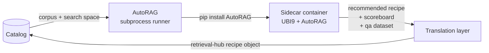

# Integration: AutoRAG

[AutoRAG](https://github.com/Marker-Inc-Korea/AutoRAG) is an open-source (Apache 2.0) AutoML-style optimizer for RAG pipelines. It does two things we care about: it generates synthetic Q&A pairs from a corpus, and it brute-force searches a declared parameter space (chunkers, chunk sizes, embedding models, retrieval top-k, rerankers, etc.) to find the combination that scores best against those Q&A pairs.

We are **not** committing to AutoRAG as a runtime dependency, an ingestion engine, or a replacement for any retrieval-hub component. We *are* documenting it here as a strong candidate for two specific moments in a source's lifecycle, with a clean integration shape that keeps it at arm's length.

**Status: Considered, not committed.** This document captures the design we'd use if we decide to wire it up. It does not declare that we have.

## How AutoRAG fits with the other platform integrations

AutoRAG was originally framed as covering two roles: (1) synthetic Q&A generation for eval data, and (2) recipe optimization. The arrival of LlamaStack and MLflow on the deployment cluster narrows AutoRAG's role.

- **Synthetic Q&A generation** now has multiple candidates: LlamaStack's `/v1/eval` API can produce or consume Ragas-style test sets ([`llamastack.md`](llamastack.md)), SDG Hub is the Red Hat tooling for the same purpose, and AutoRAG's data creation pipeline is the third option. They are alternatives, not stacked. We pick whichever lands first against a real corpus. The decision is in [`../evaluation.md`](../evaluation.md).
- **Recipe optimization** — automated search across chunkers, embedding models, top-k values, etc. — **remains uniquely AutoRAG's**. Neither LlamaStack nor MLflow does this. If we want a "tune my recipe" capability for source owners, AutoRAG is still the right tool.

So AutoRAG's role narrows: it's now primarily about **recipe optimization**, with synthetic Q&A as a secondary capability that may or may not be used depending on what we wire up first.

When MLflow is present, an AutoRAG **tuning run becomes an MLflow run** (in a separate experiment from eval runs — see [`mlflow.md`](mlflow.md) for the experiment naming convention). The scoreboard becomes MLflow metrics across multiple runs (one per combination), the recommended recipe becomes a run artifact, and the source owner reviews the recommendation against the source's existing eval scores in MLflow's UI. This is a much better fit than the round-1 plan to dump the scoreboard as Parquet to MinIO. retrieval-hub's role is still to translate the recommendation into a recipe object and present it to the source owner for promotion.

When MLflow is absent, AutoRAG runs follow the round-1 fallback: scoreboard as Parquet in MinIO, summary row in retrieval-hub Postgres. Same logic, degraded comparison ergonomics.

## What AutoRAG is, briefly

AutoRAG is a Python library + CLI built on top of LlamaIndex. The user gives it:

- A corpus (parsed and chunked)
- A QA dataset (which AutoRAG can also generate from the corpus)
- A YAML configuration declaring a search space across pipeline nodes (parser, chunker, retriever, rewriter, reranker, prompt_maker, generator)

AutoRAG generates every combination of modules and parameters in the search space, runs each combination as a pipeline, scores it, and selects the best per node. It outputs a final YAML describing the recommended pipeline plus a `summary.csv` of every combination's results.

It is a one-shot optimization tool, not a service. Its mental model is "find the best pipeline for this dataset and deploy it." retrieval-hub's mental model is "many curated sources in a catalog, each with versioned recipes, served via MCP." Those are different shapes — which is why we wrap AutoRAG, not embed it.

## The two moments we'd use it

The user framing that drives this integration: AutoRAG is valuable **at source creation time** and **periodically as the source drifts**. Both moments use the same capability — automated search for good recipe parameters — at different points in a source's lifecycle.

### Moment 1: source creation

When a source owner is bringing a new corpus into retrieval-hub, the highest-friction step today is choosing recipe parameters. The owner has to pick a chunker, a chunk size, an overlap, an embedding model, a retrieval top-k, and (if applicable) a reranker. They are guessing. The guesses might be reasonable but they're not measured.

With an AutoRAG integration, the source-creation flow would offer an opt-in **"Tune my recipe"** step:

1. Source owner declares a search space on the recipe — which chunkers to consider (e.g. semantic vs. token-fixed vs. sentence), which chunk sizes (e.g. 256, 384, 512, 768, 1024 tokens), which overlap values, which embedding models from the cluster's vLLM serving, which top-k values, optionally which rerankers.
2. retrieval-hub generates a synthetic QA dataset from the corpus (using AutoRAG's data creation pipeline, or SDG Hub if we end up wiring it up — see [`evaluation.md`](../evaluation.md)).
3. retrieval-hub runs AutoRAG against the corpus + QA dataset + search space as a subprocess job.
4. AutoRAG produces a recommended recipe and a per-combination scoreboard.
5. The recommendation is presented to the source owner in the UI as a **diff against the current draft recipe**, with the projected eval delta. The owner reviews the recommendation and either accepts it (creating a new recipe version), accepts a different combination from the scoreboard, or rejects all of them and continues hand-tuning.

The QA dataset that came out of step 2 also becomes the source's eval suite, so step 5 has real eval scores attached and the publish gate (which requires an eval run, per [`catalog.md`](../catalog.md) and [`evaluation.md`](../evaluation.md)) is satisfied automatically.

This is the highest-leverage use of AutoRAG. It turns "I'm guessing at parameters" into "the system searched the space, here's what it found, you decide." It removes a real barrier to publishing good sources.

### Moment 2: drift retuning

Sources don't stay tuned forever. The corpus refreshes (Wikipedia changes, Red Hat docs are republished, the public-repos source gets new commits). A new embedding model becomes available on the cluster. The agent population using the source shifts and queries start looking different. The original recipe was tuned six months ago against a different state of the world.

The same AutoRAG-driven flow runs again, but as a **periodic re-tuning** job rather than a one-shot creation step. Triggers:

- **Scheduled** — declare a re-tuning cadence on the source (e.g. quarterly), the catalog scheduler kicks off an AutoRAG run when due.
- **Drift-detected** — when a new physical index is built and the eval scores drop by more than a configurable threshold from the previous index, the catalog flags the source as drifted and offers a re-tuning run.
- **Capability-driven** — when a new headline embedding model lands on the cluster's vLLM serving, sources that use older embedding models get queued for re-tuning so the search space includes the new option.
- **Manual** — the source owner triggers a re-tuning run from the UI or CLI at any time.

The output is the same shape as moment 1: a recommended new recipe, a scoreboard, and an eval delta. The source owner reviews and decides. Promotion is always a human action — AutoRAG produces a *suggestion*, the catalog produces a *new recipe version* if and only if the owner accepts it.

This is what makes "your source can self-tune" a real, ongoing capability rather than a one-shot at creation. The catalog stops being a static record of "what someone configured a year ago" and becomes a living thing that asks to be improved when the world changes.

## What AutoRAG produces, what we consume

A successful AutoRAG run produces:

- A **recommended pipeline YAML** (AutoRAG's native format) — the chosen modules and parameters per node
- A **scoreboard** (`summary.csv`) — every combination tried, with its scores
- A **synthetic QA dataset** (`qa.parquet`) — if we asked AutoRAG to generate one
- An **embedded corpus** (`corpus.parquet`) — the parsed/chunked input materialized as parquet

retrieval-hub consumes these as follows:

- The **recommended pipeline YAML** is run through a translation layer (see below) into a retrieval-hub recipe object. The translation is lossy in one direction — AutoRAG has concepts retrieval-hub doesn't, and vice versa — but for the pipeline-shape parameters we both care about (chunker kind, chunk size, overlap, embedding model, retrieval top-k), the translation is mechanical.
- The **scoreboard** is stored alongside the source's eval history as a "tuning run" record, queryable from the UI. This is what lets a source owner answer "why did we pick this recipe?" six months later.
- The **synthetic QA dataset** becomes (or augments) the source's eval suite, per [`evaluation.md`](../evaluation.md).
- The **embedded corpus** is discarded after the run; retrieval-hub re-runs ingestion against the chosen recipe through its own pipeline (per [`ingestion.md`](../ingestion.md)) so the result is built by retrieval-hub's adapters and lands as a real physical index in retrieval-hub's backends. We do not import AutoRAG's parquet output as a production index.

This last point matters. **AutoRAG's role ends when the recipe is chosen.** Production retrieval always goes through retrieval-hub's own ingestion path, which is what makes lineage, refresh cadences, agent writes, and recipe versioning all work coherently. AutoRAG is the recipe-search tool; it is not the data plane.

## The integration shape: subprocess runner, not in-process

AutoRAG depends on LlamaIndex and a sizeable transitive surface (vLLM optionally, a handful of model providers, a chunker zoo, etc.). retrieval-hub uses Docling for parsing, not LlamaIndex, on purpose: Docling fits the Red Hat ecosystem better and avoids dependency duplication. Pulling AutoRAG into the core library would drag LlamaIndex in alongside Docling, which is messy and complicates the FIPS story.

So we do not import AutoRAG. We invoke it as a **subprocess runner**, structurally identical to the ingestion runners in [`ingestion.md`](../ingestion.md):

Mechanics:

- **Container boundary.** AutoRAG runs in its own container image (`retrieval-hub-autorag-runner`), built from the same UBI9 base as the rest of retrieval-hub but with AutoRAG and its dependencies installed. The core library never imports AutoRAG; it spawns the runner container as a Kubernetes Job (or Tekton Task in round 2).
- **Inputs over MinIO.** The runner reads its corpus, search space, and configuration from a MinIO bucket. The catalog writes them there before kicking off the job.
- **Outputs over MinIO.** The runner writes its recommended pipeline YAML, scoreboard, and synthetic QA dataset to the same bucket. The catalog reads them after the job completes.
- **Translation layer in the core library.** A small Python module (`src/retrieval_hub/integrations/autorag/`) that consumes AutoRAG's output YAML and produces a retrieval-hub recipe object. Lives in the core library because it's pure data translation; no AutoRAG imports.
- **Resource budgets.** Inherits the same budget machinery as ingestion runs (`max_runtime_seconds`, `max_embedding_tokens`, etc.) so a runaway AutoRAG search can't eat the cluster.
- **No FIPS coupling.** Because the runner is in its own container and only exchanges data files with the rest of the system, the FIPS posture of the core library is unaffected by whatever LlamaIndex does. If AutoRAG itself can't run under FIPS, the runner container is allowed to be a non-FIPS sidecar; the FIPS-required parts of retrieval-hub never load it.

This is the same shape we use for ingestion runners and for the eventual eval orchestrator. It's the right shape for any "heavy library we want to use but don't want to absorb."

## What we'd NOT use AutoRAG for

To be precise about scope, the things AutoRAG could plausibly do that we're explicitly not asking it to do:

- **Serve retrieval at runtime.** Production retrieval goes through retrieval-hub's MCP server and source adapters. AutoRAG's pipeline executor is not in the request path.
- **Store the corpus or the index.** retrieval-hub's storage (PostgreSQL + pgvector, MinIO) is the production data plane. AutoRAG's parquet files are intermediate artifacts only.
- **Be the auth substrate, the catalog, or the agent surface.** None of those are in AutoRAG's scope and never will be.
- **Tune `code`, `tabular`, `graph`, or `external` family sources.** AutoRAG's chunker and parser modules are document-focused. The tuning capability described in this document applies to `document` and `clinical_document` family sources only. The other families either need their own optimizer (round 3+) or stay hand-tuned indefinitely.
- **Replace SDG Hub categorically.** [`evaluation.md`](../evaluation.md) names SDG Hub as the working assumption for synthetic QA generation. AutoRAG is described there as a *pluggable alternative*, not a replacement. Either, both, or neither could end up being the wired-up generator depending on what we can integrate first.

## License and dependencies

- **License**: Apache 2.0. Compatible with the Red Hat ecosystem and with retrieval-hub's distribution model.
- **Maintenance**: Active as of 2026-04. Regular commits in recent months, releases on a steady cadence, single-org maintainer (Markr.AI). Worth re-checking before we commit, but not concerning.
- **Dependency surface**: heavy, primarily LlamaIndex and a fan-out of model client libraries. This is exactly why the runner is a sidecar container, not an in-process import.
- **Hardware**: AutoRAG can use GPUs (`AutoRAG[gpu]`) for local model inference but does not require them. In our case, the embedding calls go to the cluster's vLLM endpoint over HTTP, so the runner container doesn't need a GPU. Nice.

## The clean exit

If we evaluate AutoRAG against a real corpus and decide it doesn't earn its keep, the exit is essentially free because of how loosely we'd be coupled:

1. Stop scheduling AutoRAG runner Jobs. No code change.
2. Remove the optional "Tune my recipe" step from the source creation flow. UI change only; the underlying recipe model is unchanged.
3. Remove the translation layer module. Pure deletion.
4. Delete the runner container image.

What's left is exactly the system we'd have without AutoRAG: hand-tuned recipes, synthetic QA generation via SDG Hub or hand curation. No structural debt.

The same is true in the other direction: if AutoRAG is great and we want to use it everywhere, the integration shape scales — periodic re-tuning is the same code path as creation-time tuning, just kicked off by a scheduler instead of a UI click.

## What's Decided

- **AutoRAG is considered, not committed.** This doc captures the design we'd use if and when we decide to wire it up.
- **The two moments are creation-time tuning and drift re-tuning.** Both are the same capability at different lifecycle points. Both are document-family-only.
- **Subprocess runner integration shape**, structurally identical to ingestion runners. AutoRAG runs in its own container; no in-process imports; no LlamaIndex in the core library.
- **A translation layer in the core library** converts AutoRAG's output YAML to a retrieval-hub recipe object. The translation is mechanical for the parameters both systems care about.
- **AutoRAG's role ends when the recipe is chosen.** Production retrieval goes through retrieval-hub's own ingestion + adapter path; AutoRAG's parquet outputs are intermediate artifacts.
- **Promotion of a recommended recipe is always a human action.** AutoRAG suggests; the source owner decides; the catalog produces a new recipe version.
- **Apache 2.0**, license-compatible. **Active maintenance** as of 2026-04, worth re-checking before committing.

## What's Open

- **Whether we actually wire it up, and if so when.** This is the meta-question. The narrowest path is "ship the v0 vertical slice without AutoRAG, then add the AutoRAG integration as a v0.5 capability against the Red Hat docs source." The most ambitious is "wire it in early so the v0 source benefits from automated tuning out of the gate." Probably the narrow path.
- **Which generator (AutoRAG vs SDG Hub) gets wired up first** for the synthetic QA side. They are alternatives, not stacked. AutoRAG is more immediately runnable. SDG Hub is the Red Hat thing. Decide when we have real corpora to test against. See [`evaluation.md`](../evaluation.md).
- **The exact translation layer scope.** Mechanical for chunker/embedding/top-k; possibly impossible for AutoRAG concepts that don't have retrieval-hub equivalents (and vice versa). Needs prototyping against a real AutoRAG output.
- **The drift detection threshold.** "Eval score drops by more than X" needs a real X. Probably 5% recall@5 drop, but it depends on the source family and the noise floor of the eval suite.
- **How to handle the case where AutoRAG recommends a recipe that uses a chunker or embedding model retrieval-hub doesn't support.** Either we expand retrieval-hub's adapter set, or the translation layer rejects the recommendation with a structured error and falls back to the next-best combination from the scoreboard.
- **Per-cluster cost of running AutoRAG.** A search across 5 chunkers × 4 chunk sizes × 3 embedding models × 3 top-k values is 180 combinations, each running an embedding pass over the full corpus. For small corpora this is cheap; for the Wikipedia v0 source it could be expensive. The resource budget machinery enforces a ceiling, but we should measure on real data before defaulting users into large search spaces.
- **Whether the AutoRAG runner container is FIPS-clean.** Probably not, because LlamaIndex has dependencies that don't go through OS OpenSSL. The integration shape allows the runner to be non-FIPS without compromising the rest of the system, but we should document this explicitly when we deploy.
