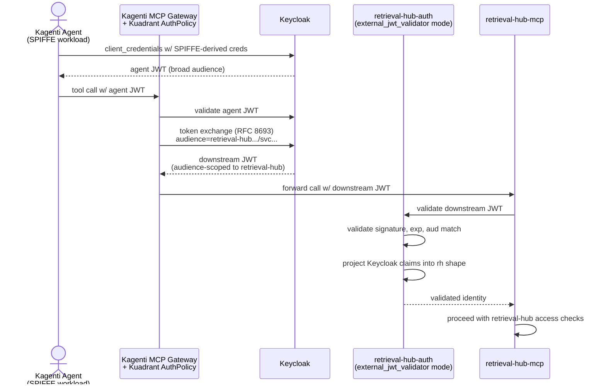

# Integration: Kagenti

[Kagenti](https://kagenti.github.io/.github/) is the Kubernetes-native, framework-neutral agent deployment platform incubated at Red Hat and planned as part of OpenShift AI. It provides workload identity (SPIFFE/SPIRE), OAuth2 (Keycloak), an MCP Gateway with audience-scoped token exchange, and a tool-filter wristband mechanism for per-agent tool gating.

The target deployment cluster will have Kagenti — but **does not have it yet**. This integration is designed for the future-not-present case: retrieval-hub must run today on the cluster without Kagenti, and must drop in cleanly when Kagenti arrives without retrieval-hub-side changes.

This document describes the integration shape, drawing on the precedent that memory-hub already established. Where memory-hub's docs from a year ago described an older `POST /api/v1/connectors` REST registration path on the adk-server, the more recent Kagenti documentation has moved to a `MCPServer` CRD + Gateway API HTTPRoute approach. We target the **more recent path**, per the user's explicit guidance.

## What Kagenti provides that we care about

Kagenti is a layered set of capabilities. The ones that matter for retrieval-hub:

- **MCP Gateway** — an Envoy-based gateway that fronts every MCP server in the cluster. Aggregates multiple MCP servers behind one endpoint, applies tool prefixing to prevent name collisions, centralizes rate limiting and auditing, and propagates trace context.
- **`MCPServer` CRD + Gateway API HTTPRoute** — the Kubernetes-native registration mechanism for MCP backends behind the gateway. retrieval-hub-mcp registers itself as a backend by creating an `MCPServer` CR pointing at its Service.
- **Kuadrant AuthPolicy** — the gateway's authorization layer. Implements OAuth 2.1 + RFC 8693 token exchange. Validates incoming agent tokens against Keycloak, then exchanges them for **audience-scoped, narrowly-bound** downstream tokens whose audience claim matches the target MCP server's hostname.
- **Tool-filter wristband** — an external authz component decides which tools the agent is allowed to see, signs a JWT wristband listing them, and injects it as an `x-authorized-tools` header. The gateway filters tool discovery responses based on the wristband.
- **SPIFFE/SPIRE** — workload identity for in-cluster agents. Every agent has a SPIFFE ID like `spiffe://cluster.local/ns/clinical-agents/sa/research-bot` baked into its workload credentials.
- **Keycloak** — the OAuth2 / OIDC provider that issues the original agent tokens and that the gateway exchanges against.
- **Namespace-as-tenant** — Kagenti's tenancy model uses Kubernetes namespaces as tenant boundaries. Cross-tenant access is explicitly not supported by the platform.
- **Kagenti Operator + AgentCard CRDs** — discovers and manages agent workloads in the cluster. Not directly a retrieval-hub concern (we are a tool, not an agent), but worth being aware of.

## What retrieval-hub consumes from Kagenti

Three things, all stacked.

### 1. MCP Gateway registration via `MCPServer` CRD

When Kagenti is present on the cluster, retrieval-hub-mcp registers as a backend behind the MCP Gateway by creating a `MCPServer` Custom Resource (and the supporting Gateway API `HTTPRoute`) in the namespace where retrieval-hub is deployed.

Conceptually:

```yaml
apiVersion: kagenti.io/v1alpha1
kind: MCPServer
metadata:
  name: retrieval-hub
  namespace: retrieval-hub
spec:
  service:
    name: retrieval-hub-mcp
    port: 8080
  transport: streamable-http
  toolPrefix: retrieval_hub_      # Kagenti applies this to all retrieval-hub tools
  authentication:
    audience: retrieval-hub.retrieval-hub.svc.cluster.local
    issuer: <keycloak-issuer>
    jwksUri: <keycloak-jwks>
  toolDiscovery:
    enabled: true
    wristbandFiltering: true        # honor x-authorized-tools header
---
apiVersion: gateway.networking.k8s.io/v1
kind: HTTPRoute
metadata:
  name: retrieval-hub-mcp
  namespace: retrieval-hub
spec:
  parentRefs:
    - name: kagenti-mcp-gateway
      namespace: kagenti-system
  rules:
    - matches:
        - path:
            type: PathPrefix
            value: /mcp/retrieval-hub
      backendRefs:
        - name: retrieval-hub-mcp
          port: 8080
```

Note: the exact field names in the `MCPServer` CRD are subject to change as Kagenti's API evolves. The shape above reflects current understanding from the available documentation; the actual schema must be confirmed against the Kagenti version that lands on the target cluster before implementation. The integration logic — *what* we register and *why* — is stable; the *how* of the YAML is the part that may need adjustment.

After registration:

- **Agents discover retrieval-hub tools** through the gateway's aggregated tool discovery, with the `retrieval_hub_` prefix applied so there's no name collision with other MCP servers behind the same gateway.
- **The gateway routes tool calls** to retrieval-hub-mcp via the HTTPRoute. retrieval-hub-mcp sees the call as if it came from the gateway (which it did) with whatever audience-scoped token the gateway minted for our hostname.
- **Tool prefixing happens at the gateway, not in retrieval-hub-mcp.** The tools we register are still named (e.g.) `query` and `rewrite`; the gateway exposes them as `retrieval_hub_query` and `retrieval_hub_rewrite`. From retrieval-hub-mcp's perspective, the prefix is invisible.

### 2. RFC 8693 audience-scoped token exchange

This is the load-bearing security property of running behind the Kagenti MCP Gateway, and it shapes how retrieval-hub-auth is configured.

The flow:



The critical property: **retrieval-hub never sees the agent's broad token**. The token we receive is already audience-bound to our hostname, so it cannot be replayed against any other MCP server behind the gateway (each gets its own audience). Lateral movement is structurally prevented at the platform layer.

retrieval-hub-auth is configured in **`external_jwt_validator` mode** for this deployment topology. Per [`../auth.md`](../auth.md), the validator:

1. Fetches the JWKS from Keycloak (cached with TTL).
2. Validates the incoming token's signature, expiry, and audience claim.
3. Confirms the audience claim matches the configured retrieval-hub audience (the hostname the gateway uses for us).
4. Projects Keycloak claims into the retrieval-hub claim shape via a configured **claim mapping** policy.
5. Hands the resolved identity to the MCP server's middleware for further authorization.

The claim mapping is the place where projection rules live, and it must be **deny-by-default**:

- **`sub`** — derived from SPIFFE ID. Format `spiffe://cluster.local/ns/<namespace>/sa/<sa-name>`. The retrieval-hub `sub` becomes `agent:spiffe:<full-spiffe-id>` for identity_kind = agent, or `service:spiffe:<full-spiffe-id>` for service workloads.
- **`rh_tenant`** — read from a namespace annotation `retrieval-hub.redhat.com/tenant-id` on the agent's namespace. If the annotation is absent, the namespace name itself is used as the tenant id. Cross-tenant access remains explicitly unsupported.
- **`rh_identity_kind`** — derived from the SPIFFE ID structure (`agent` for workloads under known agent namespaces, `service` for platform-internal workloads, `user` for human-driven calls — the latter only when a user-identity claim is present).
- **`rh_identity_groups`** — projected from the configured Keycloak roles, **filtered through a deny-allowlist**: an incoming Keycloak role is only projected into `rh_identity_groups` if it is in a deploy-time-configured allowlist. This prevents a future Kagenti or Keycloak role addition from silently granting access to retrieval-hub sources.
- **`scope`** — projected from a configured mapping of Keycloak roles to retrieval-hub scopes. The mapping is also deny-by-default. Critically, the mapping evaluator enforces in code (not in configuration) that **`admin.write` cannot be projected for any identity whose `rh_identity_kind` is `agent` or `service`**. This is the round-1 invariant from [`../auth.md`](../auth.md), preserved through token exchange.

### 3. Tool-filter wristband (read in conjunction with `mcp-tools-planning.md`)

The Kagenti MCP Gateway uses an external authz component to decide which tools an agent is allowed to *see*. The decision is signed into a JWT wristband listing the authorized tool names, injected as an `x-authorized-tools` header on requests forwarded to the downstream MCP server. The gateway filters tool discovery responses based on the wristband so an agent without authorization for a tool literally cannot enumerate it.

For retrieval-hub, this is a **second authorization layer** that sits in front of our own access policy. They layer cleanly:

- **Gateway wristband layer** — gates *tool classes*. "This agent can use retrieval-hub's `query` tool at all." Decision lives in Kagenti's authz config and is per-agent-identity, not per-source.
- **retrieval-hub policy layer** — gates *per-source actions*. "This agent can call `query` against source X but not source Y." Decision lives in the source's `access` and `agent_write_policy` fields and is per-source.

Both gates fire. Defense in depth. An agent that gets past the wristband still has to satisfy the catalog's per-source policy; an agent that satisfies the per-source policy still has to be allowed to even see the tool.

The shape of the wristband matters for tool design: tools that should be separately gateable per agent should be **separate tools**, not modes of one tool. This affects the `agent_write_policy` write tools — a strong case can be made that `append`, `upsert`, and `annotate` should be three separate MCP tools (each separately wristband-gateable) rather than one `write` tool with a `mode` parameter. This guidance is captured in [`../mcp-tools-planning.md`](../mcp-tools-planning.md) for the eventual `/plan-tools` workflow to pick up.

## Tenant model: namespace as tenant

Kagenti's tenancy model is straightforward: **a Kubernetes namespace is a tenant boundary**. retrieval-hub adopts this model when running under Kagenti.

Specifically:

- The `rh_tenant` claim, which has been reserved as `"default"` since round 1, is now populated from the agent's namespace via the `retrieval-hub.redhat.com/tenant-id` annotation (or the namespace name as fallback).
- Source-level access policy can use `rh_tenant` as one of the inputs alongside `rh_identity_groups` for sources that should be tenant-scoped.
- Cross-tenant access is **not supported** by retrieval-hub when running under Kagenti, mirroring Kagenti's own posture. A source visible to tenant A cannot be queried by an agent from tenant B, even if the agent's identity groups would otherwise allow it.

This is a shift from round 1, which described `rh_tenant` as a reserved-for-future field always set to `"default"`. In Kagenti deploys, it becomes a real field used by policy. In non-Kagenti deploys, the round-1 behavior persists (`"default"` always, policy ignores it).

The tenant model should be documented in [`../catalog.md`](../catalog.md) as part of the ownership boundary section, since `agent_write_policy.allowed_groups` and source `access.allowed_groups` checks now interact with tenant scoping.

## Standalone fallback (no Kagenti present)

The target cluster does not have Kagenti yet. Until it does, retrieval-hub runs in the **standalone mode** described by round 1:

- **No `MCPServer` CR is created.** retrieval-hub-mcp serves through its standalone Route directly. Agents connect to the Route with a JWT obtained from the cluster's existing OAuth path.
- **retrieval-hub-auth is configured with one of the other backends** (`local` for dev, `openshift_oauth` for the cluster's built-in OAuth, or `oidc_external` against whatever OIDC provider the cluster has — typically the same Keycloak that Kagenti will eventually use, deployed independently). The validator does the same JWT validation it would do under Kagenti, just against a non-gateway-issued token.
- **No tool-filter wristband.** Agents see all tools they have scope for. Per-source access policy is the only authorization gate. This is the round-1 design.
- **No audience-scoped token exchange.** Tokens have whatever audience the IdP issued them with, validated against the `RETRIEVAL_HUB_EXPECTED_AUDIENCE` configuration.
- **No namespace-as-tenant.** `rh_tenant` stays at `"default"` and policy ignores it. Multi-tenancy is not enforced in standalone mode.
- **No tool prefix.** Tools are named as the MCP server registers them (e.g. `query` rather than `retrieval_hub_query`). The agent runtime configuration handles any naming concerns.

This is exactly the round-1 deployment posture. retrieval-hub running on a Kagenti-less cluster looks identical to retrieval-hub as round-1 imagined it — because that's what round 1 imagined it as.

When Kagenti arrives on the cluster, the migration is:

1. **Deploy the `MCPServer` CR + HTTPRoute** in retrieval-hub's namespace.
2. **Switch retrieval-hub-auth to `external_jwt_validator` mode** with the gateway-issued audience and the configured Keycloak claim mapping.
3. **Annotate retrieval-hub's namespace and the agent namespaces** with `retrieval-hub.redhat.com/tenant-id` for tenant scoping (if multi-tenancy is desired).
4. **Configure the gateway-side authz component** with the wristband rules for which agents see retrieval-hub tools.
5. **Test both paths:** Kagenti-routed agents and direct-Route consumers (the SDK from a notebook, the CLI from a laptop, off-cluster agents). Both are supported simultaneously.

The retrieval-hub source code, the catalog data model, and the MCP tool surface do not change between standalone and Kagenti modes. The migration is configuration only.

## Coexistence with the standalone Route

When Kagenti is present, retrieval-hub still keeps its standalone Route. Two reasons:

1. **Off-cluster consumers** — the SDK from a developer's laptop, the CLI from a notebook, an external agent that doesn't run inside Kagenti — need a way to reach retrieval-hub that doesn't require going through the in-cluster Kagenti gateway. The Route is the path for them.
2. **Operational fallback** — if the Kagenti gateway is down or misconfigured, retrieval-hub remains reachable through the Route. This is a real operational property, not a theoretical concern.

Both topologies coexist. The MCP server itself does not know which path a given request came in through; it sees a JWT in either case and validates it the same way. The auth validation rules differ slightly (gateway-issued tokens have a specific audience, Route-issued tokens have a different one), and the validator handles both.

This is a significant operational property: **retrieval-hub does not require Kagenti to function**, even when deployed on a Kagenti cluster. The integration enriches the experience and provides a stronger security model for in-cluster agents, but it is additive.

## Ownership boundary

| Concern | Authoritative system | Notes |
|---|---|---|
| Workload identity (SPIFFE ID) | SPIFFE/SPIRE via Kagenti | We consume; we never issue |
| OAuth token issuance | Keycloak (via Kagenti) | We are a token validator, not an issuer, in this topology |
| Audience-scoped token exchange | Kagenti MCP Gateway + Kuadrant | We never see the agent's broad token |
| Identity-to-claim translation | retrieval-hub-auth (via configured claim mapping) | The deny-allowlist projection |
| Tool-class authorization (which tools an agent sees) | Kagenti gateway + wristband | Per-agent-identity, not per-source |
| Per-source action authorization (which sources an agent can query/write) | retrieval-hub catalog | Per-source policy, layered on the wristband |
| MCP tool surface | retrieval-hub | Designed via `/plan-tools`; consumed by Kagenti's tool prefixing |
| Tool prefix in agent-visible names | Kagenti gateway | We register raw tool names; gateway prefixes them |
| Tenant boundary | Kubernetes namespace via Kagenti | retrieval-hub adopts the namespace = tenant model |
| Tenant id source | Namespace annotation (`retrieval-hub.redhat.com/tenant-id`) | Falls back to namespace name |
| Cross-tenant access | Disallowed by both Kagenti and retrieval-hub | Mirrors Kagenti's posture |
| Source-level access policy | retrieval-hub catalog | Always |
| Agent_write_policy | retrieval-hub catalog | Per-source; layered on wristband |
| Audit trail of writes | retrieval-hub catalog | Includes the SPIFFE-derived identity from the validated token |
| Telemetry trace propagation | OpenTelemetry / W3C Trace Context | Both Kagenti gateway and retrieval-hub propagate; same trace ID across the chain |

Pattern: Kagenti owns *transport, identity issuance, audience scoping, and tool-class gating*. retrieval-hub owns *the catalog model, per-source policy, tool design, and audit*. The boundary is clean.

## The clean exit

If Kagenti is removed from the cluster (or replaced by a different gateway), the exit is:

1. **Delete the `MCPServer` CR and HTTPRoute** in retrieval-hub's namespace.
2. **Switch retrieval-hub-auth back to a non-gateway IdP backend** (`openshift_oauth`, `oidc_external`, or `local` depending on the post-Kagenti identity story).
3. **Tenant scoping reverts to standalone mode** — `rh_tenant` becomes `"default"` and policy ignores it (or stays populated from the namespace annotation if we want to keep namespace tenancy without Kagenti).
4. **Off-cluster consumers and direct-Route consumers are unaffected**. They were already going through the Route.

What's preserved: every source, every recipe, every eval result, every audit record. The catalog is independent of the gateway. The exit is configuration only.

## What's Decided

- **The target deployment cluster will eventually have Kagenti**, but does not have it yet. retrieval-hub runs in standalone mode today and adds the Kagenti integration when Kagenti is installed, with no source-code changes.
- **Registration is via `MCPServer` CRD + Gateway API HTTPRoute** (the more recent Kagenti registration path), not the older REST `POST /api/v1/connectors` path memory-hub used.
- **retrieval-hub-auth runs in `external_jwt_validator` mode** in Kagenti deploys, validating gateway-issued audience-scoped tokens. The other IdP backends remain available for non-Kagenti deploys.
- **Namespace = tenant**, with tenant id sourced from a `retrieval-hub.redhat.com/tenant-id` annotation. Cross-tenant access is unsupported in Kagenti deploys.
- **Claim mapping is deny-allowlist**: incoming Keycloak roles are only projected into `rh_identity_groups` if explicitly listed in the allowlist.
- **`admin.write` can never be projected to agent or service identities**, enforced in code regardless of claim mapping configuration.
- **The tool-filter wristband is a second authorization layer** in front of retrieval-hub's per-source policy. They layer cleanly: gateway gates tool classes, we gate per-source actions.
- **The standalone Route remains operational** in Kagenti deploys, for off-cluster consumers and as an operational fallback. retrieval-hub is reachable through both paths simultaneously.
- **The migration from standalone to Kagenti is configuration only.** No source code, catalog data model, or tool changes.

## What's Open

- **The exact `MCPServer` CRD schema** at the Kagenti version that lands on the target cluster. The shape in this doc reflects current understanding from the available documentation; the precise field names need to be confirmed against the deployed version before implementation.
- **The exact wristband JWT schema and the `x-authorized-tools` header format.** Same caveat — pin against the deployed version.
- **The tool-class taxonomy** the wristband uses. We need to know what granularity Kagenti supports (per tool name, per tool category, per server) to design our tool surface in [`../mcp-tools-planning.md`](../mcp-tools-planning.md) appropriately.
- **Whether retrieval-hub's tools should be split for separate wristband gating** — particularly the agent write tools (`append` / `upsert` / `annotate` as separate tools vs. one `write` tool with a mode parameter). Captured as guidance in `mcp-tools-planning.md`; decided when `/plan-tools` runs.
- **The exact Keycloak role-to-scope mapping** that we'll ship as the canonical example. Probably: `kagenti-agent-base` → `sources.list, sources.read, sources.query, rewrite.invoke`; `kagenti-agent-writer` → adds `sources.write`; `retrieval-hub-admin` → `admin.read, admin.write` (humans only). This needs to be tested against a real Kagenti install.
- **How retrieval-hub's UI handles a Kagenti-authenticated human user.** When a human is signed into a Kagenti UI (Keycloak-authenticated), can they reach retrieval-hub's admin UI without re-authenticating? Probably yes via SSO, but the BFF-side flow needs design.
- **Whether the retrieval-hub `tenant-id` namespace annotation should be propagated to MLflow run tags** so that MLflow runs are scoped per tenant for filtering. Probably yes; cross-reference [`mlflow.md`](mlflow.md).
- **Operational story for the `MCPServer` CR lifecycle.** How is it updated when retrieval-hub-mcp is upgraded? Who owns the CR? Probably the retrieval-hub Operator (when it exists) — see [`../operator.md`](../operator.md).
