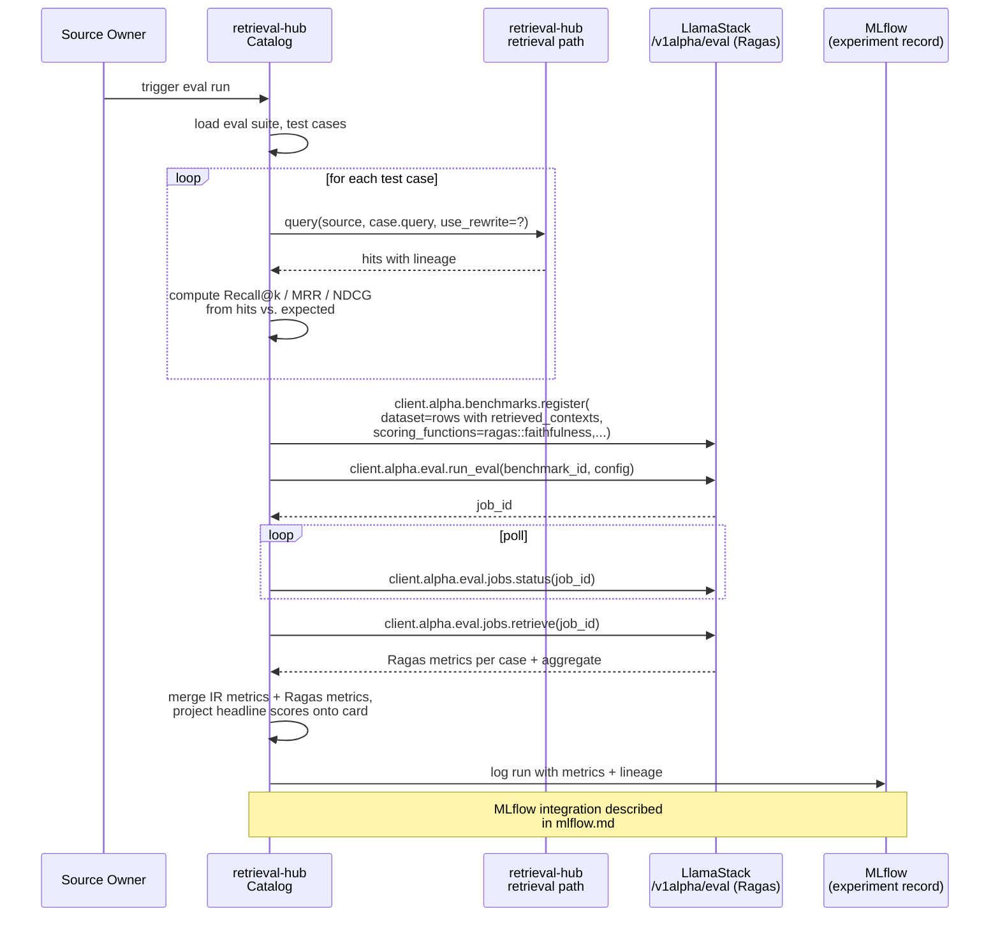

# Integration: LlamaStack

[LlamaStack](https://llamastack.github.io/) is the framework + API surface for AI applications shipping as a **Technology Preview** component on Red Hat OpenShift AI 3.0+. It is **not GA** in any RHOAI version through 3.3. On the target deployment cluster, LlamaStack is **present as a TP component** and is the primary agent runtime context retrieval-hub will be consumed from. Version map:

| RHOAI version | LlamaStack version | Status |
|---|---|---|
| RHOAI 3.0 | LlamaStack Distribution 0.3.0 | Technology Preview |
| RHOAI 3.2 | LlamaStack Operator 0.5.0 | Technology Preview |
| RHOAI 3.3 | LlamaStack Operator 0.6.0 | Technology Preview |

The **LlamaStackOperator** (TrustyAI / opendatahub-io maintained) is the supported deployment path. It is removed by default and must be explicitly enabled. The custom resource is `LlamaStackDistribution`, which declares a distribution image, replicas, vector store backend, and `run.yaml` configuration.

**Target version for the integration**: LlamaStack 0.3.x as the minimum, designed for 0.4.x–0.6.x compatibility. **Upstream v0.7.0 (released 2026-04-01) contains breaking changes** — particularly the removal of the `tool_groups` public API — that will eventually land in a future RHOAI release. Our integration is designed to be forward-compatible where possible (see "Connector registration" below).

This document describes how retrieval-hub integrates with LlamaStack: how agents discover and call retrieval-hub MCP tools through it, how eval execution delegates to LlamaStack's eval API + Ragas provider, how OAuth2 alignment works, how telemetry propagates, and what the standalone fallback looks like for clusters without LlamaStack.

## What LlamaStack provides that we care about

As of RHOAI 3.0–3.3, LlamaStack ships an OpenAI-compatible API surface plus several additional APIs that overlap with — and in some cases supersede — round-1 retrieval-hub designs. The ones that matter for our integration:

- **`/v1/toolgroups`** — registration of external MCP servers as toolgroups with `provider_id=model-context-protocol`. Tools registered this way are exposed to agents as `<toolgroup_id>::<tool_name>`. Static registration via the LlamaStackDistribution CR's `run.yaml` is supported and is the **forward-compatible path** (dynamic API registration via `client.toolgroups.register()` is being removed in upstream v0.7.0).
- **`/v1/vector_stores`, `/v1/files`** — managed vector store and file storage. Generic "bag of PDFs → file search" use case. **Not what retrieval-hub is for**, but worth understanding so we can position ourselves correctly relative to it (see "Where we are not LlamaStack" below).
- **`/v1alpha/eval`** — Evaluation API (in `v1alpha`; the Python client uses `client.alpha.eval.*`). Async benchmark execution returning a job id. A **Ragas provider** (`llama-stack-provider-ragas` from trustyai-explainability) supplies RAG-quality metrics. The provider ships both in-process (`ENABLE_RAGAS=true` on the LlamaStack distribution) and as a remote Kubeflow Pipelines deployment.
- **`/v1/telemetry/events`** — trace event endpoint, OpenTelemetry-compatible. LlamaStack also supports OpenTelemetry-native export via `OTEL_EXPORTER_OTLP_ENDPOINT`. **Trace context propagation into MCP servers is NOT automatic in LlamaStack 0.2.x/0.3.x** — see "Telemetry propagation" below.
- **OAuth2 provider backend** (`provider_type: oauth2_token`) — JWKS-based JWT validation with a claim mapper that reads a claim named literally `llamastack_roles` (must be realm roles, not client roles, in Keycloak). Documented in RHOAI 3.0 "Working with Llama Stack" Chapter 5.
- **`/v1/chat/completions`, `/v1/responses`, `/v1/embeddings`, `/v1/messages`** — inference. We don't directly integrate with these (the rewriter calls vLLM directly, not via LlamaStack), but they're part of the surface a LlamaStack-hosted agent uses.

## What retrieval-hub consumes from LlamaStack

Three things, in roughly increasing scope of integration.

### 1. Toolgroup registration (the agent surface)

When LlamaStack is present, retrieval-hub-mcp is registered with LlamaStack as a **toolgroup** with `provider_id=model-context-protocol`. There are two registration paths:

**Preferred: static registration via `run.yaml`.** The LlamaStackDistribution CR carries the retrieval-hub MCP endpoint in its `run.yaml` configuration:

```yaml
tool_groups:
  - toolgroup_id: "mcp::retrieval-hub"
    provider_id: "model-context-protocol"
    mcp_endpoint:
      uri: "https://retrieval-hub-mcp.retrieval-hub.svc.cluster.local:8080/mcp"
```

This path is forward-compatible with upstream v0.7.0's removal of the `tool_groups` public API — v0.7.0 replaces dynamic registration with auto-registration from provider specs declared in `run.yaml`, so static config is the path that survives the upgrade. It is also operationally cleaner: the toolgroup exists when LlamaStack starts, not at some later point when retrieval-hub-mcp remembers to register itself.

**Fallback: dynamic registration** via `client.toolgroups.register(toolgroup_id="mcp::retrieval-hub", provider_id="model-context-protocol", mcp_endpoint={"uri": "..."})`. This works on 0.3.x–0.6.x but **will break on v0.7.0+** when the `tool_groups` API is removed. Only use this if static registration isn't an option for the specific cluster.

**Tool naming convention.** Tools registered through a toolgroup are exposed to agents as `<toolgroup_id>::<tool_name>` — so retrieval-hub's `query` tool becomes `mcp::retrieval-hub::query` from an agent's perspective. This is what answers the "what prefix does LlamaStack apply" question in [`../mcp-tools-planning.md`](../mcp-tools-planning.md): the prefix is `mcp::retrieval-hub::`, applied by LlamaStack, not by us.

retrieval-hub continues to serve tool calls through its standalone Route regardless of LlamaStack registration, so off-LlamaStack consumers (the SDK from a notebook, the CLI from a laptop, an external agent) are unaffected even if LlamaStack is unreachable.

**Streamable-HTTP transport.** MCP toolgroups in LlamaStack originally only supported http+sse, but streamable-http support landed upstream in mid-2025 and is available on all the RHOAI-shipped versions. Our retrieval-hub-mcp streamable-http endpoint works with them.

Cross-reference: [`mcp-server.md`](../mcp-server.md) covers the three deployment topologies (standalone Route, LlamaStack toolgroup, Kagenti MCP Gateway). This integration enables topology #2.

### 2. Eval execution via the LlamaStack eval API

This is the bigger integration. Per the platform-overlap analysis in [`README.md`](README.md), eval **execution** is delegated to LlamaStack when present. retrieval-hub still owns the eval suite definition, the test cases, and the score-on-the-card — but the metric-computing run happens inside LlamaStack with Ragas, and we project the resulting metrics back onto the source card.

**The execution model is important to get right, because it's not what you might expect.** LlamaStack's `/v1alpha/eval` API does **not** have a first-class "retrieval target" parameter. Its mental model is "evaluate a model (`eval_candidate`) against a dataset (`benchmark_id`) using scoring functions (provider-supplied)." There is no way to say "call this MCP server for the retrieval step" as an argument to the eval.

What this means: **retrieval-hub runs the retrieval first and pre-populates the eval dataset with `retrieved_contexts` before handing it to Ragas to score.** The eval API sees a dataset of `(question, retrieved_contexts, generated_answer)` triples and scores them with Ragas; it never calls back into retrieval-hub-mcp. This is actually a better design for our purposes — it means retrieval-hub has full control over the retrieval step (including rewrite on/off, pattern selection, and filter handling) and Ragas focuses purely on the quality scoring.

The flow:



Four things to notice:

1. **retrieval-hub runs the retrieval itself.** The same production retrieval path that agents use is what feeds the eval. Ragas scores the retrieved contexts; it does not produce them. This is what makes eval scores predictive of real-world performance.
2. **retrieval-hub computes the IR metrics (Recall@k, MRR, NDCG@k) itself.** **Ragas does not compute these.** The original round-1 text that said Ragas covers "standard retrieval metrics (Recall@k, MRR, NDCG)" was wrong. Ragas is a RAG-quality framework — its metrics are RAG-specific (faithfulness, answer relevancy, context precision, context recall, answer correctness) and do not include classical IR ranking metrics. We compute IR metrics in retrieval-hub regardless of which execution backend is in use.
3. **Ragas adds LLM-judge metrics we would otherwise have to build.** Faithfulness (does the answer stay grounded in the retrieved context), answer relevancy (does the answer actually address the question), context precision/recall — these are all LLM-in-the-loop metrics that we get for free by delegating to Ragas. The LLM used as the judge is configured in the LlamaStack distribution; the embedding model for answer-relevancy's reverse-question generation is configured via `EMBEDDING_MODEL`.
4. **The score-on-the-card stays in retrieval-hub.** We project a small set of headline metrics from the combined (IR + Ragas) result onto the source card. The card is still authoritative for "what users see when they browse" — execution backend is interchangeable.

**Both rewrite-on and rewrite-off runs happen the same way.** For sources with the rewriter enabled, we run two eval passes (one with rewrite enabled in retrieval-hub's retrieval path, one without) and the lift metric is computed by retrieval-hub from the two results.

The confirmed-supported Ragas metrics on the trustyai provider (from the provider's demo notebook) are:

- `faithfulness`
- `answer_relevancy`
- `context_precision`
- `context_recall`
- `answer_correctness`

retrieval-hub computes on every run regardless of backend:

- `recall_at_k` for k ∈ {1, 3, 5, 10}
- `mrr`
- `ndcg_at_k` for k ∈ {5, 10}
- `latency` (p50, p95, p99) — measured during retrieval-hub's own retrieval loop
- `cost_estimate` — from a per-model cost table
- `rewrite_lift` — from the two-run delta

The contract with LlamaStack is intentionally **narrow**: we hand Ragas a pre-populated dataset and a metric list, and get back scores. We do not depend on LlamaStack's eval API to know anything about retrieval-hub catalog objects, source families, or rewriter metadata. If LlamaStack's eval API changes shape, we update one wrapper module.

### 3. OAuth2 provider alignment

LlamaStack's `oauth2_token` provider backend validates JWTs against a JWKS endpoint with configured issuer and audience, and extracts a `llamastack_roles` claim into the agent's role set. retrieval-hub-auth and LlamaStack should agree on the **same JWKS** — almost always the cluster's Keycloak, since that's the IdP both Kagenti and the customer's LlamaStack install will point at.

In the production happy path (Kagenti deploy), this works because:

- Keycloak is the issuer for both retrieval-hub and LlamaStack tokens.
- retrieval-hub-auth runs in `external_jwt_validator` mode against the same Keycloak JWKS.
- A token an agent obtains for LlamaStack is also valid for retrieval-hub if its audience claim covers our service (the Kagenti MCP Gateway handles the audience scoping).
- The claim mapping in retrieval-hub-auth projects the same Keycloak roles into `rh_identity_groups` that LlamaStack's `llamastack_roles` reads.

In a non-Kagenti deploy where LlamaStack is present but Kagenti isn't, the same alignment works as long as both retrieval-hub-auth and LlamaStack are configured against the same OIDC provider. We document this configuration alongside the `oidc_external` backend in [`../auth.md`](../auth.md).

### 4. Telemetry propagation

retrieval-hub-mcp accepts incoming W3C Trace Context headers on every MCP call and emits OpenTelemetry spans under the same trace ID. When a `traceparent` header is propagated all the way through from a LlamaStack-hosted agent, those spans land in whatever OpenTelemetry sink the LlamaStack deployment is configured to export to (commonly `/v1/telemetry/events` in 0.2.x/0.3.x, direct OTLP via `OTEL_EXPORTER_OTLP_ENDPOINT` in 0.4.x+), and the agent's user-turn trace includes retrieval-hub's spans as child operations.

**Trace continuity is best-effort on the RHOAI-shipped LlamaStack versions**, not guaranteed. Two caveats:

1. **LlamaStack 0.2.x/0.3.x did not automatically propagate W3C Trace Context from the LlamaStack server to MCP servers.** Propagation has to be enabled by starting LlamaStack under `opentelemetry-instrument`, or by manual `inject()` in the MCP-call code path (per Red Hat Developer, "Distributed tracing for agentic workflows with OpenTelemetry," 2026-04-06). The fix for automatic propagation is tracked upstream.
2. **Outbound trace context from LlamaStack to remote inference providers** (vLLM, OpenAI, etc.) is still an open issue upstream as of v0.7.0 (see `llama-stack` issue #4888). Not directly relevant to retrieval-hub — we don't call inference providers on behalf of LlamaStack — but it's a sign that trace plumbing is still settling.

What retrieval-hub can reliably do regardless of LlamaStack's trace-propagation state:

- Accept incoming `traceparent` headers and honor them.
- Emit well-formed OpenTelemetry spans with `request_id` / `source_id` / `physical_index_id` attributes so they're queryable by any OTel backend.
- Log the trace ID at info level so humans can correlate retrieval-hub logs with LlamaStack logs even when the trace plumbing is imperfect.

Documented posture: "we emit telemetry correctly; whether it joins a LlamaStack trace depends on the cluster's LlamaStack version and operator configuration." When LlamaStack's propagation improves, we get continuity for free.

## Where we are not LlamaStack

LlamaStack's `/v1/vector_stores` is tempting as a backend for retrieval-hub. It would handle file upload, chunking, and embedding for free. We deliberately do **not** use it as our backend, for the same reasons we don't use any other generic vector store as our backend:

- **It doesn't model recipes.** A LlamaStack vector store has a name and tags. retrieval-hub recipes are versioned objects with parser kind, chunker kind, chunk size, overlap, embedding model, retrieval pattern declaration, and per-family customization. That richness is what makes a curated source curated.
- **It doesn't model ownership and lifecycle.** A LlamaStack vector store doesn't have `Draft → Curated → Published → Retired`, doesn't have an owner, doesn't have eval gates on publish.
- **It doesn't model the family discriminator.** Document, clinical_document, code, tabular, graph, external — these are first-class in retrieval-hub because they determine which retrieval patterns are supported. LlamaStack vector stores are document-oriented.
- **It doesn't model rewriter metadata.** The differentiator.
- **It doesn't model agent_write_policy.** Per-source opt-in to agent-writability with mode-level control is ours.

The framing that holds: **LlamaStack handles the generic "I just want a bag of PDFs" use case; retrieval-hub handles the curated, evaluated, per-source-expertise case**. They are complementary, not competing. A team that wants to drop ten PDFs into a scratch retrieval surface should use LlamaStack `/v1/vector_stores`. A team that wants to publish a clinical knowledge source with curated rewriter metadata, eval scores per LLM, refresh cadence, and lineage should use retrieval-hub. The integration described in this doc is what makes retrieval-hub *available to* LlamaStack-hosted agents — it does not make retrieval-hub a wrapper around LlamaStack vector stores.

This positioning needs to be defended in conversations with LlamaStack-oriented reviewers. The first question we will get is "why not just use `/v1/vector_stores` and put your rewriter on top?" The answer is in [`../catalog.md`](../catalog.md) and [`../query-rewriter.md`](../query-rewriter.md): the value is in the *curated, owned, evaluated* nature of sources, and that requires a richer data model than `/v1/vector_stores` exposes.

## Why we do not move the rewriter into LlamaStack

A natural follow-up question: if we're delegating eval execution to LlamaStack, why not also delegate the query rewriter? LlamaStack has chat/completions/responses; the rewriter is just a structured chat call with a templated prompt.

The answer is that the rewriter is **not a generic prompt operation**. It is a structured operation parameterized by *per-source metadata* (vocabulary mappings, sample queries, domain notes, schema hints) that the source owner has curated. The thing that makes the rewriter valuable is the metadata — not the LLM call. LlamaStack does not have a per-source metadata model and is not the right place to put one.

What we do delegate to LlamaStack-served LLMs is the **inference itself**: the rewriter loads the metadata from the catalog, renders the shared template (which lives in MLflow prompt registry — see [`mlflow.md`](mlflow.md)), and calls an LLM. In the production happy path, that LLM is `granite-3.3-8b-instruct` served by the cluster's vLLM, which may or may not be reachable through LlamaStack's `/v1/chat/completions` proxy depending on how the cluster is configured. Either path works; the rewriter doesn't care.

See [`../query-rewriter.md`](../query-rewriter.md) for the rewriter's I/O contract and the "why not put this in the agent's prompt" defense in detail.

## Ownership boundary

| Concern | Authoritative system | Notes |
|---|---|---|
| Connector registration entry | LlamaStack | We register; LlamaStack stores it |
| MCP tool surface | retrieval-hub | Tools designed via `/plan-tools`, see [`../mcp-tools-planning.md`](../mcp-tools-planning.md) |
| Eval suite definition | retrieval-hub | Catalog object; LlamaStack consumes it as input |
| Eval test cases | MLflow when present, retrieval-hub fallback | See [`mlflow.md`](mlflow.md) |
| Eval execution | LlamaStack `/v1/eval` (Ragas) when present, retrieval-hub orchestrator fallback | The big one |
| Eval metrics computation | LlamaStack/Ragas when present, retrieval-hub fallback | |
| Score on the card | **retrieval-hub** | Always. Projection from whichever execution backend ran the eval |
| `rewrite_lift` metric computation | retrieval-hub | Always. Computed from the two-run delta |
| OAuth token issuance | Keycloak (production) or retrieval-hub-auth (standalone) | Both LlamaStack and retrieval-hub validate against the same JWKS |
| Identity claims | Keycloak / SPIFFE | LlamaStack reads `llamastack_roles`; retrieval-hub reads `rh_identity_groups`; both come from the same source |
| Agent-facing telemetry | LlamaStack `/v1/telemetry/events` | retrieval-hub emits OTel spans under propagated trace context |
| Vector store for "bag of PDFs" | LlamaStack `/v1/vector_stores` | Not retrieval-hub's use case |
| Curated retrieval source | **retrieval-hub** catalog | Always |
| Rewriter (per-source metadata + execution) | **retrieval-hub** | Always |

The pattern: LlamaStack handles transport (connectors, telemetry, eval execution, OAuth alignment); retrieval-hub handles the curated-source domain model and the rewriter. There's almost no overlap once the boundaries are drawn.

## Standalone fallback

When LlamaStack is **not** present on the cluster, retrieval-hub falls back to round-1 designs:

- **Connector registration is skipped.** retrieval-hub-mcp serves through its standalone Route only. Agents on this cluster connect to the Route directly with a retrieval-hub-issued JWT (or an externally-issued JWT if `external_jwt_validator` is configured against another IdP).
- **Eval execution runs in retrieval-hub's own orchestrator** as described in the round-1 [`../evaluation.md`](../evaluation.md). The same metric set (Recall@k, MRR, NDCG, latency, cost, rewrite_lift) is computed in our code, against the same production retrieval path. Ragas-specific metrics that require LLM-in-loop scoring are not available in this fallback unless we wire up a local Ragas runner; without LlamaStack, we ship the structural metrics only.
- **Telemetry emission still happens** as OpenTelemetry spans, but without LlamaStack ingesting them they go to whatever cluster-level OTel collector is configured (Jaeger, Tempo, etc.) or are dropped.
- **OAuth alignment** uses the `local`, `openshift_oauth`, or `oidc_external` backends as the round-1 design described.

The fallback is **degraded but functional**: every core capability of retrieval-hub still works. What's missing is the LlamaStack-native ergonomics (connector-based discovery, Ragas metrics, unified telemetry).

## The clean exit

If LlamaStack ships a feature that fully covers retrieval-hub's value proposition — a curated-source catalog with per-source rewriter metadata, owner workflows, eval gates, the family discriminator — the exit is:

1. Stop registering connectors. Sources stop being discoverable through LlamaStack's connector mechanism.
2. Stop delegating eval execution. Run evals in our own orchestrator.
3. Mark existing retrieval-hub sources as `Retired`, with a successor pointer to whatever LlamaStack ships.
4. Migrate source owners to the LlamaStack equivalent.
5. Eventually retire retrieval-hub.

What's preserved in this exit is the **lineage** — every retrieval-hub eval run, every source version, every rewriter metadata revision is auditable through the catalog and (when present) MLflow. Migration is not data loss.

This exit is unlikely in the near term. LlamaStack's roadmap does not cover the per-source rewriter metadata model, and the catalog-of-curated-sources value proposition is not on the LlamaStack roadmap as of 2026-04. But the exit being available is what makes the integration safe.

## What's Decided

- **LlamaStack is a Technology Preview capability** on the target cluster (not GA in any RHOAI version through 3.3). Retrieval-hub treats it as present and functional but not as a hard production dependency.
- **Version target**: LlamaStack 0.3.x minimum, designed for 0.4.x–0.6.x compatibility. v0.7.0+ will require a forward-compatibility pass due to the `tool_groups` API removal.
- **Toolgroup registration (not connector registration)** is the agent-access path. `provider_id=model-context-protocol` with either static run.yaml (preferred, forward-compatible) or dynamic API registration (fallback for 0.3–0.6, breaks on 0.7).
- **Tool naming convention is `mcp::retrieval-hub::<tool_name>`**, applied by LlamaStack. Retrieval-hub does not need to invent a prefix.
- **Eval execution delegates to LlamaStack `/v1alpha/eval` with the Ragas provider when present**, with retrieval-hub's own native orchestrator as the standalone fallback.
- **retrieval-hub pre-populates `retrieved_contexts` in the eval dataset** before handing it to Ragas. LlamaStack's eval API does not call back into retrieval-hub-mcp; it scores the pre-populated dataset.
- **retrieval-hub computes IR metrics (Recall@k, MRR, NDCG@k) itself** regardless of execution backend. Ragas covers RAG-quality metrics only (faithfulness, answer_relevancy, context_precision, context_recall, answer_correctness).
- **The score-on-the-card stays in retrieval-hub** regardless of execution backend.
- **`rewrite_lift` is computed by retrieval-hub** from two-run deltas in either execution mode.
- **OAuth alignment** uses the same JWKS (Keycloak in the production happy path) for both retrieval-hub-auth and LlamaStack's `oauth2_token` provider. The Keycloak protocol mapper produces a claim literally named `llamastack_roles` for LlamaStack; retrieval-hub's claim mapping projects the same Keycloak roles into `rh_identity_groups`.
- **Telemetry propagates as OpenTelemetry spans** under W3C Trace Context. Trace continuity into LlamaStack traces is best-effort: retrieval-hub emits spans correctly; whether they join a LlamaStack trace depends on LlamaStack version and operator config.
- **retrieval-hub does not become a wrapper around LlamaStack `/v1/vector_stores`.** The catalog data model is richer than a vector store name + tags, and that richness is the value proposition.
- **The rewriter is not delegated to LlamaStack.** Per-source metadata is the differentiator and does not have a LlamaStack equivalent.

## What's Open

- **Exact benchmark_config shape** for the Ragas provider, specifically how we configure the LLM judge when LLM-in-loop metrics are enabled. The demo notebooks use `"ollama/granite3.3:2b"` but whether that's the eval_candidate or the judge or both is unclear from public docs.
- **Latency and cost metrics from LlamaStack's telemetry as part of the eval result.** The original design asserted this; research shows Ragas does not compute these. They come from retrieval-hub's own measurement during the retrieval loop instead. Flagging because the sentence elsewhere implied otherwise.
- **How retrieval-hub's dataset gets registered with LlamaStack** — `client.alpha.benchmarks.register()` takes a `dataset_id`, which implies we register a dataset with LlamaStack first. Whether that dataset lives inside LlamaStack's own store or is a reference to a MinIO URI needs to be confirmed against a real install.
- **v0.7.0 forward-compat path.** Upstream v0.7.0 removed `tool_groups` from the public API and renamed Agents → Responses API. When RHOAI picks up v0.7.0 (some future RHOAI release), our integration needs a compat pass. Static run.yaml registration already survives the tool_groups change; the responses API rename is a separate concern for agent runtime code we don't ship.
- **Whether the rewriter's LLM call goes through LlamaStack's `/v1/chat/completions` proxy** or directly to vLLM. Either works; the rewriter doesn't care, but the hop count and the auth posture differ. Decide at deploy time per cluster.
- **Behavior when multiple LlamaStack instances exist on the cluster** (dev vs. prod LlamaStack). Probably we register against each via each LlamaStackDistribution CR, but the interaction with namespace isolation needs thought.
- **Whether the trustyai-explainability `llama-stack-provider-ragas` is the version shipping in customer RHOAI clusters**, or whether RHOAI 3.4+ ships its own ragas provider build. The trustyai provider tracks LlamaStack closely but is community-maintained out-of-tree.
