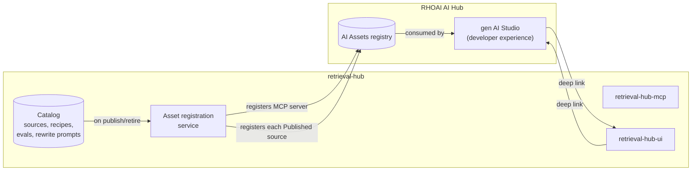

# Integration: OpenShift AI Hub / AI Assets

OpenShift AI 3 ships an **AI Hub** experience whose centerpiece is an **AI Assets** catalog — a unified place where engineers discover and reuse approved AI building blocks. Today AI Assets includes models and MCP servers; the published roadmap calls out future asset types including agents, **knowledge sources for RAG**, and safety guardrails.

That last bullet is the same idea as retrieval-hub. We are not pretending it isn't.

This document describes how retrieval-hub coexists with AI Hub / AI Assets in round 1. The posture is **coexistence, not coupling**, and the integration is **optional** — retrieval-hub works without it.

## The honest framing

> "Build what I think I would use with customers. If the other team builds something better, sooner, then I'll go use that."

That's the working principle, and it shapes everything in this doc. retrieval-hub is not trying to be the canonical "knowledge sources for RAG" implementation that ships inside AI Assets. It's trying to be the thing we would actually deploy for a customer engagement today, in a world where the AI Assets equivalent either doesn't exist yet, doesn't yet do what we need, or doesn't yet exist for the cluster the customer is on.

If, at some point, AI Assets ships a knowledge-sources experience that fully covers our use cases, the right move is to **point customers at it and retire the overlapping parts of retrieval-hub**, not to compete. Retiring is cheap if we have not built ourselves dependencies in the wrong places — which is the design constraint this doc enforces.

Concretely, that constraint means retrieval-hub:

- **Does not depend on AI Assets** for any of its core operations. The catalog, the MCP server, the rewriter, the auth substrate, the UI all function in a cluster that has no AI Hub installed.
- **Does not import any RHOAI-internal libraries.** Integration is over public APIs only.
- **Owns its own catalog UI.** We do not assume AI Assets will be the visible browse surface; we provide one, and we register sources into AI Assets *additionally*.
- **Treats AI Assets registration as a deploy-time toggle.** A flag in configuration enables or disables it cleanly.

If we hold that line, retiring (or absorbing into AI Assets) later is a focused change, not a re-architecture.

## What we register, conceptually

When AI Assets integration is enabled, retrieval-hub registers two kinds of entries:

1. **The MCP server itself**, as an `mcp_server` asset — the same shape AI Assets already supports for any approved MCP server. This is the entry an agent developer follows to "connect my agent to retrieval-hub."
2. **Each `Published` source**, as a `knowledge_source` asset (or whatever the AI Assets type is named when we ship the integration; the field name is theirs to settle). The asset entry describes the source the way the catalog card does — name, family, recipe headline, headline evals, rewrite-availability, owner, link back to retrieval-hub's source detail page.

`Draft`, `Curated`, and `Retired` sources are **not** registered. Only `Published` ones, because the whole point of the catalog's lifecycle is that `Published` is the trust gate.

The relationship looks like this:

The registration service is a small module inside the core library. It runs on source state transitions (`→ Published` and `→ Retired`) and on a periodic reconcile loop so the AI Assets registry doesn't drift from the catalog if AI Assets is restarted or a registration call fails transiently.

## What we own vs. what AI Assets owns

This is the table that matters for the AI Assets integration specifically. Whenever there's ambiguity about which system is the source of truth between AI Assets and retrieval-hub, this table is the answer. (For boundaries with the *other* platform integrations — LlamaStack, MLflow, Kagenti — see [`README.md`](README.md) and the per-capability docs.)

| Concern | Owner | Notes |
|---|---|---|
| Source identity (id, slug) | retrieval-hub | AI Assets entries reference it by id, not the other way around |
| Source recipe and version history | retrieval-hub | AI Assets carries a snapshot for browse; retrieval-hub is authoritative |
| Source lifecycle state | retrieval-hub | AI Assets only sees `Published`; transitions happen in the catalog |
| Eval results (headline) | retrieval-hub | AI Assets shows headline scores from the catalog projection; full history is in MLflow when present |
| Eval execution | LlamaStack `/v1/eval` (when present) or retrieval-hub native | Not AI Assets's concern — see [`llamastack.md`](llamastack.md) |
| Eval run history (full) | MLflow (when present) | AI Assets does not store experiment history — see [`mlflow.md`](mlflow.md) |
| Rewriter metadata + shared template | retrieval-hub Postgres (metadata) + MLflow prompt registry (template) | AI Assets does not represent rewrite prompts |
| Sample agent system prompts | retrieval-hub | AI Assets shows them as part of the asset entry |
| Access policy (who can see/query) | retrieval-hub | AI Assets does not enforce; retrieval-hub does at retrieval time |
| Audit trail | retrieval-hub | AI Assets doesn't try to be an audit system |
| Discovery / browse | **both** | retrieval-hub UI is canonical; AI Assets is a discovery surface |
| Deep-link from one to the other | **both** | bidirectional |
| The MCP transport / tools | retrieval-hub (or behind Kagenti MCP Gateway when present) | AI Assets just lists the server, doesn't proxy it |
| Workload identity | Kagenti SPIFFE/SPIRE (when present) or retrieval-hub-auth | Not AI Assets's concern — see [`kagenti.md`](kagenti.md) and [`../auth.md`](../auth.md) |

Two things to notice:

- **Discovery is the only shared concern with AI Assets.** Everything else is owned by retrieval-hub or by another platform capability. This is what makes the "retire and use AI Assets" exit cheap: if AI Assets eventually owns discovery + recipe + eval surface for knowledge sources, retrieval-hub can drop registration and become a thin runtime that AI Assets points at — or be retired entirely.
- **Rewrite metadata and the shared template are not in AI Assets** because AI Assets does not represent them. The rewriter is uniquely retrieval-hub's, regardless of which platform capability is consuming the catalog.

## How registration actually works

The technical surface is intentionally vague in this round because the AI Assets registration API is still moving. What's pinned down for round 1:

- **Registration is over a public API**, not by writing into a database AI Assets owns. If the public API isn't stable enough yet, we wrap it behind our own interface and update the wrapper as it stabilizes.
- **Registration is idempotent.** Re-registering the same source with the same payload is a no-op. This is what makes the periodic reconcile loop safe.
- **Registration carries a stable retrieval-hub source id**, and AI Assets entries are keyed on that id so updates and deletes are unambiguous.
- **De-registration** (on retire, on integration disable) is its own action and is handled separately from registration. We do not let de-registration silently drop assets that retrieval-hub still considers Published.
- **Failures are non-fatal.** If AI Assets is unavailable, source publishing in retrieval-hub still succeeds. The reconcile loop catches up later. We log the failure, increment a metric, and move on. We do not block local catalog operations on a remote registry.

The exact API call shapes will land in this doc when we implement the integration, not now. Designing against an API contract that's still moving is wasted work.

## The cross-system user experience

From the agent developer's point of view, the experience we want is:

- They land in **gen AI Studio** looking for a knowledge source for their agent.
- They see retrieval-hub's published sources listed alongside whatever else is in the AI Assets registry.
- They click through to a retrieval-hub source detail, in retrieval-hub's UI, and use the playground / copy the MCP config / read the recipe.
- Or — equivalently — they land in **retrieval-hub's catalog UI** directly, browse, and click into a source. From the source detail, an "Open AI Assets entry" deep link takes them back to gen AI Studio if they prefer that experience.

Either entry point works. They are not parallel universes; they are two views of the same set of sources, with one source of truth.

## What we won't do

Several things are tempting and several things have been tried in similar integrations and gone badly. We are not doing them.

- **We will not synchronize state in both directions.** AI Assets does not write back into retrieval-hub. If a user edits an asset entry in AI Assets, that edit is on retrieval-hub's projection there and will be overwritten on the next reconcile. Editing happens in retrieval-hub's UI.
- **We will not re-implement the AI Assets browse experience inside retrieval-hub.** Our catalog UI is for managing and inspecting sources. If it grows feature parity with gen AI Studio, that's wasted work.
- **We will not take a hard build-time dependency on RHOAI internals.** Integration is over the public API surface. If the public surface is insufficient, we file an enhancement and ship a degraded integration in the meantime.
- **We will not use AI Assets as our auth source.** retrieval-hub-auth is the identity story. AI Assets has its own; the two coexist in the cluster.

## The exit

If AI Assets ships a knowledge-sources experience that fully covers our use cases, the exit is:

1. **Stop publishing new sources to retrieval-hub.** Migrate ingestion outputs to whatever AI Assets ships.
2. **Mark existing retrieval-hub sources as Retired.** Lineage is preserved; agents using them get the structured retired error and migrate.
3. **Keep the rewriter, if AI Assets does not have one.** The rewriter is the differentiator that's least likely to be covered by a generic "knowledge sources for RAG" type, and it can run as a smaller standalone service against AI-Assets-owned sources via the same MCP surface.
4. **Retire the catalog UI.** It was always going to be redundant if AI Assets caught up.
5. **Retire the retrieval-hub-auth service** if a unified RHOAI auth is the right substrate by then. Probably already happening if Kagenti+Keycloak is the cluster's identity story — see [`kagenti.md`](kagenti.md).

What's left, in that scenario, is essentially: a query rewriter as a standalone capability, plus the ingestion recipes we built. That's a perfectly fine outcome — we will have shipped real value to customers and contributed something the community can absorb.

The other platform integrations have analogous exits documented in their respective docs:

- [`llamastack.md`](llamastack.md) — exit if LlamaStack ships a per-source curated-retrieval feature that supersedes retrieval-hub.
- [`mlflow.md`](mlflow.md) — exit if a different experiment tracker becomes the cluster default.
- [`kagenti.md`](kagenti.md) — exit if Kagenti is removed or replaced (configuration only; the catalog is unaffected).
- [`autorag.md`](autorag.md) — exit if AutoRAG is decided against (deletion only; no migration needed).

The shared property is that **none of these integrations creates lock-in**. retrieval-hub remains runnable in every direction.

## What's Decided

- **Coexistence, not coupling.** Integration is optional, no core operation depends on it.
- **We register `Published` sources into AI Assets** as a `knowledge_source` (or equivalent) asset type, plus the MCP server itself as an `mcp_server` asset.
- **retrieval-hub is the source of truth** for everything except "is this source visible in the AI Assets browse surface." See the ownership table.
- **Registration is idempotent, failures are non-fatal**, a reconcile loop catches drift.
- **The exit, if AI Assets catches up, is clean** — the design constraint that makes the exit cheap is the no-deep-coupling rule.

## What's Open

- **The exact AI Assets registration API surface.** Still moving on the RHOAI side. We'll pin shapes when we implement.
- **Whether `knowledge_source` is the right asset type name** or whether it's something else by the time we ship. Field name is theirs.
- **Whether AI Assets eventually represents rewrite prompts.** If yes, we register them. If no, the rewriter is retrieval-hub-only.
- **Whether deep-linking from gen AI Studio into retrieval-hub's UI** requires anything from the AI Assets side beyond a URL field. Probably not, but worth checking.
- **The cadence of the reconcile loop.** Probably every few minutes; tunable per cluster. Not committed.
