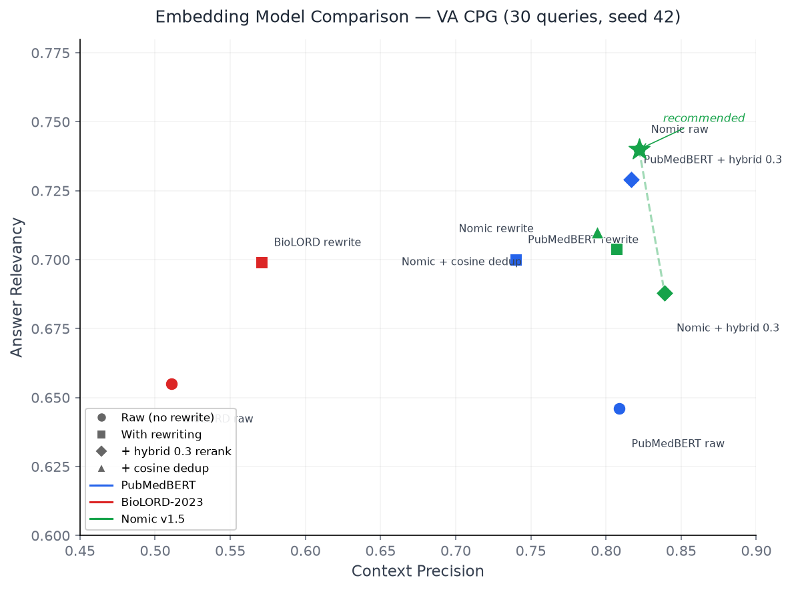

# Onboarding Journey: VA CPG Clinical Guidelines

This document traces the full path from raw PDFs to a live, queryable source
in RetrievalHub. It uses the VA/DoD Clinical Practice Guidelines (52 PDFs,
five clinical categories) as the concrete example, but the steps generalize
to any document-based source. Data owners can use this as a checklist and
reference for their own onboarding.

## Contents

1. [Extract](#1-extract)
2. [Evaluate chunking](#2-evaluate-chunking)
3. [Choose embedding model](#3-choose-embedding-model)
4. [Ingest](#4-ingest)
5. [Set usage rules](#5-set-usage-rules)
6. [Run evaluation](#6-run-evaluation)
7. [Deploy](#7-deploy)
8. [Verify](#8-verify)
9. [Time estimates](#time-estimates)

---

## 1. Extract

A KubeFlow pipeline with Docling extracted 52 VA/DoD Clinical Practice
Guideline PDFs into Markdown. The corpus spans five clinical categories:
chronic disease management, mental health, pain management, rehabilitation,
and women's health.

Docling handles the heavy lifting of PDF layout detection, table extraction,
and text normalization. The pipeline outputs one Markdown file per document,
organized by clinical category in a directory tree that the ingestion script
reads directly.

**Decisions made.** Docling was chosen over simpler PDF-to-text tools because
clinical guidelines contain complex tables, multi-column layouts, and
nested recommendation structures that require layout-aware extraction. A
simpler tool would lose table structure and scramble multi-column text.

**Data owner provides:** Source PDFs or URLs to them. For VA CPG, the PDF URLs
were cataloged in a `pdf-urls.json` file mapping each guideline slug to its
VA.gov download URL. This mapping lets retrieval responses link back to the
original document.

**Platform provides:** A KubeFlow pipeline template with Docling pre-configured
for document extraction.

**Time:** 30-60 minutes for pipeline setup, 15-30 minutes for extraction of
52 PDFs.

---

## 2. Evaluate chunking

Before committing to a chunking strategy, we ran an AutoRAG sweep across
five configurations to find the best fit for clinical text.

| Config | Hit Rate (recall@5) | MRR | Chunks |
|---|---|---|---|
| Token-512-0 | 0.680 | 0.321 | 15,539 |
| Token-512-64 | 0.640 | 0.334 | 17,756 |
| Token-1024-0 | 0.660 | 0.371 | 8,309 |
| Token-1024-64 | 0.640 | 0.315 | 8,882 |
| Sentence-512-0 | 0.440 | 0.216 | 7,956 |

**Winner:** Token-512-0 with 0.68 hit rate.

**Key findings:**

Sentence splitting hurt clinical text by 24 percentage points compared to
token splitting at the same chunk size (0.44 vs 0.68 recall@5). Clinical
guidelines use structured headings, numbered recommendations, and tables
that do not align with natural sentence boundaries. Sentence-based chunks
end up splitting recommendations mid-thought or merging unrelated sections.

Overlap provided no benefit. Token-512-64 scored lower than Token-512-0
(0.64 vs 0.68 recall@5) while increasing chunk count by 14%. The added
redundancy did not improve retrieval quality for this corpus.

Larger chunks (1024 tokens) produced competitive MRR (0.371) but fewer total
chunks. For a recall-oriented use case where we want to surface multiple
relevant passages, the 512-token size with more granular chunks performed
better overall.

**Decisions made.** Token-based splitting at 512 tokens with zero overlap.
This gives the best recall while keeping chunk count manageable.

**Data owner provides:** A set of evaluation queries with known-relevant
documents (ground truth). For VA CPG, these were 50 clinical questions with
manually identified relevant guideline sections.

**Platform provides:** The AutoRAG evaluation framework and configuration
templates for common sweep dimensions.

**Time:** 2-4 hours for the full sweep and analysis.

---

## 3. Choose embedding model

Nomic Embed Text v1.5 (`nomic-ai/nomic-embed-text-v1.5`) was selected after
a structured comparison against two other candidates.

The initial assumption was that a domain-specific biomedical model would
perform best on clinical text. We tested three models on the full 30-query
evaluation set (seed 42) using the same chunking (512/0), rewriting, and
scoring configuration:

- **PubMedBERT** (`NeuML/pubmedbert-base-embeddings`) — a biomedical model
  pre-trained on PubMed abstracts and PMC full-text. 768-dim, no prefix.
- **BioLORD-2023** (`FremyCompany/BioLORD-2023`) — a biomedical model
  trained on PubMed and MIMIC-III. 768-dim, no prefix.
- **Nomic Embed Text v1.5** (`nomic-ai/nomic-embed-text-v1.5`) — a
  general-purpose model. 768-dim, requires `search_document:` and
  `search_query:` prefixes (forgetting them silently degrades quality).

Nomic v1.5 outperformed both domain-specific models on every aggregate
metric. On raw retrieval (no rewriting), it achieved 0.822 context
precision and 0.740 answer relevancy, compared to PubMedBERT's 0.809 and
0.646. BioLORD ranked chunks poorly (0.511 context precision) despite
finding the right documents.

We also tested hybrid cross-encoder reranking (alpha=0.3) on top of each
embedding model. Nomic raw without reranking still beat PubMedBERT with
the best reranking strategy. The simpler configuration won.



The upper-right corner is better on both axes. Nomic raw (starred) sits
above and to the right of every PubMedBERT configuration, including
PubMedBERT with hybrid reranking. BioLORD clusters in the lower-left.
Adding reranking to Nomic pushes context precision higher but trades away
answer relevancy, landing below Nomic raw on the Pareto front.

The takeaway: the right embedding model depends on the corpus, not the
domain label. A general-purpose model with a larger and more diverse
training set can outperform a domain-specific model on domain-specific
text. The only way to know is to run the comparison.

**Decisions made.** Nomic Embed Text v1.5 for embeddings. Requires
`search_document:` and `search_query:` prefixes. 768-dimension vectors
stored in pgvector. No reranking needed.

**Data owner provides:** Evaluation queries with ground truth, so the
platform can run the embedding model comparison and report results.

**Platform provides:** The embedding comparison pipeline
(`scripts/ingest_va_cpg_alt_embedding.py` for re-ingestion,
`scripts/eval_answer_quality.py` for scoring) and model hosting.

**Time:** 2-4 hours for a three-model comparison including ingestion,
retrieval, and Ragas scoring.

---

## 4. Ingest

The ingestion script (`scripts/ingest_va_cpg.py`) runs a 7-stage pipeline:

1. **Fetch** loads the extracted Markdown files from the corpus directory tree.
   Source URLs from `pdf-urls.json` are attached to each document so
   retrieval responses can link to the original VA.gov PDF.

2. **Parse** converts each Markdown file into a structured document
   representation using a markdown passthrough parser.

3. **Normalize** filters out empty or too-short documents and standardizes
   whitespace and encoding.

4. **Chunk** splits each document into 512-token chunks with zero overlap
   using the `cl100k_base` tokenizer.

5. **Embed** generates 768-dimensional Nomic v1.5 embeddings for each chunk,
   prepending the `search_document:` prefix. For 6,500 chunks, embedding
   took roughly 50 seconds locally (132 chunks/s with batch size 32).

6. **Write** stores the chunks and their embeddings in a pgvector table
   (`idx_va_cpg_v1`).

7. **Register** creates the source, recipe version, and physical index
   records in the catalog database. This is what makes the source
   discoverable to agents via `list_sources` and `describe_source`.

The script is idempotent on the registration side: if the source slug
already exists, it updates the recipe version rather than creating a
duplicate.

**Decisions made.** The pgvector table name follows the convention
`idx_{source_slug}_v{version}`. The recipe stores the full configuration
(parser, chunker, embedding model, retrieval parameters) so that the
platform can reproduce the index from scratch if needed.

**Data owner provides:** The extracted corpus directory, source URLs for
provenance, and source metadata (name, description, owner team, contact
information).

**Platform provides:** The ingestion pipeline library, write infrastructure,
and catalog registration.

**Time:** 5-15 minutes for 52 documents (15,539 chunks). Larger corpora
scale linearly with chunk count.

---

## 4a. Data quality for retrieval and refine

After ingestion, data owners should verify three fields that affect
retrieval and refinement quality. These checks take minutes and catch
problems that are hard to diagnose later.

**doc_title consistency.** The `doc_title` field on each chunk is what the
`refine` tool uses to locate chunks from the same document. If ingestion
produces inconsistent titles for chunks from the same document (e.g., the
full formal title for some chunks and a heading fragment for others), refine
calls will fail silently or return incomplete results. Data owners should
verify that `doc_title` is consistent within each document after ingestion.
A quick check:

```sql
SELECT doc_title, COUNT(*) FROM idx_va_cpg_v1 GROUP BY doc_title ORDER BY doc_title;
```

Each document should appear as exactly one `doc_title` value. If you see
variants (e.g., "VA/DoD CLINICAL PRACTICE GUIDELINE FOR..." and "for the
treatment of..."), the extraction or normalization step needs adjustment.

**doc_section granularity.** The `refine` tool's section strategy fetches
all chunks sharing the same `doc_section` value. If `doc_section` is too
coarse (e.g., "Discussion" spanning 48 chunks across many topics), section
expansion returns large, unfocused context that agents must filter with a
token budget. If `doc_section` is too fine (one section per paragraph),
section expansion adds no value over adjacent-chunk retrieval.

Good granularity for clinical documents is typically at the level of
individual recommendations or clinical topics — each recommendation and its
discussion should share a `doc_section` value distinct from other
recommendations. For the VA CPG corpus, the Docling extraction produces
section headings from the PDF structure. If these are too broad, the
normalization step can refine them.

Data owners should check the section distribution after ingestion:

```sql
SELECT doc_section, COUNT(*) as chunks
FROM idx_va_cpg_v1
GROUP BY doc_section
ORDER BY chunks DESC
LIMIT 20;
```

Sections with 30+ chunks may be too broad for the section strategy and are
candidates for sub-section splitting in a future normalization pass.

**chunk_tokens accuracy.** The `refine` tool uses the `chunk_tokens` column
for token budgeting. This is populated during ingestion and should be
accurate. If you change the chunker's tokenizer encoding (e.g., from
`cl100k_base` to `o200k_base`), re-ingest to update chunk_tokens values.

---

## 5. Set usage rules

Usage rules define how consuming agents should behave when presenting
content from this source. They travel with every retrieval response, so
agents always have the context they need for responsible use.

For the VA CPG source, the data owner defined four categories of rules:

**Citation requirements.** Always cite the VA.gov source URL (provided in
`doc_url`), the CPG title, section, and recommendation number. This ensures
traceability back to the authoritative source.

**Scope disclaimer.** These are VA/DoD guidelines, jointly developed by the
Department of Veterans Affairs and Department of Defense. Recommendations
may differ from other organizations' guidelines (ACC/AHA, ESC, USPSTF).
Agents must note this when presenting recommendations.

**Handling constraints.** Content is for clinical reference only and does not
replace clinical judgment. Agents must not present guideline recommendations
as direct medical advice.

**Custom rules.** When a recommendation includes a strength rating (Strong
for, Weak for), always include it. If retrieved content does not address the
user's question, say so explicitly rather than extrapolating. When citing
specific recommendations, use the recommendation number.

**Data freshness.** The source is `healthquality.va.gov`, refreshed on
demand. Agents should note that guidelines are updated periodically and
users should check the VA website for the most current versions.

**Decisions made.** Usage rules are stored as structured JSON on the source
record, not as free-text documentation. This lets the MCP server include
them programmatically in retrieval responses.

**Data owner provides:** All of the above. The data owner is the authority
on how their content should be cited, disclaimed, and handled.

**Platform provides:** The structured storage and delivery mechanism.

**Time:** 30-60 minutes for initial definition. Revisit periodically as
policies evolve.

---

## 6. Run evaluation

With the source ingested and indexed, we run the formal evaluation and store
results in the catalog.

The `scripts/import_eval_results.py` script creates three types of records:

An **EvalSuite** defines what is being measured. For the chunking evaluation,
the metric set includes recall@5 (hit rate) and MRR (Mean Reciprocal Rank).
The suite is reusable across future evaluations of the same source.

An **EvalRun** records a specific execution of the suite against a physical
index. It stores the headline scores (recall@5 = 0.680, MRR = 0.321 for the
winning config) and links to both the source and its physical index.

**EvalResult** rows store per-configuration details. Each of the five
chunking configs gets a result row with its metrics and configuration
payload (chunker type, chunk size, overlap, chunk count, embedding model,
and whether it was the winner).

This structure lets the platform track evaluation history over time. When a
data owner re-ingests with a new recipe version, a new EvalRun linked to the
new physical index shows whether retrieval quality improved or regressed.

**Data owner provides:** Evaluation queries with ground truth (same as step
2, or an expanded set for formal evaluation).

**Platform provides:** The evaluation framework, result storage, and
historical comparison.

**Time:** 1-2 hours including query preparation and analysis.

---

## 7. Deploy

The RetrievalHub MCP server runs on OpenShift in the same namespace as its
PostgreSQL databases. It exposes three primary tools via the MCP protocol
using streamable-http transport:

- `list_sources` returns all published sources with their slugs and
  descriptions.
- `describe_source` returns full metadata for a source, including its recipe,
  usage rules, and evaluation scores.
- `retrieve` performs vector similarity search against a source's physical
  index and returns ranked chunks with provenance metadata and usage rules.
- `refine` expands context around a previously retrieved chunk — given a
  chunk from a retrieve result, fetch the surrounding section or adjacent
  chunks, respecting a token budget.

The deployment uses OpenShift manifests with Kustomize overlays for different
environments. The MCP server container is built from a Red Hat UBI base
image and deployed via ArgoCD.

**Data owner provides:** Nothing. Deployment is a platform concern. Once a
source is registered in the catalog, it becomes available through the
existing MCP server without any per-source deployment.

**Platform provides:** The MCP server, OpenShift manifests, container builds,
and monitoring.

**Time:** 15-30 minutes for initial deployment. Zero additional time for
subsequent sources (they appear automatically after ingestion).

---

## 8. Verify

Verification confirms that the source is discoverable, its metadata is
correct, and retrieval returns relevant results.

We used `mcp-test-mcp` to connect to the deployed MCP server and exercise
each tool:

**Discovery.** `list_sources` confirms the source appears with slug
`va-cpg-clinical-guidelines` and a meaningful description.

**Metadata.** `describe_source` returns the full source card including recipe
configuration, usage rules, data freshness information, and evaluation
scores.

**Retrieval.** `retrieve` with clinical queries returns relevant chunks with
proper provenance. Test queries included:

- "What does the VA CPG recommend for PTSD treatment?" (should return mental
  health guideline content)
- "Blood pressure targets for veterans with diabetes" (should return chronic
  disease management content)
- "Opioid prescribing guidelines" (should return pain management content)

For each query, we checked that returned chunks came from the expected
clinical category, that source URLs pointed to valid VA.gov PDFs, and that
usage rules were included in the response.

**Refinement.** `refine` with a chunk from a retrieve result should return
the full section containing that chunk. Test with `max_context_tokens` to
verify token budgeting works. For clinical documents, verify that the
section strategy returns complete recommendation text — a recommendation
and its full discussion, not a fragment that cuts off mid-sentence.

**Data owner provides:** Sample queries that exercise the breadth of their
content. The data owner knows their domain best and can spot irrelevant or
missing results faster than the platform team.

**Platform provides:** The `mcp-test-mcp` testing tool and verification
checklists.

**Time:** 15-30 minutes for a thorough verification pass.

---

## Time estimates

| Step | Data owner time | Platform time | Notes |
|---|---|---|---|
| 1. Extract | 30 min (provide PDFs) | 30-60 min (pipeline setup) | One-time per corpus |
| 2. Evaluate chunking | 1-2 hr (ground truth queries) | 1-2 hr (run sweep) | Largest time investment |
| 3. Choose embedding model | 15 min (describe domain) | 1-2 hr (evaluate models) | Can overlap with step 2 |
| 4. Ingest | 30 min (metadata, URLs) | 15 min (run pipeline) | Scales with corpus size |
| 5. Set usage rules | 30-60 min | Minimal | Data owner is the authority |
| 6. Run evaluation | 30 min (review results) | 1 hr (run and import) | Reuses step 2 queries |
| 7. Deploy | None | 15-30 min | Zero for subsequent sources |
| 8. Verify | 15-30 min | 15 min | Joint effort |
| **Total** | **3-5 hours** | **4-7 hours** | **6-10 hours combined** |

A first-time onboarding takes roughly 6-10 hours of combined effort, with
the evaluation step (steps 2 and 6) being the largest investment. Subsequent
onboardings are faster because the platform infrastructure is already in
place and the team has a template to follow.

For sources that skip evaluation (because the default chunking strategy is
acceptable), the total drops to 3-5 hours.
